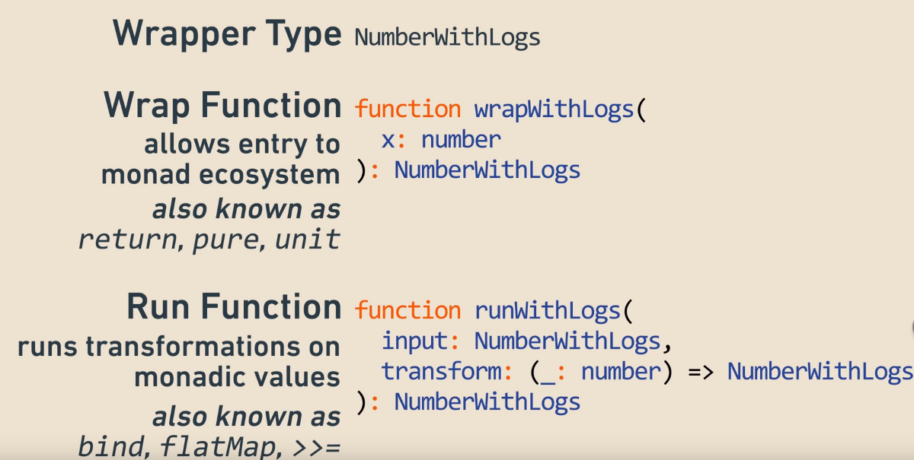
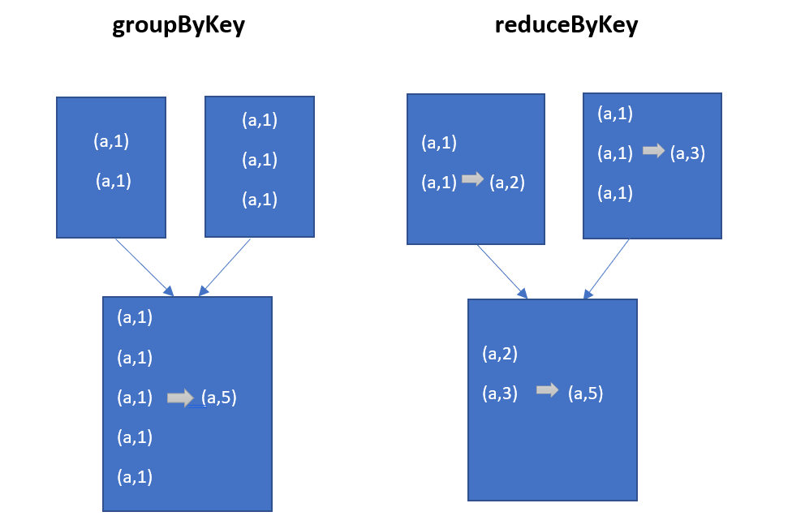
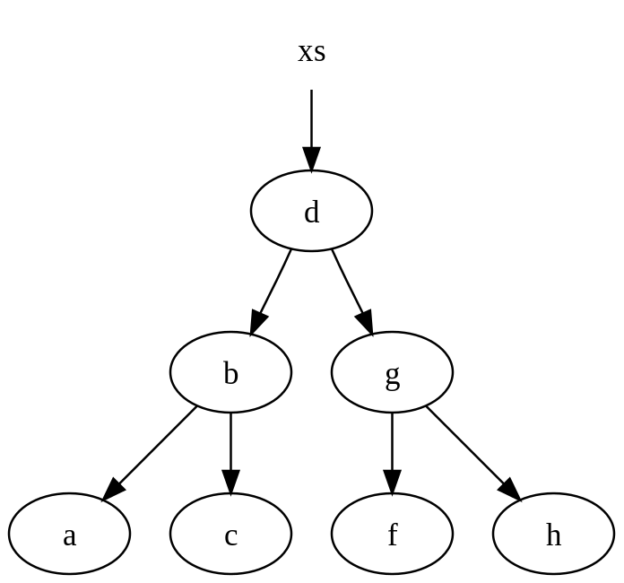
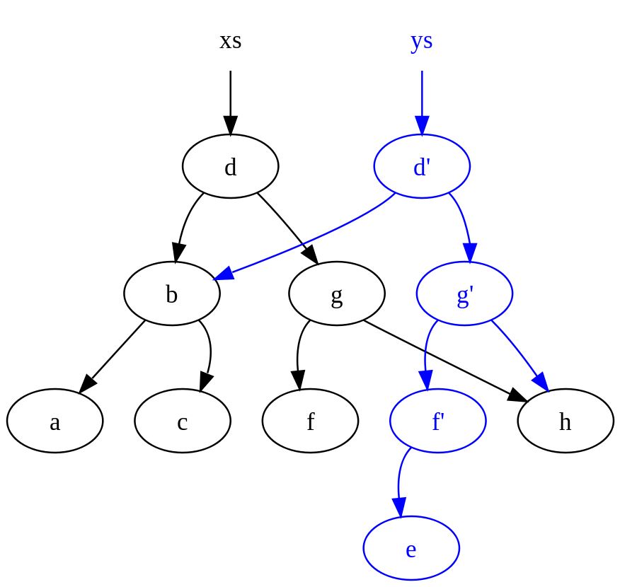

# Side effect
**side effect** is when a function modifies some state outside of its scope or makes some noticeable change besides returning a value. The below modifies the value of variable max which is outside the function scope:

```
var max = -1

def greaterOrEqual(a: Int, b: Int): Boolean = {
    if(a >= b) {
        max = a // side effect!
        true
    } else {
    max = b // side effect!
    false
    }
}
```
possible fixes: 
- take it as input
- create a local scope of max
- deep copy

In functional programming, function should only return value and don't cause any operation outside of its scope.

General rule of thumb: if function returns nothing (void or Unit) then it it most likely does a side effect

Example of side effects are: 
- modifying a variable
- modify a data structrue in place; in FP data structures must be persistent
- setting a field on an object
- throwing an exception or halting with an error (in FP, types are used to encapsualte and propagate error behavior)
- print to the console, reading user input, reading writing to fields or screen (fp encapsulates external resouces into Monads)

# Pure function
**Pure function** is a function that only reads the declared inputs (not the outside scope variables) and doesn't create side effects. The below example only uses the input it has been passed; max as an input (although it never uses it)

```
def greaterOrEqual(a: Int, b: Int, max: Int): (Boolean, Int) = {
    if(a >= b) (true, a)
    else (false, b)
}
```

Pure functions also offer **referential transparency**, where expressions can be replaced with its corresponding value (and vice-versa) without changing the program's behavior. For y=f(x) we can replace f(x) with y wherever f(x) is used. 

```
var base = 10

def plus(a: Int): Int = {
  base + a
}
```

# No loops in FP
Imperative languages need loops because they have no other way to write iterative code. Loops are not functional as they can change and are mutable.

Functional languages can instead do recursion. 

Use mutable iterator variables in recursion

**Tail-recursive** functions are optimized by the Scala compiler.

```
def factorial(n: Int): Int = {
    @annotation.tailrec
    def factorialHelper(n: Int, acc: Int): Int =
        if (n <= 0) acc
        else factorialHelper(n-1, n*acc)

    factorialHelper(n, 1)
}
```

Functions like map, filter, and fold package up common recursive patterns into library functions that are easier to use than direct recursion and signal intent. 

# OO to FP
The below is flawed for FP as:

- charge() performs a side-effect: we need to contact the credit card company!
- buyCoffee() is not testable

```
class Cafe {
    def buyCoffee(cc: CreditCard): Coffee = {
        val cup = new Coffee()
        cc.charge(cup.price)
        cup
    }
}
```

Solutions is to decouple the action of buying coffee from charging. The following allows:
- Test
- Combine multiple Charges in one
- Maintain in flight accounts for all customers

```
class Cafe {
    def buyCoffee(cc: CreditCard): (Coffee, Charge) = {
        val cup = new Coffee()
        (cup, Charge(cc, cup.price))
    }
}

class Charge(cc: CreditCard, amount: Double) {
    def combine(other: Charge) = new Charge(cc, amount + other.amount)
    def pay = cc.charge(amount)
}
```

# Immutable data structures
FP data structures are operated on pure functions for immutable properties.

Scala has both mutable and immutable versions of many common data structures (lists, tuples, maps, and sets). If in doubt, use immutable.

```
val oneTwoThree = List(1, 2, 3)
val oneTwoThree_2 = 1 :: 2 :: 3 :: Nil  // same as the above
val one = oneTwoThree.head
val twoThree = oneTwoThree.tail
```

## List operators
One of the most used aspects (at least for this course) in Scala. Below is the most used and preferred operators for lists in Scala:

- **Nil** is a list which has zero elements in it.
- :: operator to add an element at beginning of the list 
- ::: add elements of list in front of this list

The '1 :: 2 :: 3 :: Nil' expression is the same as List(1, 2, 3).
The 'b :: a :: Nil' expression is same as List(b, a) 


In scala list
- *list.head* points to the first element of the list 
- *list.tail* is rest of the collection without its first element (NOT the last element of the list)

```
val oneItem = List(1)
oneItem.head                    // 1
oneItem.tail                    // Nil (empty list)

val mulItem = List(1, 2, 3, 4)
mulItem.head                    // 1
mulItem.tail is List(2, 3, 4)   // List(2, 3, 4)
```

## Pattern matching
**Pattern matching** checks a value against a pattern. If the match is successful, it can deconstruct a value into its consitituent parts. 

Below a list is deconstructed into a head (giving it the name x) and a tail/rest (giving it the name xs). Those two parts can now be accessed separately in the expression after the arrow.

```
def length(ints: List[Int]): Int = ints match {
    case Nil => 0
    case x :: xs => 1 + length(xs)     // x, xs are declared
}
```

Another example of pattern matching:
```
val x = List(1,2,3,4,5) match {
    case x :: 2 :: 4 :: xs => x
    case Nil => 42
    case x :: y :: 3 :: 4 :: xs => x + y
    case h :: t => h
    case _ => 404
}
```

Below are examples of recursion on data strucutures. Note they are not tail recursive:
```
def incrementAll(ints: List[Int]): List[Int] = ints match {
    case Nil => Nil
    case x :: xs => x + 1 :: incrementAll(xs)
}

def doubleAll(ints: List[Int]): List[Int] = ints match {
    case Nil => Nil
    case x :: xs => x * 2 :: doubleAll(xs)
}
```

<!-- Below won't compile though because we don't have the type *Any*, and there are more than one data types -->
The last default below is to make sure the data falls into at least one of the cases. 
```
val res = myvalue match {
    // Match on a value, like if
    case 1 => "One"
    // Match on the contents of a list
    case x :: xs => "The remaining contents are " + xs
    // Match on a case class, extract values
    case Email(addr, title, _) => s"New email: $title..."
    // Match on the type
    case xs : List[_] => "This is a list"
    // With a pattern guard
    case xs : List[Int] if xs.head == 5 => "This is a list of integers"
    case _ => "This is the default case"
}
```

## High-order function
**High-order function** is a function that accepts another function as its argument.

Useful higher-order functions include Map, filter, fold and friends as they package up common recursive patterns into library functions; implemented with recursion internally.


```
// Return elements that satisfy f
def filter(xs: List[A], f: A => Boolean) : List[A]
```

Below applyToAll takes two generics; type of A and type of B. These two generics don't have to be the same. One example being when dividing an integer by 2.

```
// see how you can implement below using tail recursion
def applyToAll[A, B](xs: List[A], f: A => B): List[B] = xs match {
    case Nil => Nil
    case h :: t => f(h) :: applyToAll(t, f)
}

// applyToAll in action
def incrementAll2(ints: List[Int]): List[Int] = applyToAll(ints, (x:Int) => x + 1)
def doubleAll2(ints: List[Int]): List[Int] = applyToAll(ints, (x:Int) => x * 2)
```

Some import higher-order functions:

`map(xs: List[A], f: A => B) : List[B]`             // apply function f to all elements and returns a new list.

`flatMap(xs: List[A], f: A => List[B]) : List[B]`   // Like map, but appends all the created lists from an element into one single list

`foldL(xs: List[A], f: (B, A) => B, init: B) : B`   // Takes function of 2 arguments and an init value and combines the elements by applying f on the result of each previous application. AKA reduce. init represents some value (like any)

`groupBy(xs: List[A], f: A => K): Map[K, List[A]]`  // Partitions xs into a map of traversable collections according to a discriminator function.

`filter(xs: List[A], f: A => Boolean) : List[A]`    // Takes a predicate f and returns all elements that satisfy it

`scanL(xs: List[A], f: (B, A) => B, init: B) : List[B]` // Like foldL, but returns a list of all intermediate results

`zip(xs: List[A], ys: List[B]): List[(A,B)]`        // Returns an iterable collection formed by iterating over the corresponding items of xs and ys.

# Laziness
**Laziness** is an evaluation strategy which delays the evaluation of an expression until its value is needed. Here you acutally use the keyword **lazy**:

```
lazy val x = { println("Evaluates x "); 1}  
val y = { println("Evaluates y"); 2}
x + y

// Output:
// Evaluates y
// Evaluates x 
```

```
// does not print:
val a = (1 to 10).iterator.map(print) 

// prints the first 5 items:
val b = (1 to 10).iterator.map(print).take(5).toList 
```

Laziness is useful for
- separating pipleine construction form its evaluation
- No need to read datasets in memory (process in lazy loaded batches)
- Generate infinite collections
- optimize executions plans

```
    val r1 = (1 to 3)
    .map(x => {
      println("Mapping")
      x + 1
    })
    .filter( x => {
      println("Filtering")
      x % 2 == 0
    })
    .sum

    //Output:
    // Mapping
    // Mapping
    // Mapping
    // Filtering
    // Filtering
    // Filtering
```

```
// Working on a lazy list
  val r2 = (1 to 3).to(LazyList)
    .map(x => {
      println("Mapping")
      x + 1
    })
    .filter( x => {
      println("Filtering")
      x % 2 == 0
    })
    .sum
```

Scala lists, maps are eager to output as fast as possible. Lazy lists help form lazy pipelines. In tools like Spark and Flink, we always express computations in a lazy manner. This allows for optimizations before the actual computation is executed.

Example of infinite streams:
```
def fibs: LazyList[Int] = {
  0 #:: 1 #:: fibs.zip(fibs.tail).map{ n =>
    println("Adding " + n._1 + " and " + n._2)
    n._1 + n._2
  }
}
fibs.take(5).foreach(println)
```

# Monads
**Monads** are a design pattern to define how functions can be used togeter to build generic types.  

In FP, we want to return the effect and not mutate it. With monads, we wrap the value to keep the effect.

A monad is a value-wrapping type have:
- Wrapper type
- Wrap function
- Run function (usually flatmap in Scala)



Example with Option class:


Monads are used to deal with side-effects:
- Null points: Option[T]
- Exceptions: Try[T]
- Latency in asynchronous actions: Future[T] (eventually available)

Exceptions are considered side-effect and break referential transparency:

```
def failingFn(i: Int): Int = {
  val x: Int = throw new Exception("fail!")
  try { 
    x + 1
  } catch { case e: Exception => -1 }
}

def mean(xs: Seq[Double]): Double =
    if (xs.isEmpty)
        throw new ArithmeticException("mean of empty list!")
    else xs.sum / xs.length
```

Some functions return predefined bogus value like 0 or -1 but not permanent solution. Solution is to use Option and create a monad:

```
def mean(xs: Seq[Double]): Option[Double] =
    if (xs.isEmpty) None
    else Some(xs.sum / xs.length)
```

## Combine monads with flatMap
flatMap allows joining sequences of arbitrary types:
```
def getArgument(k: String): Option[Arg]
def processArgument(a: Arg): Option[Result]

getArgument("foo")
    .flatMap(processArgument)
    .getOrElse(new Result("default"))
```

```
def callWebService(): Future[R]
def heavyComputation(r: R): Future[V]

val r = callWebService().flatMap(r => heavyComputation(r))
```

Try wraps a computation that may either result in an exception, or return a successfully computed value. Can have 2 instances:
- Success[T], where T represents the type of the result
- Failure[E], where E represents the type of error, usually an exception

```
object Converter extends App {
    def toInt(a: String): Try[Int] = Try{Integer.parseInt(a)}
    def toString(b: Int): Try[String] = Try{b.toString}

    val a = toInt("4").flatMap(x => toString(x))
    println(a)      // Success(4)

    val b = toInt("foo").flatMap(x => toString(x))
    println(b)      // Failure(java.lang.NumberFormatException: For input string: "foo")
}
```

*In Scala, declaration of the value of Future[T] is Option[Try[T]].*

Below we have both an object Amazon (used as singleton for utility functions) and class Amazon (used to represent users).
```
object Amazon {
    def login(login: String, passwd: String): Future[Amazon]
}

class Amazon(val user: String) { 
    def search(term: String): Future[Seq[String]]
}

object Main extends App {
    val result = Amazon.login("uname", "passwd") // Might fail
        .flatMap(a => a.search("foo"))
    val resultVal = result.value
}
```
*Amazon.login* returns Future[Amazon] but it might fail, thus *result* is a Future[seq[string]].

*result.value* is Option[Try[Seq[String]]].

# Enumerating datasets

## Big datasets
The client code processes the data.

In a big data system:
- **Data source**: container a data (array, database, web service)
- **Iteration**: client asks the data source whether items left and *pulls* next item
- **Observation**: data source *pushes* next available item to client end point

## Iteration
In the context of BDP, iteration allows us to process finite-sized data sets *without loading them in memory at once*.

```
val it = Array(1,2,3,4).iterator
while(it.hasNext) {
    val i = it.next + 1
    println(i)
}

// equivalent
for (line <- data) {
    println(line)
}
```
## Observation
Observation allows us to process (almost) unbounded size data sets, where the data source controls the processing rate. 

Data is “pushed” to it asynchronously, when new data is available.

```
// Consumer
trait Observer[A] {
    def onNext(a: A): Unit
    def onError(t: Throwable): Unit
    def onComplete(): Unit
}

// Producer
trait Observable[A] {
    def subscribe(obs: Observer[A]): Unit
}

Observable.just(1, 2 ,3 ,4 ,5)
    .map(x => x + 1)
    .subscribe(x => println(x))
```

## Iteration vs Observation
Iteration and Observation are **dual**. The same set of higher-order functions can be used to process data in both cases, like the map function:

```
Array(1,2,3,4).map(x => x + 1)

Observable.just(1,2,3,4,5).map(x => x + 1)
```

## Traversal
In most programming environments traversal is implemented by **iterators**. All of container data types can be iterated.

```
case class Tree(value: String, children: List[Tree])

def dfs(tree: Tree): Iterator[String] = tree match {
    case Tree(value, Nil) => Iterator(value)
    case Tree(value, children) => children.iterator.flatMap(c => dfs(c)) ++ Iterator(value)
}

val tree = Tree("a", List(Tree("b", List(Tree("c", Nil), Tree("d", Nil)))))
dfs(tree).foreach(print)
```

# Operations
**Operations** are transformations, aggregations or cross-referencing of data in the data types. 

Example of random data generation:
```
val genders = List("Male", "Female", "Other")
val rand = new Random(42)

val people = (1 to 1000).map(i => Person(
                                i,
                                age = rand.between(10, 80),
                                height = rand.between(60, 200),
                                weight = rand.between(40, 120),
                                gender = genders(rand.between(0, 3)
                            )
                        ).toList

// Person(1000,50,102,58,Female)
```

Generally two types of operations:
- **Element-wise**: apply function to each invidiaul data (map or flatMap). Three types:
    - **Conversion**: convert values of type A to type B (map)
    - **Filtering**: only present data that match a condition (filter)
    - **Projection**: only present parts of each data item (map)

- **Aggregation**: group multiple events together and apply reduction or folding. Either left or right.

## Element-wise
```
// convert height to meters
val peopleInMeters1 = map(people, (p: Person) => p.copy(height = p.height * 1.0 / 100))

val peopleInMeters2 = people.map(p => p.copy(height = p.height * 1.0 / 100))

// project person's height and weight
val heightsAndWeights = map(people, (p: Person) => (p.height, p.weight)) 

// filter height > 180
val tallPeople = filter(people, p => p.height > 180)
```

## Aggregation
Reduce is different from fold. **Reduce** operation: 
- the initial value of the accumulator is the first value in the collection, not whatever we pass on
- The return type B must be a subtype of A

For aggregation, if the reduction operation is NOT communicative:
-> *foldRight != foldLeft*

```
// fold aggregate; 0 is the init argument
val total1 = foldLeft(people, 0, (acc: Double, p: Person) => acc + p.weight)
val total2 = foldRight(people, 0, (p: Person, acc: Double) => (p.weight + acc))

// reduce aggregate: no initial values
val totalWeightLeft = weights.reduceLeft(_ + _)
val totalWeightRight = weights.reduceRight(_ + _)
```

Other operations:
- **count**: count number of elements, possibly matching a condition
- **distinct**: produce new dequence with no duplicates (items have unique identifiers)
- **groupBy**: split sequence of items to groups given a classification function

Function signatures of above:
- count(xs:[A], pred): Integer
- distinct(xs:[A]):[A]
- groupBy(xs:[A], f:A → K): Map[K,[A]]

```
def number_classifier(x: Int): String = 
    if (x % 2 == 0) "even"
    else "odd"

val list = List(1, 2, 3, 4, 5, 6, 7)
print(groupBy(list, number_classifier))
```

the above returns the following:
```
Map(
    odd -> List(7, 5, 3, 1), 
    even -> List(6, 4, 2)
)
```

## Keys and Values
The most common data structure in big data processing is **key-value pairs**. Typical operations:
- **mapValues**: transform value parts
- **groupByKey**: group the values for each key into single sequence. doesn't map side combine
- **reduceByKey**: combine all elements mapped by same key into one. does map side combine
- **join**: return a sequence containing all pairs of elements with matching keys

Function signatures of above:
- mapValues(kv:[(K,V)],f:V→U):[(K,U)]
- groupByKey(kv:[(K,V)]):[(K,[V])]
- reduceByKey(kv:[(K,V)],f:(V,V)→V):[(K,V)]
- join(kv1:[(K,V)],kv2:[(K,W)]):[(K,(V,W))]

groupByKey vs reduceByKey:



## flatMap
**flatMap** enables us to combine two data collections and return a new collection with flattened values.

It does map and flatten in one step

flatMap(xs:[A], f:A → [B]): [B]

```
case class Addr(k: String, street: String, num: Int)
val addr = List(
    Addr("EWI", "Mekelweg", 4),
    Addr("EWI", "Van Mourik Broekmanweg", 6),
    Addr("TPM", "Jafaalaan", 5),
    Addr("AE",  "Kluyverweg", 1)
)
case class Dean(k: String, name: String, surname: String)
val deans = List(
    Dean("EWI", "John", "Schmitz"),
    Dean("TPM", "Hans", "Wamelink")
)

def deanAddresses2: List[(Dean, Addr)] =
    deans.flatMap(d =>
        addr.filter(a => a.k == d.k)
            .map(a => (d, v))
    )

// this is equivalent to above
def deanAddresses2: List[(Dean, Addr)] = {
    for (
        d <- deans
        v <- addr.filter(a => a.k == d.k)
    ) yield (d, v)
}
```

Result from above:
```
List(
    ( Dean(EWI,John,Schmitz), Addr(EWI,Mekelweg,4) ), 
    ( Dean(EWI,John,Schmitz), Addr(EWI,Van Mourik Broekmanweg,6) ),
    ( Dean(TPM,Hans,Wamelink), Addr(TPM,Jafaalaan,5) )
)
```

# Immutability
One of the key characteristics of data processing is that data is never modified in place. Instead, we apply operations that create new versions of the data, without modifying the original version.

**Copy-On-Write** is a techinque to share memory for read-only access across processes and deal with writes only if/when they are performed by copying the modified resource in a private version. Usage of this is **forking**. 

COW enables systems with multiple readers and few writers to efficiently share resources.

Immutable data structures *always preserve the previous version of themselves when they are modified*. Since data is never deleted, size is increased in memory.

With immutable data structures, we can:
- avoid locking while processing them, so we can process items in parallel
- maintain and share old versions of data
- reason about changes in the data
- safe hash table keys


Below we have tree set xs with nodes a, b, c, d, f, g, h



If we add a new node e to it, we create a new version of the tree set xs called ys:



In code:

```
val ys = xs ++ TreeSet[Char]('e')
```

## Mutable vs Immutable
Some data structures have both mutable and immutable counterparts while others done:


