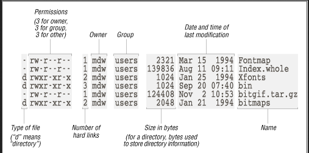

# About UNIX and Bash
UNIX is a true multiuser operating system; users have their own private space on the machine’s harddisk and are identified by an id number.

Some properties regarding UNIX users:

- All users have a user name and a password
- The user with id 0 is the system’s superuser, traditionally named root.
- UNIX processes act on behalf of the initiating user.
- Multiple users can be running multiple processes at the same time.
- Users are organised in groups. A group is a set of users that share the same class of permissions.

Bash (Bourne-again shell) is the name of the default command interpreter on most Unix environments. Bash is an almost complete programming language, with an interesting caveat: Many of its operators are programs that can be run individually!

### UNIX/Linux user:
'$' means you are a normal user
'#' system administrator or root

### UNIX filesystem
Everything in UNIX is represented as a file. It can be divided into two groups: 

- *configuration files*: Both user profile and system/server configuration files are plain text files. This allows to easily backup/restore/compare configuration files and remote administration using low-bandwidth *text console*
- *Devices*: accessing a device can be done via regular file I/O operation on filesystem objects that represent the real devices. For example *cat file.wav >/dev/sndcard* plays an audio file directly to the soundcard or *cat file.txt|lpr* prints it to a printer.

The following UNIX filesystem is the same for ALL UNIX versions:

|--bin          Binaries required before mounting /usr
|--etc          System wide configuration files
|--home         Users’ home directories
|--lib          Libraries required by the system
|--tmp          Temporary files. Everyone has RW access.
|--usr          Programs
| |--bin        Programs’ executables
| |--lib        Programs’ libraries
| |--local      Programs that are install locally
| |   |-bin,lib,share
| |--share      Programs’ required files (e.g. docs, icons)
| |--sbin       System administration programs
| |--src        Source files for the kernel and programs
|--var          Temporary space for running programs

Files need to be protected against intentional or unintentional access. Filesystem permissions provide the system with information about who can access a file or directory and what can he do with it.

### UNIX file permission
Files need to be protected against intentional or unintentional access. The filesystem permissions provide the system with information regarding who can access a file or directory and what he can do with it. The following is the permission types for each user types:


The following is the complete display of all regarding permission of a file:



### UNIX file paths
In Linux/UNIX, the backslash / symbolizes the root directory.

a dot (.) means the current directory
a double-dot (..) means the parent directory.

Thus ../ means going up one ladder

Lets say the filepath to the system log file is '/var/log/messages'

If the current directory is /var, the relative path to the system log is 

./log/messages == log/messages


### Bash variables
Variables in bash are strings followed by =, e.g. cwd="foo" and are dereferenced with $, e.g. echo $cwd.
```
# Store the results of running ls in a variable
listing=`ls -la`
# derefence the variable
echo $listing
```

To modify environment variables, modify them with the export program:

```
$ export |grep PATH
$ export PATH=$PATH:/home/gousiosg/bin
$ export |grep PATH
```

### Conditionals
Bash also suppports if/else blocks

```
if [ -e 'test' ]; then
  echo "File exists"
else
  echo "File does not exist"
fi
```

### Loops
For loop example:
```
    # Print 1 2 3 4...
    for i in `seq 1 10`; do
    echo $i
    done

    # Iterate over all files in a directory
    for i in $(ls); do
    echo `file --mime $i`
    done
```

While loop example:
```
    ls -fa |tr -s ' '|cut -f9 -d' '|
    while read file; do
    echo `file --mime $file`
    done
```

### Command line input
bash maps special variables on command line inputs: $0 is the program name, $1 is the first argument, $2 the second etc. More complex command lines (e.g. with switches) can be done with getopt.
```
#!/usr/bin/env bash

argA="defaultvalue"
while getopts ":a" opt; do
  case $opt in
    a)
      echo "-a was triggered!" >&2
      argA=$OPTARG
      ;;
    \?)
      echo "Invalid option: -$OPTARG" >&2
      ;;
  esac
done
```

### UNIX commands/programs
Useful command executors to know, along with their options:

- cd <dir>: change directory

- pushd <dir>: go to this dir

- popd: go up one dir

- ls: list storage 
    -l: list details
    -a: list hidden files (files that start with .)

- find <dir>: walk through a file hierarchy starting from <dir>
    -type [dfl]: Only display directories, files or links
    -name <name>: Only display entries that start with name
    -maxdepth <level>: descend at most levels of directories below the <level>. level must be non-negative
    -mindepth <level>: don't descend to levels beyond <level>. level must be non-nmegative

- touch <file>: Create and empty file named <file> or update the modification time for the existing file <file>

- cp <from> <to>: copy file or directory <from> to the location specified by <to>
        -R: copy directories recursively
        -p: preserve filesystem permissions and attributes

- mv <from_1> · · · <from_n> <to>: move files or directories <from*> to directory <to>
        -n: do not overwrite existing files

- mkdir: create an empty directory in the path specified by the . The path to the directory must be pre-existing.
        -p: also create intermediate directories as required

- rm <file>: remove file. After you remove files with rem, there's no way to get the files back
        *: remove all files in the current directory
        <file>*: remove all files that start with file, and any characters afterwards

- cat <file_1> · · · <file_n>: concatenate and print files to standard output

- less <file>: displays a file on the screen allowing to browse it on both directions.
        -q: exit
        /pattern: search for pattern in text, pressing / repeatedly moves through all occurrences.

- echo <string>: display line of string that has been passed as argument

- head, tail <file>: display first/last lines of <file>
        -n: Number of lines to display
        -f: Display newly appended lines

- kill -<singalno> <pid>: Send a signal to a process. Important signals:
        -TERM: informs the process that it should terminate.
        -KILL: directly kill a process

- 'ps': will show which processes are running

- locate <file>: gives every filepaths with the file name

- 'man' <cmd>: invokes the manual for a command:

- 'xargs' <cmd>: run cmd on each line in STDIN

- grep: prints lines mattching a pattern
    -v: invert search result (only print those that DO NOT match the pattern)
    -i: make matching case insensitive
    -n: print the line number of the match
    -R: recurse a directory structure

- tr: a character translator that can convert or delete specific characters
    -s: replace repeating characters into
    -d: delete a character

- cut: allows us to split a line into columns, given a character, and extract specific fields.

- sed: modifies a string at its input in various ways using pattern matching

- sort: writes a (lexicographical) sorted concatenation of all input files to standard output, using Mergesort
    -r: reverse the sort
    -n: do a numeric sort
    -k and -t: merge by the nth column (argument to -k). -t specifies what is the separator character

- uniq: finds unique records in a sorted file

- join: joins lines of two sorted files on a common field
    -1: specify fields in files 1 (first argument) that represent keys
    -2: specify fields in file 2 (second argument) that represent keys

- make: utility for building and maintaining groups of programs (and other types of files) from source code.

- ssh: securely login to a remote server and get its controlling prompt to remotely execute commands
        -L: connect to ports on machines where a filewall blocks them

- curl: queries a URL and prints the raw contents on the terminal
    -H: Set an HTTP header, e.g. “Authorization: token OAUTH-TOKEN”
    -i: Display all headers received
    -s: Don’t anything except from the response

- json_pp: pretty-prints JSON files

- jq: uses a Domain Specific Language (DSL) to query tree structures in JSON files.

- rsync: sync files between directories
    -a: archive mode, preserve permissions and access times
    -v: display files changed
    --delete: delete

- inotifywait: watches a directory for changes and prints a log of the changes
    -m enables monitor mode (run forever)
    -r watch directories recursively

- export: modify environment variables

- test: used in if/else conditions but its alias '[]' is much more common

    [ $foo = 'test' ]: Tests string equality
    [ $num -eq 3 ]: Tests number equality
    [ ! expression ]: Negates the expression


### UNIX process
*Process* is the current task that your machine is currently working on. UNIX can do many processes at once, dividing the processor’s time between the tasks so quickly that it looks as if everything is running at the same time. This is called *multitasking*.

The UNIX shell has process management capabilities. Some useful key commands:

- Ctrl + Z will suspend current process
- Ctrl + C will kill current process
- '&' at the end of the command will run the process in the background i.e. find / |sort &
- 'ps' will show which processes are running
- '>' will send a program's output to overwite the file
- '>>' will send a program's output to append to the file
- '<' will make a program read from the file

```
    $ echo "-What a nice day" > file
    $ echo "-Indeed" >> file
    $ cat file
    -What a nice day
    -Indeed
```

A process in Unix can output to 2 data streams: 

- STDOUT or 1
- STDERR or 2. 

Unix supports 2 types of text flow control:

- Redirects: send a program’s output to a file (>) or make a program read from a file (<). > will 
- Pipes: Forward a program’s STDOUT line-by-line to the input of another program.

### UNIX pipelinees
The pipe operator ( | ) allows combining commmands to read and write easy to process text. Some examples:

```        
    cat file |wc -l                                 # Count lines of file
    find / -type d | sort                           # View all directories sorted

    cat /var/log/access_log |grep foo|tail -n 10    # See the last 10 accesses from the host “foo” to our system’s web server.

    cat /etc/passwd |cut -f1 -d':'|sort             # Get a sorted list of the system’s users.
```

### Documentation
UNIX is a self-documenting system. All commands/tools have a manual page that describes their arguments, input and output formats and sometimes, even programming interfaces. Unix systems are also traditionally documented by providing full access to the source code that comprises them.

```
    $ man ls
```

### Running a command per input line
'xargs' <cmd> will run cmd on each line in <STDIN>. xargs by default appends each line at the end of cmd. Some times, it may be necessary to append it in the middle. We use the -I {} option 

```
$ find . -type f -maxdepth 1 |xargs wc      # Get file size statistics for the current directory
```

### Filtering lines with patterns
We will use the grep command here

```
    # Find all processes run by user 501
    $ ps -ef | egrep "^ +501"

    # Find all files that extend class Foo
    $ grep -Rn "(Foo)" * | grep *.py

    # Same, more efficient
    $ find . -type f -name '*.py' | xargs grep -n "(Foo)"

    # Even more efficient
    $ grep -Rn "(Foo)" *.py
```


### Regular expressions in 1 min
Regular expression symbols are the same in bash as it is in other.

- '.': Match any character once
- '*': Match the previous pattern 0 or more times
- '+': Match the previous pattern 1 or more times
- [e-fF-M]: Match any character in the (ASCII) range F-M or e-f
- [^e] Match all characters except e
- '^': match the beginning of the line
- '$': match the end of the line
- '()': Group together items for future reference
- '|': Match either the left or the right group

### Simple text processing
Character translating:
```
    # to print faa bar
    $ echo "foo bar" | tr 'o' 'a'
    # Replace tabs with spaces
    $ tr '\t' ' ' < file.txt
    # Remove all instances of #
    $ tr -d '#' < file.txt
```

Spliting line into columnns:
```
    # Get a list of users and home directories
    $ cut -f1,6 -d: /etc/passwd
    # Get details for all users that are running java
    $ ps -ef|tr -s ' '|grep "java"|cut -f3,11  -d' 
```

### Stream text processing
sed is a domain specific language of its own. Use the manual to see how they work.

```
# Replace foo with bar in the input file
$ sed -e 's/foo/bar/' < file.txt

# Change the order of columns in a 2 column file
$ sed -e 's/^\(.*\) \(.*\)$/\2 \1/' < file.txt

# Remove lines 3 and 5 from the input
$ sed -e '3d' -e '5d' < book.txt
```

### Sorting and Joining
```
# Print the 10 most used lines in foo
$ cat foo| sort | uniq -c |sort -rn |head -n 10

# Sort csv file by the 6 field
sort -n -k 6 -t ','  datasets/file.csv
```


```
$ cat foodtypes.txt
3 Fat
1 Protein
2 Carbohydrate

$ cat foods.txt
Potato 2
Cheese 1
Butter 3

join -1 1  -2 2 <(sort foodtypes.txt) <(sort -k 2 foods.txt)
```

### Orchestrating pipelines
The purpose of the make utility is to determine automatically which pieces of a large program need to be re-compiled, and issue the commands necessary to recompile them. make is not limited to programs. You can use it to describe any task where some files must be updated automatically from others whenever the others change.

To prepare to use make, you must write a file called the *makefile* that describes the relationships among files in your program, and the states the commands for updating each file. In a program, typically the executable file is updated from object files, which are in turn made by compiling source files.

Once a suitable makefile exists, each time you change some source files, simply typing the shell command *make* is enough to perform all necessary recompilations.


### Execute command on a remote host

```
# List of files on host dutihr
ssh dutihr ls

# Connect to port
$ ssh -L 27017:mongoserver:27017 mongoserver

# On another terminal
$ mongo localhost:27017
```

### Contents from URL
```
# Get all magnet links from a page
curl -s https://thepiratebay.org/browse/101 | # Get contents
tidy 2>/dev/null |                            # Tidy up HTML
grep magnet\:\? |                             # Only get links
tr -d '"'                                     # Remove quotes

```

### Querying JSON data
```
# Extract information for a Cargo package descriptor
curl -s "https://crates.io/api/v1/crates/libc" |
jq -M '[.crate .id, .crate .repository, .crate .downloads|tostring]|join(", ")'

"libc, https://github.com/rust-lang/libc, 7267424"
```

### Run command when directory change
```
## See changes to your database files
inotifywait -mr --timefmt '%d/%m/%y %H:%M' --format '%T %w %f' /mongo

## Copy all new files in the current directory to another location
inotifywait -mr . |
grep CLOSE_WRITE |
cut -f1 -d' ' |
xargs -I {} cp {} /tmp
```