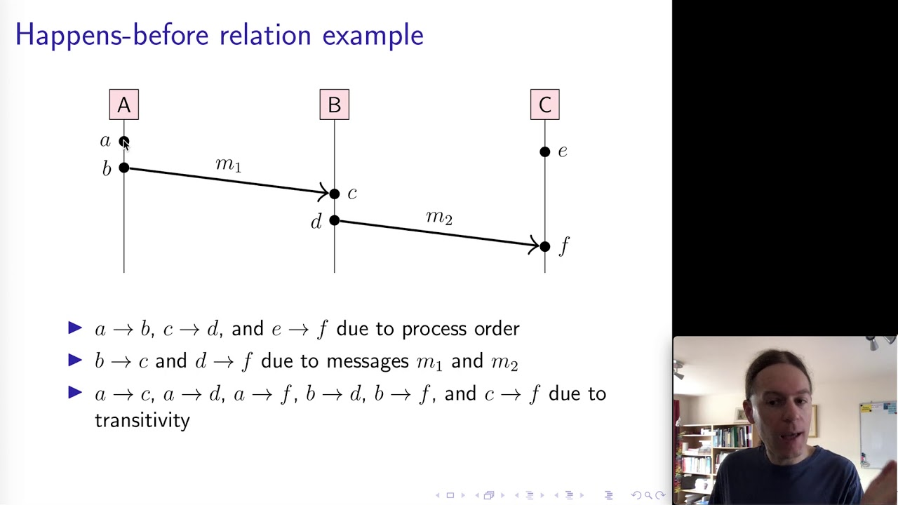
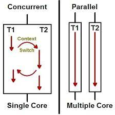

Fundamental property of distributed systems:

Messages sent between machines may arrive zero or more times at any point after they are sent

Avoid implementing or relying on a distrubted system if possible. Otherwise, only use available solutions

# Parallel vs Distributed Systems
*Distributed system* is a software system in which components located on networked computers communicate and coordinate their actions by passing messages.

Difference between *parallel systems* and *distributed systems*:

- parallel systems: use shared memory
- distributed systems: no shared hardware components
- distributed parallel systems: shared memory coordinated with HW/SW that unifies memory accesses across multiple computers

Reasons to use distributed systems:
- scalability
- distribution of tasks and collaboration
- reduced latency
- fault tolerance
- mobility

Distributed system characteristics:
- each computational entity (node) has its own memory: requires synchronization of distributed state
- entities communicate with message passing
- each entity maintains parts of the complete picture
- needs to be fault tolerant; one node failure doesn't fail the entire system.

Why building distributed systems is hard:
- often fails and difficult to spot the failure (split-brain scenarios)
- maintaining order/consistency is hard
- coordination is hard
- partial operation must be possible
- (end-to-end) testing is may be limited to small scaled system
- figuring out cause of bug is hard

Never assume the following always holds in distributed systems. Fallacies of distributed systems:
- Reliable network
- Secure network
- Latency is zero
- Bandwidth is infinite
- Topology doesn't change
- Transport cost is zero 
- Network is homogenous

# Networks
Network systems can be divided into two types in terms of execution order:

- **synchronous system**:  Process execution speeds or message delivery times are bounded. It is relatively simpler to detect problems by looking at:
    Timed failure detection
    Time based coordination
    Worst-case performance

- **asynchronous system**: No assumptions about process execution speeds or message delivery times can be made.

Most distributed systems use some form of mixed synchronous and asynchronous system. When a resposne to a request doesn't arrive within the expected time, this makes it hard to distinguish whether:

- the request was lost
- the remote node is down
- the response was lost

One solution to this is using **timeouts**, where the request is resent until it succeeds. Timeouts are fundamental in async networks and Ethernet, TCP, and most application protocols work with timeouts.

# Time
There are two types of clocks in computers:
- **Real Time Clocks (RTC)**: sync with NTP protocol with centralized servers. The time can jump forward or backward as the system's time-of-day clock is changed
- **Monotonic clocks**: absolute elapsed wall-clock time since some arbitrary, fixed point in the past. only move forward

Monotonic clock is guaranteed to only go forward thus it is best option when computing the elapsed time between two events observed on the one machine without an intervening reboot.

## Problems with computer clocks
Monotonic clocks are maintained by the OS and rely on HW counters exposed by CPUs. They are (usually) good for determining order within a node, but each node only has its own notion of time.

NTP can synchronize time across nodes with an accuracy of ms but a modern CPU can execute 10^6
instructions (× number of cores) in the same ms.

Moreover, **leap seconds** are introduced every now and then; minutes may last for 61 or 59 seconds on occasion. Nanosecond accuracy is possible with GPS clocks, but expensive.

# Main problems with distributed systems
Four main problems with distributed systems
- Partial failures: Some parts of the system may fail nondeterministically, while other parts work fine.
- Unreliable networks: Distributed systems communicate over unreliable networks.
- Unreliable time: Time is a universal coordination principle. However, we cannot use time todetermine order.
- No single source of truth: Distributed systems need to co-ordinate and agree upon a (version of) truth.

## Partial failures
Distributed systems must tolerate partial failures. If a part of the system fails, the entire system must still be functional. Hard to detect whether something failed or not, as the time it takes for a message to travel across a network.

## Unreliable networks
Network failures more common than we might think. Microsoft research states that:
- 5 devices fail per day
- 41 links fail per day
- Load balancers fail with a probability of at least 20% once per year
- Mean Time to Recovery (MTTR) is 5 mins
- Redundancy is not a permanent solution
- Most failures are result of misconfiguration

On the public cloud, a network failure may affect thousands of systems in parallel.

## Unreliable time
In a distributed system, time is the only global constant nodes can rely on to make distributed decisions on ordering problems. Ordering is crucial for the following scenarios:

- Sequencing items in memory
- Mutual exclusion of access to a shared resource
- Encoding history (“happens before” relationships)
- Transactions in a database
- Consistency of distributed data
- Debugging (finding the root cause of a bug)

# Logical time and Order
Renowned computer scientist Lamport introduced **logical time**. The idea is to capture the events relationship between a pair of events rather than using a precise clock time. 

If some event possibly causes another event, then the first event happened-before the other.

Order is a way of arranging items in a set so that the following properties are maintained. Two types of order:

- **strict total order**


- **strict partial order**


Partial order explains how sometimes events happen with no possible causal relationship i.e. not (A -> B or B -> A).


<!-- FIFO is enough to maintain order with a single sender while time at the receiver end is enough to maintain order at the receiver end. -->

When multiple senders/receivers are involved, we need an external ordering scheme:
- **total ordering**: EVERY pair of events can be placed in some order (usually by global time)
- **casual ordering**: order can be defined by a relationship between two events

Total ordering only possible if our message rate is *globally* bounded (e.g. 1 msg/sec/receiver), and less fine-grained than our clock accuracy (e.g. ms range), then synchronized RTCs are enough to guarantee order.

But in real life total global order is not possible. Therefore distributed systems rely on **happens before** relationships

## Happens-before relation
**happens-before** relation captures dependencies between events. It is a **strict partial order** (irreflexive, antisymmetric and transitive), meaning that if one event should happen before another event, the result must reflect that, even if those events are in reality executed out of order (to optimize program flow)


In a distributed system, a process has the following events:
- A process performs some local computation
- A process sends a message
- A process receives a message

In a *happens-before* relation:
- If a and b are events in the same node, and a occurs before b, then a → b
- If a is the event of sending a message and b is the event of receiving that message, then a → b
- The relation is transitive

Here is an example of happens-before relation with transitivity in action:



## Concurrency vs Parallelism
Two events that don't have a **happens-before** relation are said to be **concurrent**.

Concurrency means multiple *independent* tasks are running in overlapping time periods, thus no specific order. This is done in a single core and the tasks can be switched back and forth. It is not the same as paralleism.

Parallelism is about *multiple subtasks from the same task* are running at the same time. This is done via multiple cores and they are all being processed simultaneously.



## Lamport timestamps
Lamport also introduced timestamps.

- Each individual process p maintains a counter: LT(p)
- When a process 'p' performs an action, it increments LT(p)
- When a process 'p' sends a message, it includes LT(p) in the message
- When a process 'p' receives a message from a process 'q', that message includes the value of LT(q); p updates its LT(p) by **max(LT(p),LT(q))+1**


For two events a and b, *if a → b, then LT(a) < LT(b)*. But the same does *not hold for reverse as some events are independent*. Thus LT(a) < LT(b) might be true but if a, b are independent, not necessarily a -> b 


# Vector clocks
**Vector clocks** are used to maintain casual order.

For a system with N nodes, each node i has its own vector Vi of size N.

Vi[i] is the number of events that occurred at node i
Vi[j] is the number of events that node i knows occurred at node j

How vector clocks are updated:
- Local events increment Vi[i]
- When i sends a message to j, it includes Vi
- When j receives Vi, it updates all elements of Vj to *Vj[a] = max(Vi[a],Vj[a])*

Comparing vector clocks:
- Vi=Vj iff Vi[k]=Vj[k] for all k
- Vi<=Vj iff Vi[k]<=Vj[k] for all k
- (Concurrency) Vi||Vj otherwise

For two events a and b and their vector clocks VC(a) and VC(b), the following are guaranteed:
- if a -> b, then VC(a) < VC(b)
- if VC(a) < VC(b), then a -> b

Vector clocks require O(n) timestamps to be exchanged PER communication does expensive. But it is by far the best choice.

Example of vector clock in action:

```
Initial state of vector clocks: [A(0,0,0,0),B(0,0,0,0),C(0,0,0,0),D(0,0,0,0)]

E1. A
sends to C: [A(1,0,0,0),B(0,0,0,0),C(0,0,0,0),D(0,0,0,0)]

E2. C
receives from A: [A(1,0,0,0),B(0,0,0,0),C(1,0,1,0),D(0,0,0,0)]

E3. C
sends to A: [A(1,0,0,0),B(0,0,0,0),C(1,0,2,0),D(0,0,0,0)]

E4. A
receives from C: [A(2,0,2,0),B(0,0,0,0),C(1,0,2,0),D(0,0,0,0)]

E5. B
sends to D: [A(2,0,2,0),B(0,1,0,0),C(1,0,2,0),D(0,0,0,0)]

E6. D
receives from B: [A(2,0,2,0),B(0,1,0,0),C(1,0,2,0),D(0,1,0,1)]
```

## Distributed Decision making
Reaching a consensus in a distrubted system is a fundamental problem. This is due to in a distributed setting:
- nodes can't know anything for sure
- invidiual nodes can't rely on their own information (unsync clocks, unresponsive other nodes)
- *Split-brain* scenarios: Parts of the system know a different version of the truth than the other parts

As mentioned before, there is no single source of truth 

### Reaching consensus
    Resource allocation
    Committing a transaction
    Synchronizing state machines
    Leader election
    Atomic broadcasts

### 2 generals problem


The two generals problem setting:
- 2 armies camped in opposing hills (A1 and A2)
- They must both attack the enemy (B) at the same time to win. Otherwise will lose.
- The are only able to communicate with messengers
- They need to decide on a time to attack
- Enemy (B) is camped between the two hills and can at any time intercept the messengers

This makes the generals of A1 and A2 impossible to sync their time of attack.

### Byzantine generals problem


Consistency vs Isolation


FLP impossibility - in an async network, consensus can't reach if at least one node fails

Async communications


Byzantine general problem:
*we assume only one traitor (malicious) here. 
In real life, not sure exactly how many

PBFT - *Byzantine fault-tolerant* consensus: For N nodes, f faulty ones, N must be of at least size N>=3f+1 in order to reach tolerant consensus
If N is not big enough, maybe able to detect partial malicious nodes but definitely not all of them

Paxos, Raft - *Crash fault-tolerant* consensus with at least N>=2f+1. Here we won't get any malicious messages. So having a  
f + f + 1

In theory, we assume no malicious nodes so no Byzantine scenario. In practice, byzantine scenario more in real life.

State-machine: some logical system that can be in multiple states. A set of transactions defines the transition from one state to another. Normally we assume finite states. (if we define with RTC it can be considered infinite states)

State

## Paxos protocol:
By Lamport. Homogenous system?

Three roles
- Proposer: chooses a value (or receive from client) and sent itt  oa a set of 'acceptors' to collect votes (kind of a leader but not really as it depends on who received the client message)
- Acceptor: Vote to accept or reject the vote
- Learner:

Paxos is actually hard to implement correctly, not many handling of edge cases

In paxos anyone can become a proposer (whoever receives the message from client). THus not guaranteed to be proposer for next client message

In case of two possible proposers (each receive message from different clients at the same time), the node with the higher bottle number will executed first and then the other. 
## Raft consensus algorithm 
Leader based asymmetic model. This is able to choose a new leader once the crash is detected. REmember that this is not byzantine fault-tolerant, only crash fault-tolerant.


Three roles:
- Leader
- Follower
- Candidate

The process starts with the follower 9not leader). If none, becomes for candidate. The majority becomes the leader. The rest can stay in candidate or hears from leader and become follower. Unl

(LEader constantly receives heartbeat from others, and send msg to only the lagging behind node)

IF two concurrent requests, the same leader will get both requests.

If there are multiple candidates for votes and none has the majority of nodes, if some of the vote msgs are lost and no majority vote time for vote againt after timeout (time out is also random for each process). Use randomness and timeouts 


The term value of one value can be different from . Every has current term value (not global view). This taerm value is exchanged in every RPC, 

Guaranteed Raft selects at most one leader at each term

ONce leader is selected, it does log replication. A log entry is committed once the leader that creates the entyr has replicated it on a majority of the servers. 

Commit index is at 7 in the slides. The oens that don't have commit nidex 7 must have been partitioned before index 7 made. The ones with missing indices need to receied first. *anything not committed is lost

Leader appends 9 and then crash wihtout replicate. In taht case only middle can be leader since it has the hightest latest. 
*different colors repreent each term (commites made during different leadership)

FOr the ones without all the commits, those nodes will  get updated once back into the network AND hear from the leader. Before being elected asleader, we must update the term

Raft can 
## Distrubted database
For sync, if another operation in the queue, need to wait until the current one is done for ALL the followers.
For asyn if leader goes down, no way of knowing which nodes successed and which ones failed. In addition all nodes not guaranteed to have same consistent state since each process and finish time can be different and can have different states at a given point.

Hybrid async and sync: 
