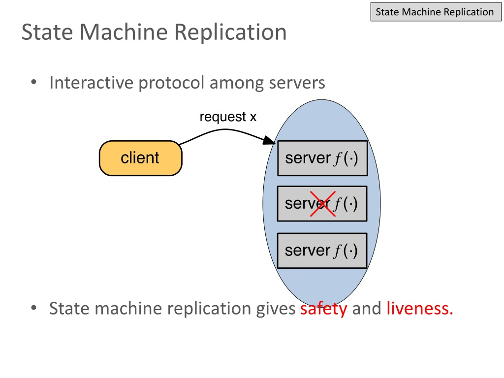

# Intro
The reason why distributed systems are hard to implement:

*Messages sent between machines may arrive zero or more times at any point after they are sent*

*No way to guarantee that something happens precisely once*

**At least once** semantics: 

If possible, avoid distributed systems. 

No single source of truth in a distributed system.

# Parallel vs Distributed Systems
*Distributed system* is a software system in which components located on networked computers communicate and coordinate their actions by passing messages.

Difference between *parallel systems* and *distributed systems*:

- parallel systems: use shared memory
- distributed systems: no shared hardware components
- distributed parallel systems: shared memory coordinated with HW/SW that unifies memory accesses across multiple computers

Reasons to use distributed systems:
- scalability
- distribution of tasks and collaboration
- reduced latency
- fault tolerance
- mobility

Distributed system characteristics:
- each computational entity (node) has its own memory: requires synchronization of distributed state
- entities communicate with message passing
- each entity maintains parts of the complete picture
- needs to be fault tolerant; one node failure doesn't fail the entire system.

Why building distributed systems is hard:
- often fails and difficult to spot the failure (**split-brain scenario**)
- maintaining order/consistency is hard
- coordination is hard
- partial operation must be possible
- (end-to-end) testing is may be limited to small scaled system
- figuring out cause of bug is hard

Never assume the following always holds in distributed systems. Fallacies of distributed systems:
- Reliable network
- Secure network
- Latency is zero
- Bandwidth is infinite
- Topology doesn't change
- Transport cost is zero 
- Network is homogenous: all the nodes in the network have the same function in the 

# Networks
Network systems can be divided into two types in terms of execution order:

- **synchronous system**:  Process execution speeds or message delivery times are bounded. It is relatively simpler to detect problems by looking at:
    Timed failure detection
    Time based coordination
    Worst-case performance

- **asynchronous system**: No assumptions about process execution speeds or message delivery times can be made.

Most distributed systems use some form of mixed synchronous and asynchronous system. When a resposne to a request doesn't arrive within the expected time, this makes it hard to distinguish whether:

- the request was lost
- the remote node is down
- the response was lost

One solution to this is using **timeouts**, where the request is resent until it succeeds. Timeouts are fundamental in async networks and Ethernet, TCP, and most application protocols work with timeouts.

# Time
There are two types of clocks in computers:
- **Real Time Clocks (RTC)**: sync with NTP protocol with centralized servers. The time can jump forward or backward as the system's time-of-day clock is changed
- **Monotonic clocks**: absolute elapsed wall-clock time since some arbitrary, fixed point in the past. only move forward

Monotonic clock is guaranteed to only go forward thus it is best option when computing the elapsed time between two events observed on the one machine without an intervening reboot.

## Problems with computer clocks
Monotonic clocks are maintained by the OS and rely on HW counters exposed by CPUs. They are (usually) good for determining order within a node, but each node only has its own notion of time.

NTP can synchronize time across nodes with an accuracy of ms but a modern CPU can execute 10^6
instructions (× number of cores) in the same ms.

Moreover, **leap seconds** are introduced every now and then; minutes may last for 61 or 59 seconds on occasion. Nanosecond accuracy is possible with GPS clocks, but expensive.

# Main problems with distributed systems
Four main problems with distributed systems
- Partial failures: Some parts of the system may fail nondeterministically, while other parts work fine.
- Unreliable networks: Distributed systems communicate over unreliable networks.
- Unreliable time: Time is a universal coordination principle. However, we cannot use time todetermine order.
- No single source of truth: Distributed systems need to co-ordinate and agree upon a (version of) truth.

## Partial failures
Distributed systems must tolerate partial failures. If a part of the system fails, the entire system must still be functional. Hard to detect whether something failed or not, as the time it takes for a message to travel across a network.

## Unreliable networks
Network failures more common than we might think. Microsoft research states that:
- 5 devices fail per day
- 41 links fail per day
- Load balancers fail with a probability of at least 20% once per year
- Mean Time to Recovery (MTTR) is 5 mins
- Redundancy is not a permanent solution
- Most failures are result of misconfiguration

On the public cloud, a network failure may affect thousands of systems in parallel.

## Unreliable time
In a distributed system, time is the only global constant nodes can rely on to make distributed decisions on ordering problems. Ordering is crucial for the following scenarios:

- Sequencing items in memory
- Mutual exclusion of access to a shared resource
- Encoding history (“happens before” relationships)
- Transactions in a database
- Consistency of distributed data
- Debugging (finding the root cause of a bug)

# Logical time and Order
Renowned computer scientist Lamport introduced **logical time**. The idea is to capture the events relationship between a pair of events rather than using a precise clock time. 

If some event possibly causes another event, then the first event happened-before the other.

Order is a way of arranging items in a set so that the following properties are maintained. Two types of order:

- **strict partial order**: any relation that is reflexive, antisymmetric, and transitive


- **strict total order**: partial order in which every element of the set is comparable with every other element of the set (this forces a linear order or chain)


Partial order explains how sometimes events happen with no possible causal relationship i.e. not (A -> B or B -> A).


<!-- FIFO is enough to maintain order with a single sender while time at the receiver end is enough to maintain order at the receiver end. -->

When multiple senders/receivers are involved, we need an external ordering scheme:
- **total ordering**: EVERY pair of events can be placed in some order (usually by global time)
- **causal ordering**: order can be defined by a relationship between two events

Total ordering only possible if our message rate is *globally* bounded (e.g. 1 msg/sec/receiver), and less fine-grained than our clock accuracy (e.g. ms range), then synchronized RTCs are enough to guarantee order.

But in real life total global order is not possible. Therefore distributed systems rely on **happens before** relationships

## Happens-before relation
**happens-before** relation captures dependencies between events. It is a **strict partial order** (irreflexive, antisymmetric and transitive), meaning that if one event should happen before another event, the result must reflect that, even if those events are in reality executed out of order (to optimize program flow)


In a distributed system, a process has the following events:
- A process performs some local computation
- A process sends a message
- A process receives a message

In a *happens-before* relation:
- If a and b are events in the same node, and a occurs before b, then a → b
- If a is the event of sending a message and b is the event of receiving that message, then a → b
- The relation is transitive

Here is an example of happens-before relation with transitivity in action:


## Concurrency vs Parallelism
Two events that don't have a **happens-before** relation are said to be **concurrent**.

Concurrency means multiple *independent* tasks are running in overlapping time periods, thus no specific order. This is done in a single core and the tasks can be switched back and forth. It is not the same as paralleism.

Parallelism is about *multiple subtasks from the same task* are running at the same time. This is done via multiple cores and they are all being processed simultaneously.


## Lamport timestamps
Lamport also introduced timestamps.

- Each individual process p maintains a counter: LT(p)
- When a process 'p' performs an action, it increments LT(p)
- When a process 'p' sends a message, it includes LT(p) in the message
- When a process 'p' receives a message from a process 'q', that message includes the value of LT(q); p updates its LT(p) by **max(LT(p),LT(q))+1**


For two events a and b, *if a → b, then LT(a) < LT(b)*. But the same does *not hold for reverse as some events are independent*. Thus LT(a) < LT(b) might be true but if a, b are independent, not necessarily a -> b 


# Vector clocks
**Vector clocks** are used to maintain causal order.

For a system with N nodes:
- each node i has its own vector clock Vi of size N
- Vi[i] is the number of events that occurred at node i
- Vi[j] is the number of events that node i knows occurred at node j

How vector clocks are updated:
- Local events increment Vi[i]
- When i sends a message to j, it includes Vi
- When j receives Vi, it updates all elements of Vj to *Vj[a] = max(Vi[a],Vj[a])*

Comparing vector clocks:
- Vi=Vj iff Vi[k]=Vj[k] for all k
- Vi<=Vj iff Vi[k]<=Vj[k] for all k
- (Concurrency) Vi||Vj otherwise

For two events a and b and their vector clocks VC(a) and VC(b), the following are guaranteed:
- if a -> b, then VC(a) < VC(b)
- if VC(a) < VC(b), then a -> b

Vector clocks require O(n) timestamps to be exchanged PER communication does expensive. But it is by far the best choice.

Example of vector clock in action:

```
Initial state of vector clocks: [A(0,0,0,0),B(0,0,0,0),C(0,0,0,0),D(0,0,0,0)]

E1. A
sends to C: [A(1,0,0,0),B(0,0,0,0),C(0,0,0,0),D(0,0,0,0)]

E2. C
receives from A: [A(1,0,0,0),B(0,0,0,0),C(1,0,1,0),D(0,0,0,0)]

E3. C
sends to A: [A(1,0,0,0),B(0,0,0,0),C(1,0,2,0),D(0,0,0,0)]

E4. A
receives from C: [A(2,0,2,0),B(0,0,0,0),C(1,0,2,0),D(0,0,0,0)]

E5. B
sends to D: [A(2,0,2,0),B(0,1,0,0),C(1,0,2,0),D(0,0,0,0)]

E6. D
receives from B: [A(2,0,2,0),B(0,1,0,0),C(1,0,2,0),D(0,1,0,1)]
```

# Distributed Decision making
Reaching a consensus in a distrubted system hard because the systems are distributed. This causes:
- nodes can't know anything for sure
- invidiual nodes can't rely on their own information (unsync clocks, unresponsive other nodes)
- **Split-brain** scenarios: Parts of the system know a different version of the truth than the other parts

As mentioned before, there is no single source of truth thus the entire nodes must come to an agreement/consensus in case of a faulty node. Consensus includes the following:

- Resource allocation
- Committing a transaction
- Synchronizing state machines
- Leader election
- Atomic broadcasts

# Theoretical problems 
In theory we don't assume any byzantine settings (although we should as this happens a lot in real life).

## FLP impossibility
The **The FLP impossibility** states in a distributed system with the following constraints:
- async network
- no clocks nor timeouts
- no random number generators

Under these constraints if at least one node fails consensus can't be reached. But in real life this can be solved using randomization and partial synchrony.

## 2 generals problem
The two generals problem setting:
- 2 armies camped in opposing hills (A1 and A2)
- They must both attack the enemy (B) at the same time to win. Otherwise will lose.
- The are only able to communicate with messengers
- They need to decide on a time to attack
- Enemy (B) is camped between the two hills and can at any time intercept the messengers


This makes the generals of A1 and A2 impossible to sync their time of attack. Of course in real life this can be (partially) solved using randomization, timeouts, partial synchronization.

## Byzantine generals problem
In real life nodes can not only be faulty but can also be malicious. They are called **byzantine nodes**.

This problem simulates the presence of a byzantine node. Here we assume only one traitor (malicious) here. In real life, we never know exactly how many.

- 3 divisions of the Byzantine army are camped outside an enemy city, each division commanded by its own general.
- They must decide upon a common plan of action: Attack or Retreat.
- The generals can communicate with each other only by messengers.
- There might be a traitor (malicious or arbitrary behavior).
- All loyal generals must agree on a plan.

# Consensus protocol
A consensus protocol defines a set of rules for message exchange and processing for distributed components to reach agreement.

Basic properties of crash fault-tolerant consensus protocols include:

- Safety: Never returning an incorrect result *in the presence of non-Byzantine conditions.
- Availability: Able to provide an answer if (n/2) + 1 nodes are operational
- No clocks: They do not depend on RTCs to work
- Immune to stranglers: If n/2+1 nodes vote, then the result is considered safe.

## Fault tolerant consensus
There are several kinds of consensus protocols with different purposes. For N nodes, f faulty nodes:

- **Practical Byzantine Fault Tolerance** or **PBFT**: a *Byzantine fault-tolerant* consensus protocol. N must be of at least size *N>=3f+1* in order to reach tolerant consensus.
*If N is not big enough, may be able to detect some malicious nodes but definitely not all of them

- **Paxos**, **Raft**: a *crash fault-tolerant* consensus protocol. N must be of at least size   *N>=2f+1*. 
*Here we don't assume any byzantine nodes. 

## State machine replication
**State-machine**: some logical system that can be in multiple states. A set of transactions defines the system from one state to another. Normally we assume finite states but if we define the system with RTC it can be considered infinite states.

A **SMR** system is one that where the state-machines are replicated to implement a fault-tolerante distributed system. We literally replicate servers and coordinate client interactions with server replicas. 



Consensus algorithms can be used in SMR systems to keep the log module of replicated state machines in sync:
- Consensus protocol provides all replicas to agree on the same order of commands/entries.
- Paxos and Raft are crash fault tolerant consensus protocols for SMR systems

## Paxos consensus protocol:
The **paxos consensus protocol** has three roles:

- **Proposer**: the node chooses a value (or receive from client) and sends it to a set of *acceptors *to collect votes.
- **Acceptor**: vote to accept or reject values proposed by *proposer*. For fault tolerance only requires majority of acceptor votes, not all of them.
- **Learner**: when proposal passed, adopts the new value

About paxos the protocol
- Every proposal consists of a value, proposed by the client, and a unique monotonically increasing proposal number, aka **ballot number**.
- Any node can become a proposer: whoever receives the message from client becomes the new proposer.
- In case of two possible proposers (each receive message from different clients at the same time), the node with the higher batllot number will be executed first and then the other.

Paxos is actually hard to implement correctly and it doesn't handle many edge cases.

There are 4 steps in the protocol
1. Prepare: proposer selectes **proposal number** n and sends **prepare** request to acceptors
2. Promise: If the n is higher than every previous proposal number received, then Acceptors return **promise** to Proposer. 
If the Acceptor accepted a proposal at some point in the past, it must include the previous proposal number, say m, and the corresponding accepted value, say w, in its response to the Proposer.
3. If the proposer receives a response from a majority of acceptors, then it sends an **accept** request for the proposal n with the highest-numbered proposal among the responses.
4. If acceptor receives **accept** for a proposal n, it accepts proposal n unless it has already responded to a prepare request having a number greater or equal than the proposal number n.


## Raft consensus protocol 
Rapt is a **leader-based** asymmetic model. This means there is a new leader once a crash is detected. Remember that this is not byzantine fault-tolerant, only crash fault-tolerant.

Three roles:
- **Leader**: accepts log entries from clients (not other nodes), replicates them on other servers
- **Follower**: replicate the leader’s state machine
- **Candidate**: candidate for being a leader, asks for votes

About the leader elecetion :
- process starts with the follower, not the leader. If there is no leader, followers can becomes candidates. The candidate with the majority vote becomes the leader. The rest revert back to being a follower to replicate the leader's state machine.
- Raft selects at most one leader at each term. For some terms, the election may fail and result in no leader for that term.
- Each node maintains current term value (not gloval view). This term value is exchanged in every RPC
- Leader constantly receives heartbeat from others, and send msg to only the lagging behind node
- If two concurrent requests, the same leader will get both requests.
- Some of the vote msgs may get lost and no majority vote. Then we use timeouts and randomness to vote again.


When leader is elected, the leader accepts log entries from clients and replicates them across the servers:

- Each log entry has an integer index identifying its position in the log.
- The leader sends AppendEntries message to append an entry to the log
- A log entry is committed once the leader that created the entry has replicated it on a majority of the servers.
- Before being elected as leader the soon-to-be leader's **term**(commites made during different leadership) must be updated

About the below visual:
- Different colors represent different terms
- The last node's commit index is at 7. The nodes that don't have commit at index 7 must have been partitioned before that commit was made. The ones with missing indices need to receive it first as anything not committed is lost.


Assum from above that the leader appends commit at index 9 and then crash without replicate. In that case only middle node can be leader since it has the hightest index out of the other candidates. 
