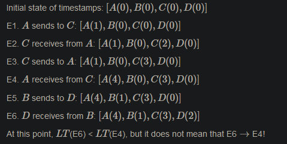

# Distributed systems
Avoid implementing or relying on a distrubted system if possible. Otherwise, only use available solutions

## Characteristics
*Distributed system* is a software system in which components located on networked computers communicate and coordinate their actions by passing messages.

There is a difference between *parallel systems* and *distributed systems*:

- parallel systems: use shared memory
- distributed systems: no shared hardware components
- distributed parallel systems: shared memory coordinated with HW/SW that unifies memory accesses across multiple computers

Reasons to use distributed systems:
- Scalability
- distribution of tasks and collaboration
- Reduced latency
- Fault tolerance
- Mobility

Distributed system characteristics:
- Computational entities each with own memory: requires synchronization of distributed state
- Entities communicate with message passing
- Each entity maintains parts of the complete picture
- Need to tolerate failure

Why building distributed systems is hard:
- They fail often and often difficult to spot (split-brain scenarios)
- Maintaining consistency is hard
- Coordination is hard
- Partial operation must be possible
- Testing is hard
- Profiling the lag/bug is hard

Never assume the following always holds in distributed systems. Fallacies of distributed systems:
- Reliable network
- Secure network
- Latency is zero
- Bandwidth is infinite
- Topology doesn't change
- Transport cost is zero
- Network is homogenous

## Main problems
Four main problems with distributed systems
- Partial failures: Some parts of the system may fail nondeterministically, while other parts work fine.
- Unreliable networks: Distributed systems communicate over unreliable networks.
- Unreliable time: Time is a universal coordination principle. However, we cannot use time determine order.
- No single source of truth: Distributed systems need to co-ordinate and agree upon a (version of) truth.

### Partial failures
Distributed systems must tolerate partial failures. If a part of the system fails, the entire system must still be functional. Hard to detect whether something failed or not, as the time it takes for a message to travel across a network.

## Networks
Network systems can be divided into two types in terms of execution order:

- synchronous system:  Process execution speeds or message delivery times are bounded. It is relatively simpler to detect problems by looking at:
    Timed failure detection
    Time based coordination
    Worst-case performance
- asynchronous system: No assumptions about process execution speeds or message delivery times can be made.

Most distributed systems use some form of asynchronous networking to communite, never pure synchronous. When a resposne to a request doesn't arrive within the expected time, this makes it hard to distinguish whether:

- the request was lost
- the remote node is down
- the response was lost

One solution to this is using *timeouts*, where the request is resent until it succeeds. Timeouts are fundamental in async networks and Ethernet, TCP, and most application protocols work with timeouts.

### Unreliable networks
Microsoft research discoverd that

- 5 devices per day fail
- 41 links per day fail
- Load balancers fail with a probability of at least 20% once per year
- Mean Time to Recovery (MTTR) is 5 mins
- Redundancy is not a permanent solution
- Most failures are result of misconfiguration

On the public cloud, a network failure may affect thousands of systems in parallel.

## Time

### Time in computer systems
There are two types of clocks in computers:
- Real Time Clocks (RTC): sync with NTP protocol with centralized servers. The time can jump forward or backward as the system's time-of-day clock is changed
- Monotonic clocks: absolute elapsed wall-clock time since some arbitrary, fixed point in the past. only move forward

To compute the elapsed time between two events observed on the one machine without an intervening reboot, monotonic clock is the best option as it is guaranteed to only go forward.

Monotonic clocks are maintained by the OS and rely on HW counters exposed by CPUs. They are (usually!) good for determining order within a node, but each node only has its own notion of time.

NTP can synchronize time across nodes with an accuracy of ms. A modern CPU can execute 10^6
instructions (× number of cores) in an ms!

Moreover, *leap seconds* are introduced every now and then; minutes may last for 61 or 59 seconds on occasion. Nanosecond accuracy is possible with GPS clocks, but expensive.

### Unreliable time
In a distributed system, time is the only global constant nodes can rely on to make distributed decisions on ordering problems. Ordering is crucial for the following scenarios:

- Sequencing items in memory
- Mutual exclusion of access to a shared resource
- Encoding history (“happens before” relationships)
- Transactions in a database
- Consistency of distributed data
- Debugging (finding the root cause of a bug)

### Logical time and Order
Renowned computer scientist Lamport introduced *logical time*. The idea is to capture the events relationship between a pair of events rather than using a precise clock time. If some event possibly causes another event, then the first event happened-before the other.

Order is a way of arranging items in a set so that the following properties are maintained. There is *strict partial order*:

*strict total order*:

FIFO is enough to maintain order with a single sender while time at the receiver end is enough to maintain order at the receiver end.

When multiple senders/receivers are involved, we need external ordering scheme:
- Total order: If our message rate is globally bounded (e.g. 1 msg/sec/receiver), and less fine-grained than our clock accuracy (e.g. ms range), then synchronized RTCs are enough to guarantee order.
- Causal order: Otherwise, we need to rely on *happens before* relationships

### Happens-before relation
Lamport introduced *happens-before* relation to capture dependencies between events. It is a strict partial order (irreflexive, antisymmetric and transitive.). THis means that if one event should happen before another event, the result must reflect that, even if those events are in reality executed out of order (to optimize program flow)

In a distributed system, a process has the following events:
- A process performs some local computation
- A process sends a message
- A process receives a message

In a *happens-before* relation:
- If a and b are events in the same node, and a occurs before b, then a → b
- If a is the event of sending a message and b is the event of receiving that message, then a → b
- The relation is transitive

Two events not related to this relation are *concurrent*

### Lamport timestamps
Lamport introduced the eponymous logical timestamps in 1978.

- Each individual process p maintains a counter: LT(p)
- When a process 'p' performs an action, it increments LT(p)
- When a process 'p' sends a message, it includes LT(p) in the message
- When a process 'p' receives a message from a process 'q', that message includes the value of LT(q); p updates its LT(p) to the max(LT(p),LT(q))+1

For two events a and b, if a→b, then LT(a) < LT(b). But the same does not hold for reverse. This is because some events are independent. Thus LT(a) < LT(b) might be true but if a, b are independent, not necessarily a -> b 

### Vector clocks
 
## Concurrency
Concurrency means multiple computations are happening at the same time. It is everywhere in modern computing: multiple computers in a network and multiple applications running on one computer

## Distributed Decision making
Reaching a consensus in a distrubted system is a fundamental problem. This is due to in a distributed setting:
- nodes can't know anything for sure
- invidiual nodes can't rely on their own information (unsync clocks, unresponsive other nodes)
- *Split-brain* scenarios: Parts of the system know a different version of the truth than the other parts

As mentioned before, there is no single source of truth 

### Reaching consensus
    Resource allocation
    Committing a transaction
    Synchronizing state machines
    Leader election
    Atomic broadcasts

### 2 generals problem

The two generals problem setting:
- 2 armies camped in opposing hills (A1 and A2)
- They must both attack the enemy (B) at the same time to win. Otherwise will lose.
- The are only able to communicate with messengers
- They need to decide on a time to attack
- Enemy (B) is camped between the two hills and can at any time intercept the messengers

This makes the generals of A1 and A2 impossible to sync their time of attack.

### Byzantine generals problem