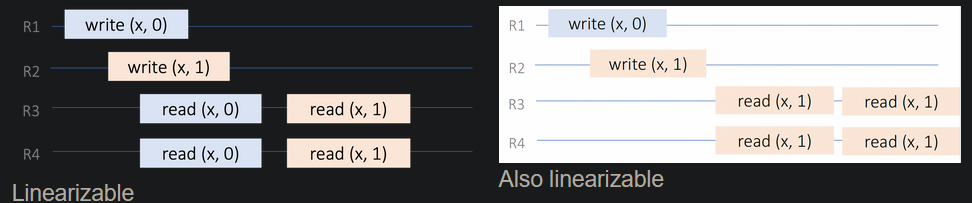

# Distributed databases
Simply a distributed system that allows read/write access to data.

Three properties
- replication: keep a copy of the same data on several different nodes
- partitioning: split the database into smaller subsets and distribute the partitions to different nodes
- transactions: units of work that group several reads and writes to be performed together in the database

## Replication
Replication allows the following
- data scalability: allow more machines to serve read-only requests, increases read throughput
- geo scalability: data geographically close to clients
- fault tolerance: if a part of the system goes down, the entire system should still work

Steps for replication:
1. Take a consistent snapshot from the leader
2. Ship it to the replicas
3. Get an id of the leader’s replication log state at the time of snapshot creation
4. Initialize the replication function to the latest leader id
5. The replica must retrieve and apply the replication log until it catches up with the leader

Replication example:
```
> SHOW MASTER STATUS;
+--------------------+----------+
| File               | Position |
+--------------------+----------+
| mariadb-bin.004252 | 30591477 |

>CHANGE MASTER TO
  MASTER_HOST='10.0.0.7',
  MASTER_USER='replicator',
  MASTER_PORT=3306,
  MASTER_CONNECT_RETRY=20,
  MASTER_LOG_FILE='mariadb-bin.452',
  MASTER_LOG_POS= 30591477;
```

Replication result:
```
> SHOW SLAVE STATUS\G

Master_Host: 10.0.0.7
Master_User: replicator
Master_Port: 3306
Master_Log_File: mariadb-bin.452
Read_Master_Log_Pos: 34791477
Relay_Log_File: relay-bin.000032
Relay_Log_Pos: 1332
Slave_IO_Running: Yes
Slave_SQL_Running: Yes
```

### Replication log implementation
When logs are to be replicated, different ways to replicate them:
- **statement based**: replicate by copying the exact write statement of the master/leader
- **write-ahead log based**: before any actual replication, the followers write the intended change to an append-only **write-ahead log** or **WAL**
- **logical based**: database generates a stream of logical updates for each update to the WAL

Statement-based replication is non-deterministic and almost never used. Because state of one node is never guaranteed to be the same for the state of another node. Below, the NOW() is different per node:
```
UPDATE foo
SET updated_at=NOW()
WHERE id = 10
```

WAL-based replication *writes all changes to the leader WAL*. The followers apply the WAL entries to get consistent data. Problematic as WAL is bound to the current data structure. If leader's data structure changes, followers stop working.

In logical-based replication the database generates a stream of **logical updates** for each update to the WAL. Logical updates can be:
- For new records, the values that were inserted
- For deleted records, their unique id
- For updated records, their id and the updated values

### Replication distribution
Replication distribution:
- synchronous: leader reports success when certain number of followers confirm writes were made on their disks 
- asynchronous: leader reports success immediately after write committeed to its own disk. followers apply changes on their own pace

#### Synchronous distribution
- A follower is guaranteed to have an up-to-date copy of the data that is consistent with the leader.
- If the leader suddenly fails, we can be sure that the data is still available on the follower.
- If the synchronous follower does not respond, the write cannot be processed.
- The leader must block all writes and wait until the synchronous replica is available again.


With sync, the current write must be completed before leader can start any other write replication. If another write operation in the queue, need to wait until certain number of followers are done replicating the current one; it’s *impractical for all followers to be synchronous*.

#### Asynchronous distribution
- Higher availability: The leader does not need to block writes in case of inaccessible follower.
- A follower is not guaranteed to have an up-to-date copy of the data that is consistent with the leader.
- Writes are not guaranteed to be durable in case of leader failure.


For asyn if leader goes down, no way of knowing which nodes successed and which ones failed. In addition all nodes not guaranteed to have same consistent state since each process and finish time can be different and can have different states at a given point.


Async is hard to implement due to many possible problems:
- **Read-after-write**: Clients may not see their own writes, i.e., when they connect to a replica which does not have the update.
- **(non-) Monotonic reads**: When reading from multiple replicas concurrently, a stale replica might not return records that the client read from an up to date one.
- **Causality violations**: Updates might be visible in different orders at different replicas. This allows for violations of the happened-before property.

### Replication architecture
In a replicated system, there are two node roles:
- leader/master: node that accepts write queries from clients
- follower/slaves/replicas: nodes that provide *read-only access* to data

Several replication architecture depending on the role configurations:
- leader-based or master-slave: a single leader accepts writes and distributes the update to followers
- multi-leader: multiple leaders accept writes while keeping themselves in sync. Then distributes update to followers
- leaderless: All nodes are peers in the replication network

#### Multi-leader replication
Multiple leaders to accept writes. Replication to followers is similiar to single-leader case. Here **write conflicts** may arise, which is when multiples leaders concurrently update the same record:


Code example:
```
                                # Clock
# User 1
git clone git://....            # t+1
git add foo.c                   # t+2
git commit -a -m 'Hacked v1'    # t+3
git push                        # t+5

# User 2
git clone git://....            # t+2
git add foo.c                   # t+5
git commit -m 'Hacked new file' # t+6
git push # fails                # t+7
git pull # CONFLICT             # t+7
```

To avoid this, we can have *one leader per session*.

Or converge to consistent state by applying the one of the following conflict resolution policies:
- **last-write-wins** policy: order writes by timestamp (may lose data)
- **report conflict to application** policy: let the application resolve the conflicts(like Git or Google docs)
- **conflict-free data types** policy: use conflit-free data types with specific conflict resolution logics

#### Leaderless replication
No leader exists in this scenario -> any node (replica) can accept read/write queries from the clients.

Writes are successful if written to W replicas and reads are successful if written to R replicas.
For W, R and N replicas:
- if W + R > N : We expect to read up-to-date value
- if W < N : We can process writes if a node is unavailable
- if R < N : We can process reads if a node is unavailable


Replication of a total order of operations is fundamentally a consensus problem.

## CAP theorem
The **CAP theorem** states that in a replicated system it is impossible to get all three of:
- (Strong) Consistency: All nodes in the network have the same (most recent) value
- Availability: Every request to a non-failing replica receives a response
- Partition tolerance: The system continues to operate even if component or network faults

Synchronous replication: Strong consistency but not always available
Data not always available in case a failure of any replicas.

Asynchronous replication: Always available but not strong consistency
Replicas may not have up to date data.

*Trade-off is not “Availability vs Consistency” but “Availability vs Strong Consistency”*

## Consistency model
**Consistency model** is a contract between programmer and replicated system, i.e., it specifies the consistency between replicas and what can be observed as possible results of operations.

It answers questions such as:
- What are the possible results of a read query?
- Can a client see its own updates?
- Is the causal order of queries preserved at all copies of data?
- Is there a total order of operations preserved at all replicas?


**Strong consistency** means maintaining the illusion of a single copy. These models trade off availability for strong consistency. Focuses on *total order*

Two main types of weak consistency models:
- Sequential consistency
- Linearizable consisntency

**Weak consistency models** trade-off strong consistency for better performance. Focuses on *partial order*

Three main types of weak consistency models:
- Eventual consistency
- Causal consistency
- Client-centric consistency models (Read your writes, monotonic reads, monotonic writes)

### Strong consistency: Sequential consistency
Here the operations take place in some *total order* that is consistent with the order of operations for ALL replicas. This doesn't consider the true order of operations that happen in real time. Therefore the following two examples are sequentially consistent:


But the following is not sequentially consistent as the orders of R3 and R4 are different.


### Strong consistency: Linearizable consistency
This combines sequential consistency + the total order of operations conform to the real time ordering:


The following is linearlizable:



The following is NOT lienarlizable as it doesn't show the true order of real time:


It has the following property:
- As soon as writes complete successfully, the result is immediately replicated to all nodes atomically and is made available to reads.
- At any time, concurrent reads from any node return the same values.

### Weak consistency: Eventual consistency
All updates eventually delivered to all replicas.

All replicas reach consistent steate once no more user updates arrive.

Examples:
- Search engines: Search results are not always consistent with the current state of the web
- Cloud file systems: File contents may be out-of-sync with their latest versions
- Social media applications: Number of likes for a video may not be up to date

### Weak consistency: Causal consistency
Causally related operations deliverd to other replicas in correct order; maintains a *partial order* of events based on causality.

The following is allowed:


The following is NOT allowed as it breaks partial order:


Ideal for messaging applications.

### Weak consistency: Client-centric consistency
Provide guarantees about ordering of operations *only for a single client process*:

- **Monotonic reads**: If a process reads the value of x, any successive read operation on x by that process will always return that same value or a more recent value.
- **Monotonic writes**: If a process writes a value to x, the replica on which a successive operation is performed reflects the effect of a previous write operation by the same process
- **Read your writes**: The effect of a write operation by a process on x will always be seen by a successive read operation on x by the same process
- **Writes follow reads**: If a process writes a value to x following a previous read operation on x by the same process, it is guaranteed to take place on the same or more recent values of x that was read.

## Partitioning
Partitioning breaks the whole dataset into different parts and distributes them to different hosts. Also known as **sharding**. 

Partition allows queries to be run in parallel on parts of the dataset, and read/write are spread on multiple machines.

Three types of partitioning:
- **Range partitioning**: Takes into account the natural order of keys to split the dataset in the required number of partitions. Requires keys to be naturally ordered and keys to be equally distributed across the value range.
- **Hash partitioning**: Calculates a hash over the each item key and then produces the modulo of this hash to determine the new partition.
- **Custom partitioning** Exploits locality or uniqueness properties of the data to calculate the appropriate partition to store the data to. An example would be pre-hashed data (e.g. git commits) or location specific data (e.g. all records from Europe).


On partitioned datasets, clients need to be aware of the partitioning scheme in order to direct queries and writes to the appropriate nodes. But most partitioned systems feature a **query router** component that sits between client and the partitions. The query router knows the employed partitioning scheme and directs requests to the appropriate partitions.

Partitioning is always combined with replication as a node failure will result in irreversible data corruption. As shown below, each shard has the primary dataset part and secondary (replicated) dataset parts:


## Transactions
(read up on at night)
### Isolation vs Consistency


# Distrubted filesystems
Windows and MaxOSX already have network filesystems. But additional distriuted filesystems are needed as big data processing arose:
- Availability across different locations
- Existing file systems like CIFS NFS, are not distributed, as there is a centralized server to maintain consistency, therefore could create bottleneck as data size became bigger.

## Google filesystem
**Google filesystem** is first notable distributed file system. It is able to:
- Process large sized files and large number of files
- Two main reads: large streaming reads and rare small random reads
- Process data in bulk at high rate
- Fault tolerant
- High availability

The GFS architecture has:
- single master (but can also be replicated)
- multiple chunkserers
- multiple clients can connect to GFS

The GFS storage model:
- single file can contain many objects (web documents)
- Files are divided into fixed size chunks (64MB) with unique identifers generated at insertion time
- Single file larger than node's disk space
- fixed size makes allocation computations easy
- Files are replicated across chunk servers (at least 3, so can be in 1 chunk server of 3 instances or 1 instance for 3 different chunk server)
- Neither client nor chunkserver cache file data as the data is huge.

GFS write:
1. Client sends a request to master server
2. MASTER SENDS TO CLIENT THE LOCATION O THE CHUNKSERVER replica and primary replica
3. Client sends the write data to all replicas chunk server's buffer
4. Once replicas receive dat, client teslls primary replica to begin the write function (primary assigns serial number to write requests)
5. The primary replica writes the data to the appropriate chunk and same is done on secondary replicas
6. The secondary replias complte the write function and reports back to primary
7. primary sends confimation to client
(eventual consistency. If one of the replicas fail, it will come back alive in stale state and retry to be consistent)


GFS operation:
- master does not keep a persistent reor of chunk locations but instead queries the chunk servers at statup and then updated by periodic polling.
- GFS is a journaled file
- If current master fails, recovers by rerunning the operation log
- If chunkserver fails, it just restarts

GFS consistency model:
- Has a *relaxed consistency model* (**eventual consistency**) that supports highly distributed applications. 
- File namespace mutations are atomic (handled in master), handled in a global order
- State of file region (kept in chunkserver), whether it is concurrent mutaion or single one


Terms used specifically for GFS:
- Write: changes to data are orderesd as chosen by a primary
- Record append: completes atomically at least once
- Consistent: if all clients see always the same data, regardless of which replicas they read from
- Defined: if the region is consistent and clients will see what the mutation writes in its entirety

defined but inconsistent (writes guaranteed to be happen at least once)

GFS favors availability over strong consistency.

learn what happens in what mutation and such

## HDFS - Hadoop Distributed File System
Unlike GFS it is opensource. Same architecture as GFS but different names

Big data processing in distributed setting. It is expensive to move data from one location to other

- Latency. For accessing data in memory, it is 1000 slower on disk and in network 1000000 slower
- Partial failure. 100s of machines may fail at any time

