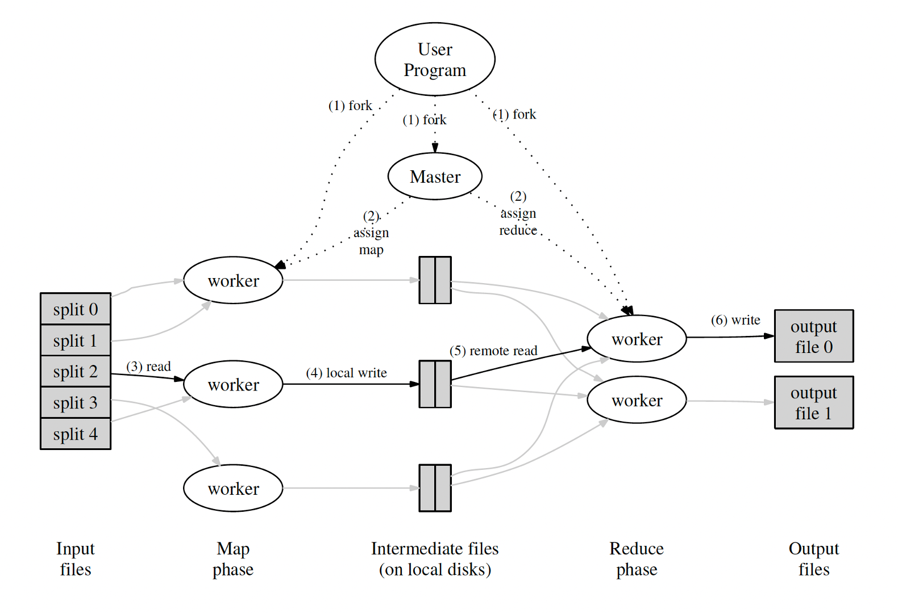
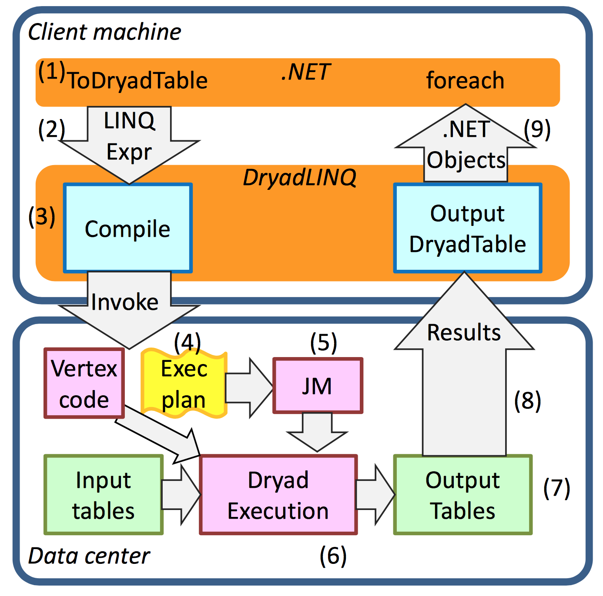

# Parallelism meets data processing
Parallelism is about speeding up computations by using multiple processors.

- **Task parallelism**: Different computations performed on the same data
- **Data parallelism**: Apply the same computation on dataset partitions

BDP in a distributed setting is hard due to:
- Latency: accessing data is 1000x slower on disk and in network 1000000x slower than accessing data in memory
- Partial failure: 100s of machines may fail at any time

# Map/Reduce model
The **map/reduce model** is a programming model for processing big data sets with a parallel, distributed algorithm on a cluster. It has a **map phase** and **reduce phase** and both done in parallel.

```
map(List[(K1, V1)], f: (K1, V1) -> (K2, V2)): List[(K2, V2)]
reduce((K2, List[V2])): List[(K3, V3)]
```



- DFS chunks are assigned to Map tasks processing each chunk into a sequence of KV pairs.
- Periodically, the buffered pairs are written to local disk.
- The keys are divided among all Reduce tasks.
- Reduce tasks work on each key separately and combine all the values associated with a specific key.

## Hadoop Map/Reduce


The above model is fault tolerant but lacks performance:
- Before each Map and Reduce phase, there are these shuffling and iterative writes; significant latency
- If a problem requires iteration, the whole cycle has to be repeated. Thus hard to express iterative problems in M/R

## DryadLINQ



## FlumeJava
From Google

Not only Map/Reduce provides other simple abstractions for programming data-parallel computations. In practice, not very easy to work with.

```
PTable<String,Integer> wordsWithOnes =
  words.parallelDo( new DoFn<String, Pair<String,Integer>>() {
    void process(String word,
                  EmitFn<Pair<String,Integer>> emitFn) {
      emitFn.emit(Pair.of(word, 1));
    }
  }, tableOf(strings(), ints()));

PTable<String,Collection<Integer>>
  groupedWordsWithOnes = wordsWithOnes.groupByKey();

PTable<String,Integer> wordCounts =
  groupedWordsWithOnes.combineValues(SUM_INTS);
```

# Spark
New technology (created in 2009). Originally most systems are built around acyclic (not iterable). Spark is open source cluster computing framework. While spark itself is implemented in Scala. It uses the 'Akka' actor framework to handle distributed state and Netty to handle networking. 

Also available in Python to allow python programs to acces java objects in a remote JVM. The PySpark PI is designed to do most compuations in the remote JVM, if processing needs to happen IN Python

## RDD (Resilient Distributed Dataset)
RDDs are the core abstraction that Spark uses.
Huge dataset (immutable). Reside mostly in memory

First create spark context (sc). Turn this into a RDD, and use this RDD to apply functional proramming. All these transformations (take, foreach, reducebykey) create a NEW RDD

To create an RDD:
- read data from exetrnal source
- convert a local memory dataset to distributed one
- Transform existing RDD

In RDD:
- Transformation: Applying a function that returns a new RDD. They are lazy.
- Action: Request the computation of a result. They are eager.

In Scala, lists are eager but in RDD is lazy by default

```
// This just sets up the pipeline
val result = rdd
  .flatMap(l => l.split(" "))
  .map(x => (x, 1))

// Side-effect, triggers computation
result.foreach(println)
```

Some common RDD transformation:
- map
- flatmap
- filter 
- split

We can't have a nested RDD of RDDs; only an array of RDDs.

Before action, we create a pipeline. With action, we actually perform the computation (lazy)

WIth transform, we create new RDDs but it is not like a new RDD on top of another in the memory. When the action is executed, Spark optimizes the RDDs so won't have to worry about memory overflow.


Common actions on RDDs:
- collect
- take
- reduce, fold
- aggregate (new in Spark)


aggregate vs fold: types are different. With aggregate tye type may be different etween A and B, with fold they are all the same type.

With transformation we create new RDD and with an action we finally compute the RDD (no more RDD) 