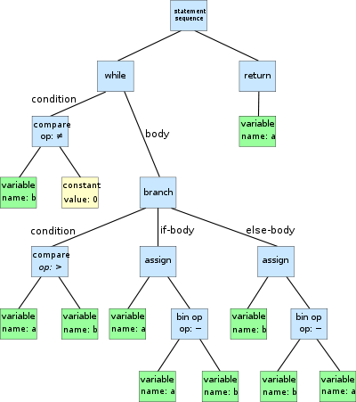

# Spark
Relatively new technology (created in 2009). 

Originally most systems are built around acyclic (not iterable). 

Spark is open source cluster computing framework. 

It uses the **Akka** actor framework to handle distributed state and **Netty** to handle networking. 

- automates distribution of data and computations on a cluster of computers
- provides a fault-tolerant abstraction to distributed datasets
- is based on functional programming primitives
- provides two abstractions to data, list-like (**RDD**) and table-like (**Dataset**)

Also available in Python to allow python programs to acces java objects in a remote JVM. The PySpark PI is designed to do most compuations in the remote JVM, if processing needs to happen IN Python

# RDD (Resilient Distributed Dataset)
**RDD** is the core abstraction that Spark uses.

RDD makes datasets that are distributed over a cluster of machines look like a Scala collection.

RDD properties:
- immutable
- reside mostly in memory (fast)
- transparently distributed
- features all FP primities

How spark uses RDD:
1. create spark context (sc)
2. convert this into a RDD
3. use this RDD to apply functional programming. 

To create an RDD:
- read data from external source
```
val rdd1 = sc.textFile("hdfs://...")
val rdd2 = sc.textFile("file://odyssey.txt")
val rdd3 = sc.textFile("s3://...")
```
- convert a local memory dataset to distributed one
```
val xs: Range = Range(1, 10000)
val rdd: RDD[Int] = sc.parallelize(xs)
```
- apply transformation operation onto an existing RDD
```
rdd.map(x => x.toString) //returns an RDD[String]
```

Two types of operations in RDD:
- **Transformation**: Applying a function that returns a new RDD. They are lazy. 
- **Action**: Request the computation of a result. They are eager.

With transformation we create new RDD and with an action we finally compute the RDD (no more RDD).

With transform, we create new RDDs but it is not like a new RDD on top of another in the memory: when the action is executed, Spark optimizes the RDDs so won't have to worry about memory overflow.

Before action, we create a pipeline. With action, we actually perform the computation (lazy)

In Scala, lists are eager but in RDD lists are lazy by default:
```
// This just sets up the pipeline
val result = rdd
  .flatMap(l => l.split(" "))
  .map(x => (x, 1))

// Side-effect, triggers computation
result.foreach(println)
```

Some common RDD transformation:
- map
- flatmap
- sortBy
- filter 
- take
- split

Common actions on RDDs:
- collect
- take
- reduce, fold
- foreach
- aggregate (new in Spark)

aggregate vs fold: types are different. With aggregate, the type may be different between A and B, with fold they are all the same type.

## Pair RDDs
We can't have a nested RDD of RDDs; only an array of RDDs. But it can represent any complex data type, if it can be iterated. 

The type **RDD[(K, V)]** is called **PairRDDs** and it can be both iterated and indexed.

We can only combine RDDs if their contents can be indexed. Therefore the **join** operation is only defined on PairRDDs.

Create PairRDDs from regular RDD by simply applying an indexing function:

```
val rdd = sc.parallelize(List("foo", "bar", "baz")) // RDD[String]

val pairRDD = rdd.map(x => (x.charAt(0), x))  // RDD[(Char, String)]
pairRDD.collect // Array((f,foo), (b,bar), (b,baz))

val pairRDD2 = rdd.keyBy(x => x.toLowerCase.head) // RDD[(Char, String)]
pairRDD2.collect // Array((f,foo), (b,bar), (b,baz))

val pairRDD3 = rdd.groupBy(x => x.charAt(0))  // RDD[(Char, Iterable(String))]
pairRDD3.collect // Array((b,CompactBuffer(bar, baz)), (f,CompactBuffer(foo)))
```

There are PairRDD specific transformations:
- **reduceByKey**: merge the values for each key using an associative and commutative reduce function
- **aggregateByKey**: aggregate the values of each key, using given combine functions and a neutral “zero value”
- **join**: return an RDD containing all pairs of elements with matching keys

```
val odyssey = sc.textFile("sample.txt").flatMap(_.split(" "))
val words = odyssey.flatMap(_.split(" ")).map(c => (c, 1))


val counts = words.groupByKey()         // RDD[(String, Iterable[Int])]
  .map(row => (row._1, row._2.sum))     // RDD[(String, Int)]
  .collect()                            // Array[(String, Int)]

val counts2 = words.reduceByKey(_ + _)  // RDD[(String, Int)]
  .collect()                            // Array[(String, Int)]

val counts3 = words.aggregateByKey(0)(_ + _, _ + _) // RDD[(String, Int)]
```

More example of aggregateByKey
```
object PartOfSpeech {
  sealed trait Word
  case object Verb extends Word
  case object Noun extends Word
  case object Article extends Word
  case object Other extends Word
}

def partOfSpeech(w: String): Word = ???

odyssey.groupBy(partOfSpeech)
      .aggregateByKey(0)((acc, x) => acc + 1,
                          (x, y) => x + y)
```

Example of join:
```
case class Person(
  id: Int, 
  name: String
)
case class Addr(
  id: Int, 
  person_id: Int,
  address: String, 
  number: Int
)

val pers = sc.textFile("pers.csv") // id, name
val addr = sc.textFile("addr.csv") // id, person_id, street, num

val ps = pers.map(_.split(",")).map(
  x => Person(
    x(0).toInt, 
    x(1)
  )
)
val as = addr.map(_.split(",")).map(
  x => Addr(
    x(0).toInt, 
    x(1).toInt,
    x(2), 
    x(3).toInt
  )
)

val pairPs = ps.keyBy(_.id) // RDD[(Int, Person)]
val pairAs = as.keyBy(_.person_id) // RDD[(Int, Addr)]

val addrForPers = pairAs.join(pairPs) // RDD[(Int, (Addr, Person))]

```

Different type of join:


## RDD partitions
Each RDD has five main properties
- list of partitions
- function for computing each split
- list of dependencies on other RDDs
- (optional) partitioner for key-value RDDs
- (optional) list of preferred locations to compute each split on

**Partitions** define a unit of computation and persistence: any Spark computation transforms a partition to a new partition.

Data in RDDs is split into partitions, not as a continuous memory block spread across a cluster.

If during computation a machine fails, Spark will redistribute its partitions to other machines and restart the computation on those partitions only.

The partitioning scheme of an application is configurable; better configurations lead to better performance.

Spark supports 3 types of partitioning.
For all RDD:
- **Default partitioning**: split in equal sized partitions, no knowledge of underlying data properties

For PairRDD only:
- **Range partitioning**: uses natural order of keys to split the dataset in required number of partitions. *keys must be naturally ordered and equally distributed across the value range.
- **Hash partitioning**: Calculates a hash over each item key and then produces the modulo of this hash to determine the new partition. This is equivalent to:

```
key.hashCode() % numPartitions
```

Depending on the previous transformation operation, the partition dependencies also vary:
- **Narrow dependencies**: Each partition of the source RDD is used by *at most one partition of the target RDD*
- **Wide dependencies**: a partition of the source RDD is used in multiple partitions of the target RDD


### Shuffling
When operations need to calculate results using a common characteristic (e.g. a common key), this data needs to reside on the same physical node. This is the case with *all “wide dependency” operations*. The process of re-arranging data so that similar records end up in the same partitions is called **shuffling**.

Shuffling is very expensive as it involves moving data across the network and possibly spilling them to disk (e.g. if too much data is computed to be hosted on a single node). Avoid it at all costs!


To minimize shuffling:


## Lineage
RDDs create a directed acyclic graph of computations.

Lineage information allow an RDD to be traced to its ancestors.

The following code:

```
val rdd1 = sc.parallelize(0 to 10)
val rdd2 = sc.parallelize(10 to 100)
val rdd3 = rdd1.cartesian(rdd2)
val rdd4 = rdd3.map(x => (x._1 + 1, x._2 + 1))
```

will result in the following log:

```
scala> rdd4.toDebugString
res3: String =
(16) MapPartitionsRDD[3] at map at <console>:30 []
 |   CartesianRDD[2] at cartesian at <console>:28 []
 |   ParallelCollectionRDD[0] at parallelize at <console>:24 []
 |   ParallelCollectionRDD[1] at parallelize at <console>:24 []
```

## Persistence
RDD stores data in three ways
- Java objects: each item in the RDD is an allocated object
- serialized data: memory-efficient formats. Faster option if sending data across network or writing to disk
- on filesystem: if RDD too big mapped on a filesystem (usually HDFS)

Frequently used computations (along with its data) can be configured to be stored in memory. Below *persisted* is now cached. Further accesses will avoid reloading the textfile and applying the map function.

```
val rdd = sc.textFile("hdfs://host/foo.txt")
val persisted = rdd.map(x => x + 1).persist(StorageLevel.MEMORY_ONLY_SER)
```

Different types of persistence storage levels:
- **MEMORY_ONLY**: default level. RDD saved as deserialized Java object in JVM. If RDD doesn't fit in memory, some partitions not cached.
- **MEMORY_AND_DISK**: RDD saved as deserialized Java object in JVM. If RDD doesn't fit in memory, some partitions stored on disk.
- **MEMORY_ONLY_SER**: RDD saved as serialized Java object (one byte array per partition). More space-efficient. Overflow partitions not cached.
- **MEMORY_AND_DISK_SER**: RDD saved as serialized Java object (one byte array per partition). More space-efficient. Overflow partitions saved on disk.
- **DISK_ONLY**: All RDD partitions saved on disk.

# Spark architecture
The **spark cluster architecture** has the following components:

- **driver**: accepts user programs and returns results
- **cluster manager**: resource allocation
- **worker**: one of many nodes that form the RDD
- **executor**: does the actual processing; worker nodes can contain multiple executors


Process:
1. **Driver** accepts user programs
2. This is sent to the **cluster manager**
3. **Cluster manager** allocates resource to multiple **workers**
4. Each worker receives a task and its **executors** does the processing
5. Each worker sends result back to cluster manager
6. Cluster manager formats the collective result into one
7. Cluster manager sends the final result to the driver

## Spark's Toolkit


## Fault tolerance
*Spark is node-fault tolerant* but NOT master-fault tolerant.

If there is a node failure, Spark uses RDD lineage information to know which partitions to recompute. 

*Recomputing happens at stage level.*

To minimize recompute time, use **checkpointing** which is saving job stages to reliable storage. 

## Request resources
Below is example of starting the application with custom resource configuration:

```
spark-shell   \
    --master spark://spark.master.ip:7077 \
    --deploy-mode cluster  \
    --driver-cores 12
    --driver-memory 5g \
    --num-executors 52 \
    --executor-cores 6 \
    --executor-memory 30g
```

## Job, Stage, Task
When an action is requested, one or multiple **jobs** are created. The RDD dependency graph is traversed *backwards* and a graph of stages are built.

For the code below, one job is requested:

```
val result = sc.textFile("sample.txt")
  .flatMap(_.split(" "))
  .filter(x => x.length > 1)
  .map(x => (x, 1))
  .reduceByKey((a,b) => a + b)
  .sortBy(_._1)
```

When a job requires wide dependencies (e.g. groupByKey or sort), it is called a **Stage**. the **Spark scheduler** reshuffles the data and this creates a new stage. Stages are always executed serially and each stage consists of one or more **tasks**.


# Formatted data
If data is formatted, we can create a schema and have the Scala compiler type-check our computations. 

For the following log format, use a regex that can parse the log:
```
127.0.0.1 user-identifier frank [10/Oct/2000:13:55:36 -0700] "GET /apache_pb.gif HTTP/1.0" 200 2326

([^\s]+) ([^\s]+) ([^\s]+) ([^\s]+) "(.+)" (\d+) (\d+)
```

This can be mapped to a Scala case class and use flatMap and pattern matching to filter out bad lines. Then with the filtered logs RDD, do whatever we want with it:
```
case class LogLine(
  ip: String, 
  id: String, 
  user: String,
  dateTime: Date, 
  req: String, 
  resp: Int,
  bytes: Int,
)

val dateFormat = "d/M/y:HH:mm:ss Z"
val regex = """([^\s]+) ([^\s]+) ([^\s]+) ([^\s]+) "(.+)" (\d+) (\d+)""".r
val rdd = sc
    .textFile("access-log.txt")
    .flatMap ( x => x match {
      case regex(ip, id, user, dateTime, req, resp, bytes) =>
        val df = new SimpleDateFormat(dateFormat)
        new Some(LogLine(ip, id, user, df.parse(dateTime),
                         req, resp.toInt, bytes.toInt))
      case _ => None
      })

val bytesPerMonth = rdd
    .groupBy(k => k.dateTime.getMonth)
    .aggregateByKey(0)(
      { (acc, x) => acc + x.map(_.bytes).sum },
      { (x, y) => x + y }
    )
```

# Optimizing partitioning
Often we need to perform join operations or shuffling operations. When defining your own custom partitioning schemes, you can benefit from 

- Joins between a large, almost static dataset with a much smaller, continuously updated one.
- reduceByKey or aggregateByKey on RDDs with arithmetic keys benefit from range partitioning as the shuffling stage is minimal (or none) because reduction happens locally!

## Broadcasts
**Broadcast** is a variable that allow programmers to cache it as a read-only variable on *each* worker. These variables are often precomputed items such as *lookup tables* or *machine learning models*. This way, workers don't need to request a copy of these every time on every shuffling.

Once broadcasts are cached, it can be accessed in parallel by the executors as it is a read-only variable:


Broadcasts should be relatively big and immutable (obviously).

Broadcasts also allow in-memory joins between a processed dataset and a lookup table:

```
val curseWords = List("foo", "bar") // Use your imagination here!
val bcw = sc.broadcast(curseWords)

odyssey.filter(x => !curseWords.contains(x))
```

## Accumulators
As mentioned before, we should avoid any side-effects in functional programming. But sometimes it is necessary to keep track of variables like performance counters, debug values or line counts *while* computations are running.

**Accumulator** is a variable that is manipulated by various workers. It is kind of like the opposite of broadcasts:
- multiple writes are performed on it
- Only one copy of it exists and always in the driver

Accumulator resides in the driver thus frequent writes to it from the workers will cause large network traffic. 

Accumulators is still a side-effecting operation and should thus be avoided if possible.

```
// Bad code
var taskTime = 0L
odyssey.map{x =>
  val ts = System.currentTimeMillis()
  val r = foo(x)
  taskTime += (System.currentTimeMillis() - ts)
  r
}

// Better
val taskTime = sc.accumulator(0L)
odyssey.map{x =>
  val ts = System.currentTimeMillis()
  val r = foo(x)
  taskTime += (System.currentTimeMillis() - ts)
  r
}
```
# Connecting to databases and filesystems
Spark can go beyond simple textFiles and connect to databases and distributed file systems such as:
- MongoDB
- MySQL (over JDBC)
- Postgres (over JDBC)
- Amazon S3
- HDFS
- Azure Data Lake

```
val readConfig = ReadConfig(Map("uri" -> "mongodb://127.0.0.1/github.events"))
sc.loadFromMongoDB(readConfig)
val events = MongoSpark.load(sc, readConfig)

events.count

val users = spark.read.format("jdbc").options(
  Map("url" ->  "jdbc:mysql://localhost:3306/ghtorrent?user=root&password=",
  "dbtable" -> "ghtorrent.users",
  "fetchSize" -> "10000"
  )).load()

users.count
```

# RDDs and structure
Spark does not know the schema of the data; RDDs only see binary blobs with an attached type.

If they knew the data tpes for each field (schema) join operations can be done a lot faster

Small database related recap:
```
val people : RDD[Person]
val addresses: RDD[(Int, Address)]

//Option 1
people.keyBy(_.id).join(addresses.filter(x._2._2.city == "Delft"))

//Option 2
people.keyBy(_.id).join(addresses).filter(x._2._2.city == "Delft")

//Option 3
people.keyBy(_.id).cartesian(addresses).filter(x._2._2.city == "Delft")
```

Option 1 is the fastested as we minimize the dataset as much as possible before performing he join operation. 

# SparkSQL
**SparkSQL** is a library built on top of the Spark RDDs. It allows:

- SQL syntax
- automatic execution plan optimizations
- automatic data partitioning optimizations
- directly connect and use structured data sources (e.g. SQL databases)
- import CSV, JSON, Parquet, Avro and data formats by inferring their schema.

It first requires us to manually transform the data into a tabular format and describe its schema. Then relational algebra does the optimizations.

It provides two main abstractions:
- **Datasets**: collections of strongly-typed objects (Scala and Java only).
- **Dataframes**: basically a `Dataset[Row]` where Row ≈ Array[Object]. Similar to Pandas Dataframes.

The interface to SparkSQL:


SparkSQL is very fast thanks to the **catalyst optimizer**. It can take a SQL query, rewrite it so that SparkSQL runs multiple parallel queries instead of 1 complex query. One method is to use range conditions to restrict the examined data volumes.

## SparkSession
*Like normal Spark, SparkSQL needs a context object (like a Session Object) to invoke its functionality*.

```
val spark = SparkSession.builder.config(sc.getConf).getOrCreate()
```

## RDD, Dataframe, and Datasets
You can create a Dataframe from an RDD. 

A Dataframe can have one or multiple Datasets, which each Dataset being equivalent to a column.

Think of Dataset as an RDD with a single type.

Datasets use special **encoders** to convert data into compact internal formats. This can be used directly by Spark for applying operations like map or filter. 

The above internal format is very efficient and the in-memory data size is less than that on a disk format. 


## Creating Dataframes and Datasets
You can create Dataframes in several ways:

- RDDs containing tuples (e.g. RDD[(String, Int, String)])
- RDDs with known complex types (e.g. RDD[Person])
- RDDs with manual schema definition
- Reading (semi-) structured datafiles

```
import spark.implicits._

val df = rdd.toDF("name", "id", "address")                // RDD[(String, Int, String)]
val df = persons.toDF()                                   // types are inferred

val schema = StructType(Array(
  StructField("level", StringType, nullable = true),      // String type
  StructField("date", DateType, nullable = true),         // Date type
  StructField("client_id", IntegerType, nullable = true), // Int type
  StructField("stage", StringType, nullable = true),      // String type
  StructField("msg", StringType, nullable = true),        // String type
))
val rowRDD = sc.textFile("ghtorrent-log.txt")   
             .map(_.split(" ")).
             .map(r => Row(
                r(0),                                     // String type (default)
                new Date(r(1)),                           // Date type
                r(2).toInt,                               // String to Int type
                r(3),                                     // String type
                r(4)                                      // String typw
              )
            )
val logDF = spark.createDataFrame(rowRDD, schema)

val jsonDF = spark.read.json("examples/src/main/resources/people.json")
val csvDF = sqlContext.read.csv(
  "/datasets/pullreqs.csv", 
  sep=",", 
  header=True,
  inferSchema=True
)
```

### Columns
Once you created a Dataframe, the Datasets can be accessed by name, just like Pandas Dataframes:

```
df("team_size")
$"team_size" //scala only
```

*Columns are defined by expressions*. The API overrides language operators to return expression objects.

```
df("team_size") + 1

// spark.sql.expressions.Add(df("team_size"), lit(1).expr)
```

## Dataframe operations
All typical relational algebra operations can be applied with Dataframes:
- Projection
- Selection
- Joins (as long both Dataframes share a key)
- Aggregation (only on groupped Dataframes, like SQL)

```
// projection
df.select("project_name").show()
df.drop("project_name", "pullreq_id").show()

// selection
df.filter(df.team_size.between(1,4)).show()

// join
people = sqlContext.read.csv("people.csv")
department = sqlContext.read.jdbc("jdbc:mysql://company/departments")
people.filter(people.age > 30)
      .join(department, people.deptId == department.id)
people.join(
  department, 
  people.deptId == department.id,
  how = left_outer,
)
people.join(
  department, 
  people.deptId == department.id,
  how = full_outer,
)
```

Like SQL only groupped Dataframes can perform aggregate functions. 

*groupBy* splits the Dataframe in a key/value:
- key is the different values of the specified column/Dataset (duplicate ones are groupped)
- value are rows containing each individual value (result of which is the aggregation function)

Below each row is split based on the project_name values. For duplicate values, those rows are merged and in the process, the mean of the lifetime_minutes values is applied.

```
df.groupBy(df.project_name).mean("lifetime_minutes").show()
```

# SparkSQL optimization
SparkSQL is fast as it uses optimization and code generation. 

## Expressions
It is mentionred before that Dataframe columns are defined by expressions. 

Similarily, code passed to higher order functions (e.g. predicate to filter) is a **syntatic sugar**, meaning it is syntax within a programming language that is designed to make things easier to read or to express (makes the language "sweeter" for human use). This syntatic sugar is converted to expressions more complex expressions. This is done by generating **expression trees**, which is similar to **abstract syntax trees**.

```
df.filter(df("team_size") > (3 + 1))
```

Is converted to:

```
df.filter(GreaterThan(
              UnresolvedAttribute("team_size"),
              Add( Literal(3) + Literal(1) )
          ))
```

where 'GreaterThan...' expression is the expression tree.

## Slight detour: Abstract Syntax Tree
Abstract Syntax Tree is a tree representation of the abstract syntactic structure of the source code. 

The syntax is "abstract" in the sense that it does not represent every detail appearing in the real syntax, but rather just the structural or content-related details.

It is used in program analysis and program transformation systems. 

The following code:
```
while b ≠ 0:
    if a > b:
        a := a - b
    else:
        b := b - a
return a
```

Can be converted to the following AST:



## Catalyst Optimizer
The **Catalyst optimizer** is responsible for all the optimizations. 

It uses tree patterns to simplify the AST.

The previous expression tree:

```
GreaterThan(
  UnresolvedAttribute("team_size"),
  Add( Literal(3) + Literal(1) )
)
```

Is saved as an AST and simplified:

```
val ast = GreaterThan(
            UnresolvedAttribute("team_size"),
            Add( Literal(3) + Literal(1) )
          )
val optimized = ast.transform {
  case Add( Literal(c1), Literal(c2) ) => Literal(c1+c2)
}
```

The **Catalyst optimizer** needs:
- expression tree
- context (the Dataframe)

to take advantage of Scala’s compiler ability to *manipulate ASTs as Strings*. The below function converts the expression tree:

```
def compile(node: Node): AST = node match {
  case Literal(value) => q"$value"
  case Attribute(name) => q"row.get($name)"
  case GreaterThan(left, right) =>
        q"${compile(left)} > ${compile(right)}"
}
```

The original code:
```
df.filter(df("team_size") > (3 + 1))
```

The new, optimized code:
```
df.filter(row => row.get("team_size") > 4)
```

The new, optimized code is compiled at *runtime* (not compile time) to JVM code

*Conclusion: when in doubt, provide a schema!*

### Catalyst Optimizer process:
Catalyst performs the following steps:

1. Analysis: to get to know the types of column expressions.
2. Rule optimization
3. Physical optimization
4. Code generation

The end result is native code that runs in optimal locations on top of an RDD.

The phases of query planning in Spark SQL:


