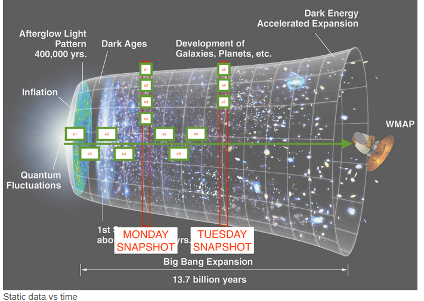
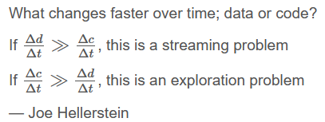
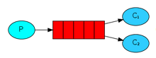
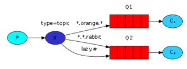
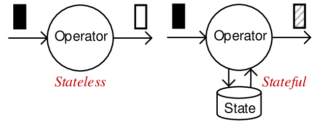
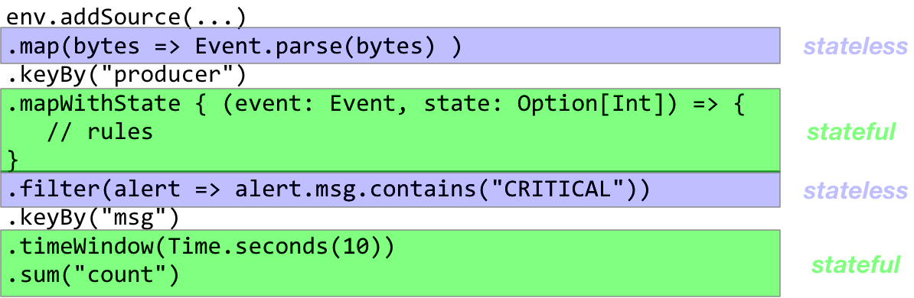
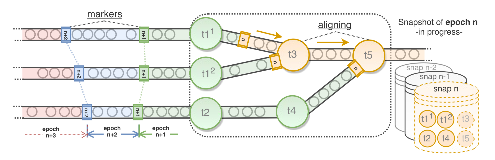

# Bounded vs unbounded datasets
**Bounded data**: dataset itself can be enumerated and/or iterated upon. Has size property. **static data**

**Unbounded data**: dataset can only be enumerated given a **snapshot**. No size property

*most datasets are unbounded; running processes generate data continuously
-> users need to continously monitor processes. 

Bounded data are usually a time-restricted view of unbounded data.

The fact that we use mostly static data is due to legacy constraints.



# Batch processing vs Stream processing
- **Batch processing**: applies an algorithm on a **bounded dataset** to produce a single result at the end
-> Unix, Map/Reduce and Spark are batch processing systems
- **Stream processing** applies an algorithm on continuosly updating data (**unbounded dataset**) and continuously creates results
-> Flink and Storm are stream processing systems

In stream processing, data changes faster than code over time:



# Stream processing
Stream processing processes **timestamped events**.

It requires:
- A component that acquires events from producers and forwards it to consumers
- A component that processes events 

Stream processing is simply batch processing done multiple times continuously
-> split streams in batches, called **windowing**

Stream processing requires several things
- place to acquire the stream data
- intermediate storage of streamed data
- splitting streams in batches (**windowing**)
- applying function on splitted streamed data
- Recomputing when new batches arrive (**triggers**)

## Unix streaming
Unix has many components required for stream processing:
- Streaming data acquisition: tail or pipe
- Intermediate storage: pipes
- Ways of applying functions on streaming data

It is missing:
- Splitting streams in batches (windowing)
- Recomputing when new batches arrive (triggers)

For the following code example:
- **tail** is the producer 
- **wc** is the consumer. 
- **pipe** is the messaging system. 

```
tail -f log.txt | wc -l
```

A pipe has the following functionality:
- Reads data from the producer and buffers it
- Blocks the producer when the buffer is full
- Notifies the consumer that data is available

# Messaging systems
**Messaging systems** receive continuous data from the **producers**. It then splits the continuous data into separate batches called **events**. The messaging system then sends the events to the **consumers**.

Example:
1. Web application backend - data producer (generate continuous data stream)
2. Amazon SMS - messaging system (handles the stream of data into events)
3. AWS Lambda function - data consumer (process the events and apply the UbiOps 'function')

Pipes implement the publish / subscribe model for *1 producer to 1 consumer*.

## Publish/Subscribe
**Publish/subscribe** systems connect multiple producers to multiple consumers.

- **Direct messaging systems** use simple network communication (usually UDP) to broadcast messages to multiple consumers. They are fast, but require the producers/consumers to deal with data loss. Example: ZeroMQ
- **Message brokers** or **queues** are centralized systems that sit between producers and consumers and deal with the complexities of reliable message delivery.

## Messaging patterns
**Competing workers**: multiple consumers read from a single queue



**Fan out pattern**: each consumer has a queue of its own and messages are *replicated* on ALL queues


**Topics pattern**: Producer assigns keys to msg metadata. Consumer creates topic queues and messages are routed based on the corresponding topic



# Broker-based messaging
A broker can be responsible for multiple queues.

The producers send messages in any of the following modes:
- **Fire and forget** - broker acks the message immediately (no storage)
- **Transaction-based** - broker writes the message to permanent storage prior to ack’ing it.

The broker:
- Buffers the messages, spilling to disk as necessary
- Routes the messages to the appropriate queues
- Notifies consumers when messages have arrived

The consumers:
- Subscribe to a queue that contains the desired messages
- Ack the message receipt (or successful processing)

If broker doesn't store the received message
- can't reprocess message
- can't prove message was delivered

## GHTorrent: broker-based example
GHTorrent uses topic queues to decouple the following GitHub event stream from the retrieval of items linked from events. Events are written to the RabbitMQ broker with a routing key according to their event type; a configurable number of data retrieval processes subscribes to those queues.


# Log-based messaging 
A **log** is an append-only data structure stored on disk. 

A **log-based messaging system** makes use of logging to store message and then forward it to consumers. A log based messaging system also has a **broker**

- *Producers* (not brokers) append messages to the log
- All consumers connect to the log and pull messages from it. A new client starts processing from the beginning of the log.
- To maximize performance, the *broker* partitions and distributes the log to a cluster of machines.
- The *broker* keeps track of the current message offset for each consumer per partition


## Kafka: log-based example
**Kafka** is a very well known log server. It does both storing of raw events and acting as intermediary between systems.


# Time in stream processing
In streaming systems, we have two notions of time:
- **Processing time**: the time at which events are *processed* in the system
- **Event time**: the time at which events *occurred*

**Event time** has to be derived from the field in event, example : timestamp field.

**Processing time** is determined by the clock on the system processing the element.

If the dataflow can't process the published events in publishing frequency, then the event time will lag behind, so your system latency will increase in your dataflow.

Applications that calculate streaming aggregates (e.g. avg rainfall per country per hour) don’t care much about the event order.

Applications with precise timing requirements (e.g. bank transactions, fraud detection) care about *event* time (not processed time). Events may however enter the system delayed or out of order.


## Event time skew
If processing (wall-clock) time is *t*:
- **Skew**: difference in the actual event time and expected ideal event time
- **Lag**: difference in the actual processing time and ideal processing time


# Programming models for stream processing
Processing of events to dervies some form of state.

## Stream as a database
Stream systems are similar to database systems:

- Events can be filtered and transformed
- Event streams can be joined with other event streams
- Event streams can be aggregated (given time constraints)
- Event streams can be replicated on other hosts for scaling and fault tolerance

Main difference: databases contain state, whereas streams contain state modifications. Therefore, *databases can be updated, while streams can be appended*.

## Event sourcing and CQS (command query segregation)
Capture all changes of an application state as a sequence of events. 

The application state is generated by processing the events.

Store the event that causes the application state mutation in an immutable log. 

Benefits
- Use specialized systems for scaling writes (e.g. Kafka) and reads (e.g. Redis), while the *application remains stateless*
- Provide separate, continuously updated views of the application state (e.g. per user, per location etc)
- Regenerate the application state at any point in time by reprocessing events

## Reactive programming
Reactive programming is a declarative programming paradigm concerned with data streams and the propagation of change.

Reactive APIs model event sources as infinite collections on which observers subscribe to receive events.

```
Observable.from(TwitterSource).      // List of tweets
  filter{_.location == 'NL'}.        // Do some filtering
  flatMap{t => GeolocateService(t)}. // Precise geolocation
  groupBy{loc => loc.city}.          // Group results per city
  flatMap{grp => grp.map(v => (grp.key, v))}.
  subscribe(println)
```

## Dataflow model
The DataFlow model attempts to explain stream processing in four dimensions:

- What: results are being computed
- Where: in *event* time they are being computed
- When: in *processing* time they are materialized
- How: earlier results relate to later refinements

**Flink** draws inspiration from this.

# Stream processing in four dimensions
## What: operations on streams
- **element-wise**: apply function to each individual message (e.g. map or flatmap)
- **aggregation**: group multiple events together and apply a reduction (e.g. fold or max)

*checkout examples

## Where: streaming windows
**Windows** are static size (e.g., 1000 events) or time-length (e.g., 10 secs) *batches* of data:


Example:

```
// Count number of tweets per user per minute
tweets.map(t => (t.user_id, 1))
      .keyBy(x => x._1)
      .timeWindow(Time.minutes(1))
      .reduce((a,b) => a._2 + b._2)

// result: every minute produce list of pairs:
(323, 1)
(44332, 4)
(212, 32)
```


**Session windows** are dynamic size that aggrgate batches of user activity. Session windows end after **session gap** time:


Example:

```
// Number of clicks per user session
case class Click(id: Integer, link: String, ...)
clickStream.map(c => (c.id, 1))
           .keyBy(x => x._1)
           .window(EventTimeSessionWindows.withGap(Time.minutes(10)))
           .sum(1)
```


when using event-time windows:
- Buffering: Aggregation functions are applied when the window finishes (see When). This means that in-flight events need to be buffered in RAM and spilled to disk.
- Completeness: Given that *events may arrive out of order*, how can we know that a window is ready to be materialized and what do we do with out of order events?

## When: window triggers
**Trigger** defines when in processing time the results of a window are materialized / processed. Types of triggers:

- **Per-record triggers** fire after x records in a window have been encountered.
- **Aligned delay triggers** fire after a specified amount of time has passed across all active windows (aka micro-batching).
- **Unaligned delay triggers** fire after a specified amount of time has passed after the first event in a single window.

### Watermarks
*review this later

Event-time processors need to determine when event time has progressed enough so that they can trigger windows. When reprocessing events from storage, a system might process weeks of event-time data in seconds; relying on processing time to trigger windows is not enough.

A **watermark** represents the temporal completeness of an out-of- order data stream. Watermarks flow as part of the data stream and carry a timestamp. The watermark's current value informs a processor that all messages with a lower timestamp have been received.

Watermarks allow late messages to be processed up to a specified amount of (event-time) delay (allowed lateness).

As the watermarks flow through the streaming program, they advance the event time at the operators where they arrive. Whenever an operator advances its event time, it generates a new watermark downstream for its successor operators.


## How: window refinements:
In certain complex cases, a combination of triggers and watermarks flowing may cause a window to be materialized multiple times. In such cases, we can discard, accumulate or *accumulate and retract* the window results.

# Stream processing system
Messaging systems move data from producers to consumers, in a scalable and fault-tolerant way. **Stream processing systems** does the actual processing of the moved data.

Approaches to processing streams:

- **micro-batching**: Aggregate data in batches of configurable (processing-time) duration
- **event-based streaming**: Process events one by one

Event-time systems can emulate micro-batching by setting an aligned delay trigger to keyed window.

## Spark: micro-batching
Uses **micro-batching architecture**: breaks input data into batches (of x seconds processing time length) and schedules those in the cluster using the exact same mechanisms for fault tolerance as normal RDDs.


Some issues:
- Latency:
  - The micro-batch computation is triggered after the batch times out
  - Each batch needs to be scheduled, libraries need to be loaded, connections need to be open etc
- Programming model:
  - No clean separation of mechanism from business logic
  - Changing the micro-batch size leads to different results

## Flink: event-based
The core of Apache Flink is a distributed streaming data-flow engine written in Java and Scala.

In Flink, a program is first compiled to a **data-flow graph**, which describes how data flows between operations.

Each **node** in the DFG are called **operators** and it represents a task (computation). The operators can be scheduled within a **task manager** (essentially, a JVM instance).
Each **edge** represents data dependencies.


A DFG consists of:
- **Data Source**: operartion without input ports. A dataflow graph must have at least one data source
- **Data Sink**: operation without output ports. A dataflow graph must have at least one data sink

A sink cannot be a source: this means that 2 Flink computations cannot exchange data directly.

In order to execute a dataflow program, its logical graph (simplified) is converted into a physical dataflow which specifies in detail how the program is executed:


# Stream archtiectures

The **flink cluster architecture**:


The **kafka streams architecture**:


# Stateful streaming
- A **stateless streaming** can be understood in isolation. There is no stored knowledge of or reference to past transactions. Each transaction is made as if from scratch for the first time.
- A **stateful streaming** the state is shared between events(stream entities). And therefore past events can influence the way the current events are processed.


Many operators (both windowing and aggregation ones) are inherently stateful:



If for each item we process we would like to keep a counter, use the **mapWithState** operator.

The **mapWithState** operator takes and returns an optional state, which the stream processor must maintain.

```
val stream: DataStream[(String, Int)] = ...

val counts: DataStream[(String, Int)] = stream
  .keyBy(_._1)
  .mapWithState((in: (String, Int), count: Option[Int]) =>
    count match {
      case Some(c) => ( (in._1, c), Some(c + in._2) )
      case None => ( (in._1, 0), Some(in._2) )
    })
```

As the processing graph is distributed, we need a consistent, fault-tolerant global view of the counter
-> naive approach is to start a 2-phase commit process and restart the processing when all nodes are committed.

Better apropach is **Chandy-Lamport algorithm**

## Chandy-Lamport algorithm
Used to capture consistent global snapshots. Models a distributed system as a graph of processes that have input and output channels

From this, the observer builds up a complete snapshot: a saved state for each process and all messages “in the ether” are saved. 

1. **Snapshot initiator** or **observer process** (process taking a snapshot) saves its local state
2. It sends a **epoch marker** or simply **marker** (snapshot request message) along with a snapshot token to all its output channels (other processes)
3. A process receiving the snapshot token for the first time on any message: 
  - Sends the **observer process** its own saved local state
  - Attaches the snapshot token to all outgoing subsequent messages
4. When a process that has already received the snapshot token receives a message that does not bear the snapshot token:
  - Forward that message to the observer process (message obviously sent before the snapshot occured)
5. When the **observer process** receives the same **marker** from all channels, all the states for all operators are saved into a single global consistent snapshot.

Example of Flink snapshots:



*Operators wait for the same epoch markers from all channels before they take a snapshot.

## Event processing guarantees
The following guarantees are offered by streaming systems:

- **At most once**: an event will be processed once if delivered at all
- **At least once**: in case of failure, an event might flow through a system twice 
- **Exactly once**: an event flows through a set of operators once

Flink supports exactly once. 

To do so, it requires the source to support event replay on request and the sink to be transactional. Both requirements are satisfied by Apache Kafka.