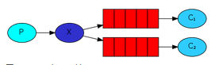

# Bounded vs unbounded datasets
**Bounded data**: dataset itself can be enumerated and/or iterated upon. Has size property. **static data**

**Unbounded data**: dataset can only be enumerated given a **snapshot**. No size property

*most datasets are unbounded; running processes generate data continuously
-> users need to continously monitor processes. 

Bounded data are usually a time-restricted view of unbounded data.

The fact that we use mostly static data is due to legacy constraints.


# Batch processing vs Stream processing
- **Batch processing**: applies an algorithm on a **bounded dataset** to produce a single result at the end
-> Unix, Map/Reduce and Spark are batch processing systems
- **Stream processing** applies an algorithm on continuosly updating data (**unbounded dataset**) and continuously creates results
-> Flink and Storm are stream processing systems

In stream processing, data changes faster than code over time:


# Stream processing
Stream processing processes **timestamped events**.

It requires:
- A component that acquires events from producers and forwards it to consumers
- A component that processes events 

Stream processing is simply batch processing done multiple times continuously
-> split streams in batches, called **windowing**

Stream processing requires several things
- place to acquire the stream data
- intermediate storage of streamed data
- splitting streams in batches (**windowing**)
- applying function on splitted streamed data
- Recomputing when new batches arrive (**triggers**)

## Unix streaming
Unix has many components required for stream processing:
- Streaming data acquisition: tail or pipe
- Intermediate storage: pipes
- Ways of applying functions on streaming data

It is missing:
- Splitting streams in batches (windowing)
- Recomputing when new batches arrive (triggers)

For the following code example:
- **tail** is the producer 
- **wc** is the consumer. 
- **pipe** is the messaging system. 

```
tail -f log.txt | wc -l
```

A pipe has the following functionality:
- Reads data from the producer and buffers it
- Blocks the producer when the buffer is full
- Notifies the consumer that data is available

# Messaging systems
**Messaging systems** receive continuous data from the **producers**. It then splits the continuous data into separate batches called **events**. The messaging system then sends the events to the **consumers**.

Example:
1. Web application backend - data producer (generate continuous data stream)
2. Amazon SMS - messaging system (handles the stream of data into events)
3. AWS Lambda function - data consumer (process the events and apply the UbiOps 'function')

Pipes implement the publish / subscribe model for *1 producer to 1 consumer*.

## Publish/Subscribe
**Publish/subscribe** systems connect multiple producers to multiple consumers.

- **Direct messaging systems** use simple network communication (usually UDP) to broadcast messages to multiple consumers. They are fast, but require the producers/consumers to deal with data loss. Example: ZeroMQ
- **Message brokers** or **queues** are centralized systems that sit between producers and consumers and deal with the complexities of reliable message delivery.

## Messaging patterns
**Competing workers**: multiple consumers read from a single queue


**Fan out pattern**: each consumer has a queue of its own and messages are *replicated* on ALL queues



**Topics pattern**: Producer assigns keys to msg metadata. Consumer creates topic queues and messages are routed based on the corresponding topic


# Broker-based messaging
A broker can be responsible for multiple queues.

The producers send messages in any of the following modes:
- **Fire and forget** - broker acks the message immediately (no storage)
- **Transaction-based** - broker writes the message to permanent storage prior to ack’ing it.

The broker:
- Buffers the messages, spilling to disk as necessary
- Routes the messages to the appropriate queues
- Notifies consumers when messages have arrived

The consumers:
- Subscribe to a queue that contains the desired messages
- Ack the message receipt (or successful processing)

If broker doesn't store the received message
- can't reprocess message
- can't prove message was delivered

## GHTorrent: broker-based example
GHTorrent uses topic queues to decouple the following GitHub event stream from the retrieval of items linked from events. Events are written to the RabbitMQ broker with a routing key according to their event type; a configurable number of data retrieval processes subscribes to those queues.


# Log-based messaging 
A **log** is an append-only data structure stored on disk. 

A **log-based messaging system** makes use of logging to store message and then forward it to consumers. A log based messaging system also has a **broker**

- *Producers* (not brokers) append messages to the log
- All consumers connect to the log and pull messages from it. A new client starts processing from the beginning of the log.
- To maximize performance, the *broker* partitions and distributes the log to a cluster of machines.
- The *broker* keeps track of the current message offset for each consumer per partition


## Kafka: log-based example
**Kafka** is a very well known log server. It does both storing of raw events and acting as intermediary between systems.


# Programming models for stream processing
Processing of events to dervies some form of state

## Event sourcing and CQS (command query segregation)
Capture all changes of an application state as a sequence of events. 

The application state is generated by processing the events.

Store the event that causes the application state mutation in an immutable log. 

Benefits
- Use specialized systems for scaling writes (e.g. Kafka) and reads (e.g. Redis), while the *application remains stateless*
- Provide separate, continuously updated views of the application state (e.g. per user, per location etc)
- Regenerate the application state at any point in time by reprocessing events

## Reactive programming
Reactive programming is a declarative programming paradigm concerned with data streams and the propagation of change.

Reactive APIs model event sources as infinite collections on which observers subscribe to receive events.

```
Observable.from(TwitterSource).      // List of tweets
  filter{_.location == 'NL'}.        // Do some filtering
  flatMap{t => GeolocateService(t)}. // Precise geolocation
  groupBy{loc => loc.city}.          // Group results per city
  flatMap{grp => grp.map(v => (grp.key, v))}.
  subscribe(println)
```

## Dataflow model
The DataFlow model attempts to explain stream processing in four dimensions:

- What: results are being computed
- Where: in *event* time they are being computed
- When: in *processing* time they are materialized
- How: earlier results relate to later refinements

**Flink** draws inspiration from this.

# Time in stream processing
In streaming systems, we have two notions of time:
- **Processing time**: the time at which events are *processed* in the system
- **Event time**: the time at which events *occurred*

Event time has to be derived from the field in event, example : timestamp field.

Processing time is determined by the clock on the system processing the element

If the dataflow can't process the published events in publishing frequency, then the event time will lag behind, so your system latency will increase in your dataflow.

Applications that calculate streaming aggregates (e.g. avg rainfall per country per hour) don’t care much about the event order.

Applications with precise timing requirements (e.g. bank transactions, fraud detection) care about *event* time (not processed time). Events may however enter the system delayed or out of order.
