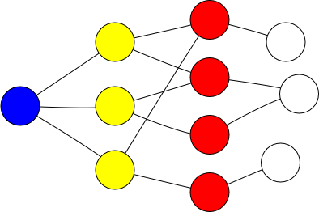
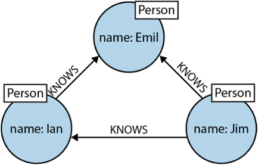
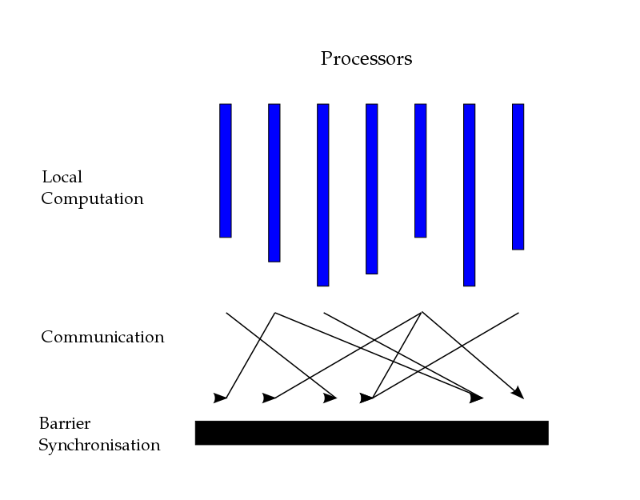
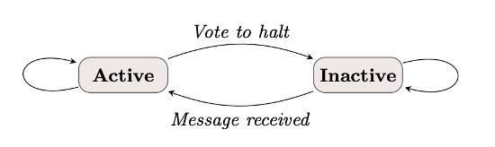
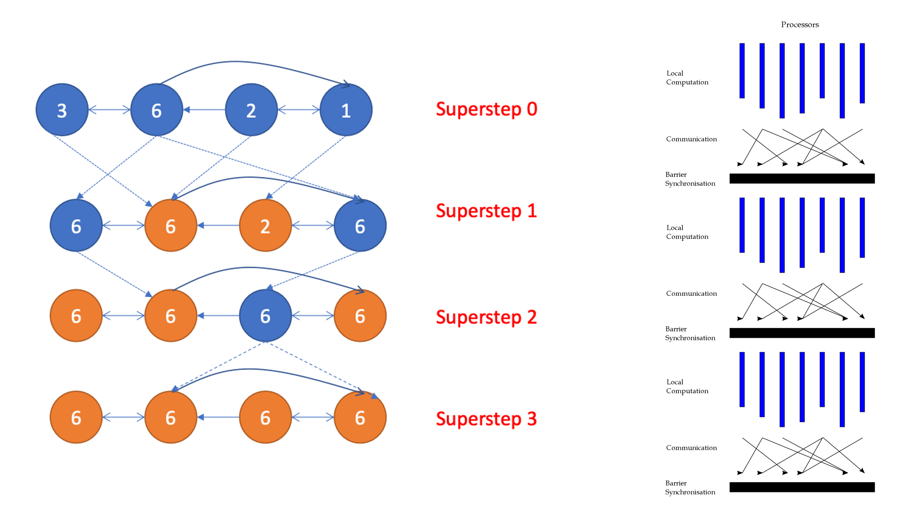

# Graph processing
Graphs and other forms of hierarchical data structures appear every time a system models a **dependency relationship**. Common big graphs are:

- The social graph in social networking applications
- The web graph of linked pages
- The dependency graph in (software) package ecosystems

Graphs can be represented as:
- **Adjacency matrix**: n × n matrix M where n is size of nodes. non-zero element Mij indicates and edge from Vi to Vj (v is the node)
- **Adjacency list**: A List[(V, List[V])] where each tuple represents a node and its connections to other nodes.
- **Edge list**: A List[(V, V)] of node pairs that represents and edge

Graph (sub-) structures:
- **Graph components**: subgraphs in which any two vertices are connected to each other by paths
- **Strongly connected component**: largest sub-graph with a path from each node to every other node
- **Triangles** or **polygons**: one vertex is connected to two other vertices and those two vertices are also connected.
- **Spanning trees**: sub-graph that contains all nodes and the minimum number of edges


Typical graph algorithms
- **Traversal**: Starting from a node, find all connected nodes
    - **Depth-first**: Recursively follow all graph edges until all reachable nodes are visited
    - **Breadth-first**: Follow graph edges per level; maintain a work-queue of visited nodes

- **Node importance**: Calculate the importance of a node relative to other nodes
    - **Centrality measures** or **PageRank**
- **Shortest paths**:
    - **Dijkstra’s algorithm**

To process small to medium sized graphs (< 500M edges), we can:
- Use SQL databases and recursive queries
- Use a **graph database**

For really big graphs (>= 500M edges), our options are somewhat limited
- Efficiently compress the graphs so that they fit in memory
- Use a **message-passing architecture**, like the bulk synchronous parallel model

## Graphs in SQL databases
Example of modelling graphs as node pairs. Nodes and edges have metadata.

```
CREATE TABLE nodes (
    id INTEGER,
    metadata ...
)

CREATE TABLE edges (
    a INTEGER,
    b INTEGER,
    metadata ...,
    CONSTRAINT src_fkey
        FOREIGN KEY (a) REFERENCES nodes(id),
    CONSTRAINT target_fkey
        FOREIGN KEY (b) REFERENCES nodes(id)
)
```

Example of recursive queries in a SQL-based graph traversals:

```
WITH RECURSIVE transitive_closure (a, b, distance, path) AS
(
    SELECT a, b, 1 as distance, a || '->' || b AS path
    FROM edges

  UNION ALL

    SELECT tc.a, e.b, tc.distance + 1, tc.path || '->' || e.b
    FROM edges e
    JOIN transitive_closure tc ON e.a = tc.b
    WHERE a.metadata = ...   -- Traversal filters on nodes/edges
        and tc.path NOT LIKE '%->' || e.b || '->%'
)
SELECT * FROM transitive_closure
```

Real life example: friend recommendation



The below code base expression will find all directly connected nodes, while the second will recurse into their first level descendants:

```
WITH RECURSIVE transitive_closure (a, b, distance, path) AS
(
    -- Find the yellow nodes
    SELECT a, b, 1 as distance, a || '->' || b AS path
    FROM edges
    WHERE a = src -- the blue node

  UNION ALL
    -- Find the red nodes
    SELECT tc.a, e.b, tc.distance + 1, tc.path || '->' || e.b
    FROM edges e
    JOIN transitive_closure tc ON e.a = tc.b
    WHERE tc.path NOT LIKE '%->' || e.b || '->%'
      AND tc.distance < 2 -- don't recurse into white nodes
)
SELECT a, b FROM transitive_closure
GROUP BY a, b
HAVING MIN(distance) = 2 -- only report red nodes
```

## Graph databases
Graph databases are specialized RDBMs for storing recursive data structures and support CRUD operations on them, while maintaining transactional consistency (ACID or otherwise).

The most commonly used language for graph databases is Cypher, the base language for Neo4J.

Below code is the description for the below illustration:
```
(emil:Person {name:'Emil’}) 
  <-[:KNOWS]-(jim:Person {name:'Jim’}) 
  -[:KNOWS]->(ian:Person {name:'Ian’}) 
  -[:KNOWS]->(emil)
```



Query for finding mutual friends of a user named Jim:

MATCH (a:Person {name:'Jim'})-[:KNOWS]->(b:Person)-[:KNOWS]->(c:Person), (a)-[:KNOWS]->(c) 
RETURN b, c

# Big graphs
Graphs are an inherently recursive data structures, which means that computations may have dependencies to previous computation steps (and thus they are not trivially parallelizable).

Traditional frameworks are not well-suited for processing graphs.

    Poor locality of memory accesses
        Access patterns not very suitable for distribution
        Further complicated due to latency issues
    Little work to be done per node
        Applications mostly care about the edges

## PageRank algorithm
PageRank is a centrality measure based on the idea that nodes are important if multiple important nodes point to them. 

For node *pi*, its Page rank is recursively defined as:


- *d* is a damping factor (usually set 0.85)
- *M(pi)* are the nodes pointing to *pi*

The following code for PageRank on Spark is iterative and side-effecting and therefore non-parallelizable.
```
val links: RDD[(V,List(E))] = ....cache()
var ranks = links.mapValues(v => 1.0)

for (i <- 1 to iters) {
  val contribs = links.join(ranks).values.flatMap {
    case (links, rank) =>
      val size = links.size
      links.map(url => (links, rank / size))
  }
  ranks = contribs.reduceByKey(_ + _).mapValues(0.15 + 0.85 * _)
}
```

To make it side-effect free, we need to write each step of the computation to external storage.

# BSP: Bulk synchronous parallel model
The BSP model is a general model for parallel algorithms.

It assumes that a system has:
- multiple processors with fast local memory
- **pair-wise communication** between processors
- a **barrier** implementation (hardware or other) to synchronize super steps



BSP computation can have one or multiple **supersteps**. Each superstep has 3 phases:
1. Local execution: processors use own memory to perform computations on local data partitions
2. Data exchange: exchange data between processes
3. Barrier synchronization: processes wait until all processes finished communicating

BSP termination:
1. **Superstep 0**: all vertices are active
2. All active vertices participate in the computation at each superstep
3. A vertex deactivates itself by voting to halt
4. No execution in subsequent supersteps
5. A vertex can be reactivated by receiving a message



Example of computation and termination:



## Pregel
**Pregel** is a distributed graph processing framework. Pregel computations impose a BSP structure on a program execution:

- Computations consist of a sequence of supersteps
- In a superstep, the framework invokes a user-defined function for each vertex
- Function specifies behaviour at a single vertex (V) and a single superstep (S)
    - it can read messages sent to V in superstep (S-1)
    - it can send messages to other vertices that will be read in superstep (S+1)
    - it can modify the state of V and its outgoing edges

Pregel is a **vertex-centric** graph processing model: the *algorithm iterates over vertices*

Attributes of Pregel:
- Reminiscent of MapReduce
    - User (i.e. algorithm developer) focus on a local action
    - Each vertex is processed independently
- By design: well suited for a distributed implementation
    - All communication is from superstep S to (S+1)
    - No defined execution order within a superstep
    - Free of deadlocks and data races
- Graphs stored as adjacency lists
- partitioned using **hash partitioning**
- distributed using a network filesystem

Pregel has:
- Leader: maintains mapping between data partitions and cluster node, implements the BSP barrier
- Worker: for each vertex maintains the following in memory:
    - adjacency list
    - current calculation value
    - queue of incoming messages
    - state (active/inactive)

Within a Pregel superstep:
1. Workers combine incoming messages for all vertices.
    - The combinator function updates the vertex state
2. If a termination condition has been met, the vertex votes to exclude itself for further iterations
3. (Optional) The vertex updates a global aggregator
4. Message passing:
    - If receiving vertex is local: update its message queue
    - Else wrap messages per receiving node and send them in bulk
