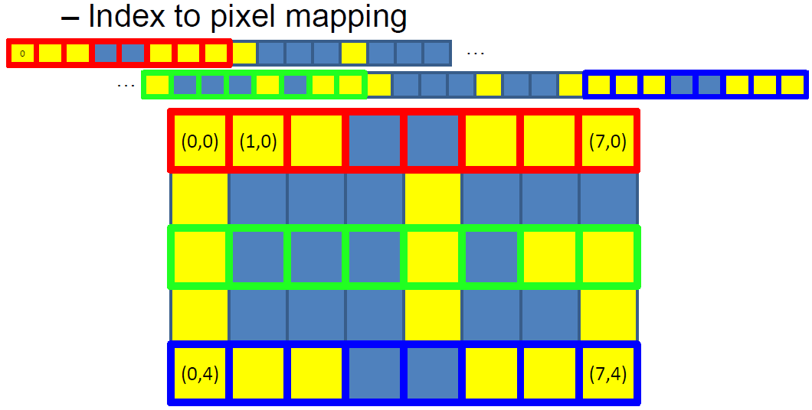
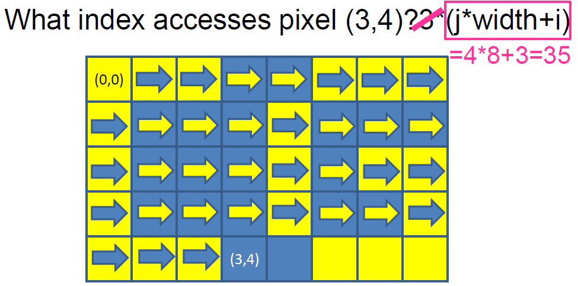
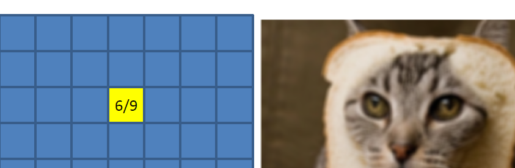
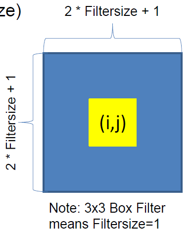
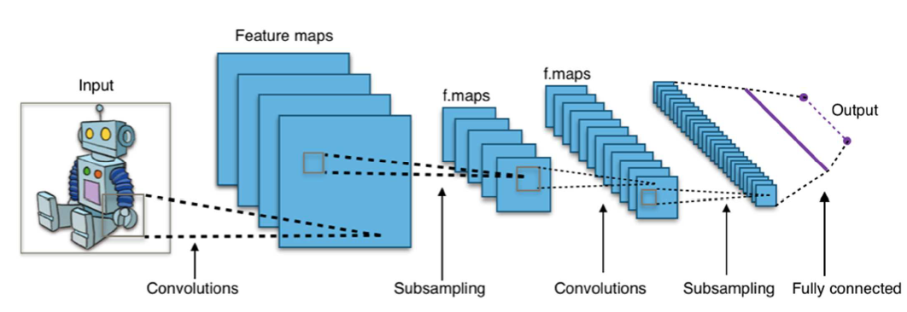

# Week 1
3D models are typically triangles. 

*Projection*: Transforming coordinates to 2D screen

*Rasterization*: Filling screen pixe

## Image
When specifying image size, we define it as **width * height**

### Pixels
A image is basically many pixels with different colors combined. Each pixel color can be represented by 3 color components: 
- Red
- Green
- Blue

### Pixels index
Each value is between 0 ~ 1, typically a continuous value. In practice, they must be discretized, so we assign 8 bit per color component. This gives us 256 available values per color component and 256^3 total combinations. 

The formula for this conversion: **min(v * 255, 255)**

In the memory, each pixel representation is grouped by factor of 3 since RGB. We prefer to use index to map each pixels:

The LHS number corresponds to veritical (width) movement and the RHS number corresponds to horizontal (height) movement. For a RGB pixel (i, j), the memory location (index) is: 

**3 * (j * width + i)**

3 is for the 3 components for each RGB pixel. If we were working with a grayscale image which only has one pixel the memory location is:

**(j * width + i)**

This is because each component takes up 1 index. Width is important thus this info is typically stored in image file as well. Height as well but can be derived from data

Ex) For a grayscale image with resolution (8 * 5), with 8 being the width, the pixel (3, 4) index is
(4 * 8 + 3) = 35:

Ex) For a RGB image with resolution (8 * 5), with 8 being the width, the pixel (3, 4) index is
3*(4 * 8 + 1) = 105:

### Pixels reverse index
If we want to find a pixel(i, j) given index I for a grayscale image:

**i = I % width** - full rows that fit into I
**j = I / width** - remainder that offsets in the row

*note that j is an integer division thus 5/3 = 1, not 1.666666666

## Filter
Filter basically applies some computation on each pixel and for each color channel on the pixel. 

These filters are very simple but powerful. In bright values, hard to detect small changes. In darker values, our eyes are better at detecting. 

### Box Filter
*Box filter* is literally just a box filter, where we have a center pixel and a box filter that defines how many pixels. It then averages out the pixel value and apply it to the center pixel:

The formula to set the size of our Box Filter is;

**2 * Filtersize + 1** 

*Filtersize* is the size of our pixel of interest. The formula is like the above so that we cover the entire region around the center pixel and that the pixel of interest can be at the center:

Thus the box filter size is (2 * Filtersize + 1) * (2 * Filtersize + 1)

Notes:
- Avoid the pow() function in C++ and use the typical math expression like aboe.
- i and j are pixel positions so we do want them to be integers, but for the sum we want them to be float because.
- In the box filter code, we first make a copy of the image and then store the pixel result in the copied image, to prevent averaging what you already averaged.

### Boom filter
1. Copy the original image
2. Threshold the image (only keep large color values like > 0.9). 
-> instead of immediately dropping down any below threshold value to 0, have a function that makes this transtion smoother.
3. Apply box filter on thresholded image. 
-> This may result in a darker image. If too dark, multiply by scalar to scale up the highlighted values.
4. Add the highlighted values to the original image

The square box from the boxfilter may be visilbe on the result. You can also have a generla filter. THe sum of the values in the filter image should always be 1, to maintain brightness level.

Simply put, Machine learning is a successive filtering and thresholding process, where filtered pixel entires are optimized during training:

## Storing Images
There are several formats for images. Two major categories:
- Compress data but lose details. Relatively small space - JPEG
- Lossless but require more space - PPM
### PPM
PPM image consists of a header and iamge data. Header specifies all meta data. It contains for example:
- magic number, e.g. P3 for human readable (the big array part) pixel values in RGB format
- IMage width, whtie space, IMage hieght, white space
- Maximum color value between [0, 65535]. MOre pricision than 8 bit
IN the example, you will see that 15 is the hightest number in any pixel. THus max color value is 15.
PPM is simple but inefficient in storage. THe size directly relates to the bytes per color channel (if not human-readable)
and resolution
### JPEG
JPEG is much more complicated than PPM. you won't have to reproduce JPEG images
Basically trying to represent the functions within an image
COmpression by reducing the quality (lossy). THe compression ratio 1:10 still results in high quality images. THe main idea is to use frequencey decomposition and remove high frequency first. THis means that if the. 
FOr each of the functions in the image, the coefficient values of the functions that change very little will be 'larger' and the ones that change frequently will be 'small'
Because we discard very small changes, the quality has limitations. You can see very closely in JPG files that when zoomed in the transition is not smooth
When working with JPEG images, it requires more memory in RAM compared to storage in HARD DISK
## Linking ALgebra with GPU
It takes a triangle and projects it onto a screen. Linear perspective: haveing one point where everything is converging. This was present since middle ages art
On a checker board from a linear perspective, how to find the distances between these horizontal lines. When the checkboard turns, the central point will lie somewhere on a horizontal line. The intersection from the original point lines (check the picture for detailed explanation). YOu can do the same for another point on the opposite side and you can create *two point perspective*.
## Linear perspective
It is relatively easy because with projective geometry everyting is lienar using homongeous equations.
## Virtual Camera model
Given a 3d point, find a function that results in the points projection in the photo. As the camera moves or the object moves, the image will be the same. ON the graphics card, the image is always the same, we just change our perspective. 
To translate an image (vertices), add a vector to our vertices.
To rotate an iamge, use matrix multiplication with the cos, sin matrix
Combine these to calculate the perspective projection. For the computer to calculate where to project it on the screen. In 2D perspective: calculate v by using the ratio of similar triangles. IMage:
Naive operation to project a scene point with the camera:
Apply camera position (add offset)
Aply rotation (matrix mul)
APply projection (non linear scaling)

This can become complicated. A better way is to unify translation, rotation and projection. But because translations and projections are not linear  we can't use matrixes. Instead use homogenous coordinates from projective geometry. 

A camera projection is a matri and combining matrices allows us to define hierarchical-object dependencies.
A camera projection is a matri and combining matrices allows us to define hierarchical-object dependencies.

## HOmogenous coordinates
An N-dimensional projective space Pn is represented by N+1 coordinates. No null vectors

Two points p,q are equal iff exists a != 0 s.t p*a = q 

IN a 2D projective space P2,
(2,2,2) = (3,3,3,) = (4,4,4)
(3, 3, 3) != (4, 3, 4)
(0, 1, 0) = (0, 2, 0)

To embed a standard vectors space Rn into an n-D projective space Pn, we can map
Take Rn add a 1 to its end 

A point (x, y) in R2 embbed in a projective space corresponds to (x, y, 1). All points (x, y, 1) form a plane, called as *affine plane*. ALl these poitns are basically lines, simply scaled with a scalar.

Thus we can go back to R2 by dividing the corodintes by the last entry. (x, y, w) in P2 corresponds to (x/w, y/w) R2. But the poitns where you have zero in the end, has no correspondence to R2. The plane with w=0 is not reachable. THese points with w=0, as you drag w near towards 0, the points go towards infinity. THis is away to decribe poitns at infinit, and they converge to that central point! This isthe key to transform ojcets using projective geometry