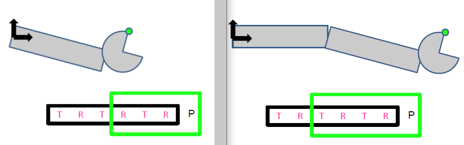
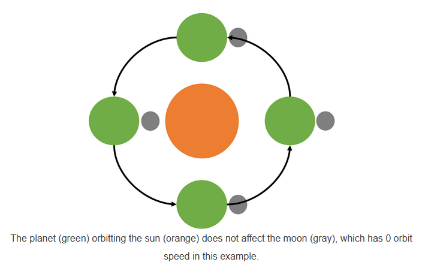
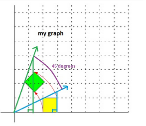
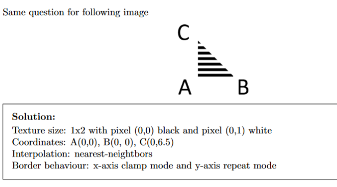
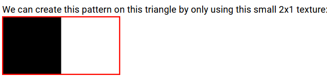
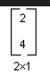

# Assignment
## Robot arm
After the cube, when we want to apply an operation to its whole, the operation should be applied at the very last thus after it is finished creating parts for cube. This is to ensure the entire cube is affected by the operation in the end.

When drawing a segment that is influenced by a previous one, operations are involved that take part from the previous segment in order to be influenced by the previous segment's movement as well.

If segment3 exists after segment1 and segment2, the *order of applying the previous operations should be reversed*. For segment3 operation:

1. segment3's scaling
2. segment3's rotation (self position)
3. apply translation from segment2's distance
4. apply rotation from segment2's angle
5. apply segment1's translation
6. apply segment1's rotation

```
    glm::mat4 matrix_segment1 = 
        glm::rotate(id, segment1.rotationX, x_axis) * 
        glm::scale(id, segment1.boxSize) * 
        centering;

    glm::mat4 matrix_segment2 = 
        // Operation to allign with segment1:
        glm::rotate(id, segment1.rotationX, x_axis) * 
        glm::translate(id, { 0, 0, segment1.boxSize.z } ) *

        // Segment2's self operation
        glm::rotate(id, segment2.rotationX, x_axis) * 
        glm::scale(id, segment2.boxSize) * 
        centering;

    glm::mat4 matrix_segment3 =
        // Operation to allign with segment1:
        glm::rotate(id, segment1.rotationX, x_axis) *
        glm::translate(id, glm::vec3 { 0, 0, segment1.boxSize.z }) *

        // Operation to allign with segment2:
        glm::rotate(id, segment2.rotationX, x_axis) *
        glm::translate(id, glm::vec3 { 0, 0, segment2.boxSize.z }) * 

        // Segment3's self operation
        glm::rotate(id, segment3.rotationX, x_axis) * 
        glm::scale(id, segment3.boxSize) * 
        centering;
```

The below image depicts that after finishing applying segment2's rotation, we apply segment1's translation.



## Solar System
Solar system assignment is similar but has one more condition: orbiting and spinning are two separate operations that should not impact each other in any way.

If the moon has an orbit speed of zero, then it would always stay on the same side of the planet as seen from a static point in space:



In order to achieve this, we need to 'offset' the 'static-rotation' that occurs when the moon orbits around the sun. If not, then the moon won't face the same side of the planet when its orbit speed is zero, due to the 'static-rotation' that occurs when rotating the sun:



Same goes for spinning: if the spin speed were zero then the orientation of the body should not change relative to the orbit. 

In order to achieve the above two, we need to similary 'offset' the 'static-rotation' that occurs when orbiting around the planet. If we didn't do this then the moon's orientation will not be the same, due to the 'static-rotation' that occurs when rotating the planet.

Example of a moon's transformation that orbits around a planet which orbits the static sun:

```
rotationMatrix(computeAngle(planet.orbitPeriod, time), yaxis) *  // orbit(rotate) around sun
translationMatrix(glm::vec3 { planet.orbitAltitude, 0, 0 }) *    // translate to distance from sun
// offset to be on same side of planet when orbit speed is 0
rotationMatrix(-computeAngle(planet.orbitPeriod, time), yaxis) * 

rotationMatrix(computeAngle(body.orbitPeriod, time), yaxis) *   // orbit(rotate) around planet
translationMatrix(glm::vec3 { body.orbitAltitude, 0, 0 }) *     // translate to distance from planet
// offset to achieve static orientation when orbit speed is 0
rotationMatrix(-computeAngle(body.orbitPeriod, time), yaxis) *  /

rotationMatrix(computeAngle(body.spinPeriod, time), yaxis)      // moon static-rotate
```
## Others
- Remember that vector is not the same as position. Position is a point on a space. A vector is a direction from point A to point B. Just because they are both in the form of glm::vec3 in C++ does NOT mean same thing.

To get a vector going in the direction of point A:
```
point.A - point.B
```

If we did point.B - point.A, it is going in the direction of point B

- When we calculate the dot product of two vectors, we are calculating their cosO multiply by their magnitudes, with O being the angle. Lets say we have a normal vector from a surface point and a light vector. In order to make sure that the light is only reflected ABOVE the surface and NOT BENEATH the surface:

```
    if (glm::dot(normal, lightVector) < 0.0)
        return { 0.0, 0.0, 0.0 }; 
```

This is because if the angle between normal vector and a vector is between 90 ~ 270 degrees (beneath the surface), cosO is [-1, 0]. Therefore, any dot product that is less than 0.0 can be dark.

If we applied normalization, then cos0 is only the dot product as magnitude multiplication 1 * 1 =1;


- For the shading assignment, the light, reflection, half-way, view (camera) vector ALL have to me normalized.
(L, R, H, V)

cross product of two vectors returns a new vector that is perpendicular to both vectors. But keep in mind that this result in a vector, which starts in the origin (0, 0, 0). If you wanted to use this result vector to get to a point, the selected position must be added to the vector (thing of it as 'new' origin). In addition, make sure the vector you use in cross product is in right direction.

The result of every 

# Exam tips

- must bring object to origin first in order to rotate around another object and then translate again. For points q,p and p rotatates around q, we must make p 'in-position' to rotate around the origin. Thus translate p by negative q coordinate. This will make the p 'in-position' to rotate around the origin which can be seens as rotating around the q, just in different location. If we don't do this it will NOT rotate as a circle around the origin.

- question for bike, the absoute value angle part is to consider that bike will move 1 unit forward
when pedaled full 360 degrees. iT IS absolute since we are pedal goes clockwise.

- Order always on the right for first operation. direction of the multiplication doesn't affect the result, ONLY THE ORDERING OF THE TRANSFORMATIONS. When in doubt always assume we are applying one by one thus right to left direction.

- focal length, is when the image (projection) plane's center to top distance is one and projection plane's center to bottom distance is also one. To find focal length, find the projection plane coordinate such that the length from its center to top is 1 and center to bottom is also 1

- Remember that black pixel + white pixel does NOT equal gray. as 0.0 + 1.0 = 1.0. Same for the rest:

- black + white = white
- black + black = black
- black + gray = gray
- gray + white = white

- To check if any point is inside triangle, make it into a linear (matrix multiplication) form and do the gaussian elimination

- To see if a point lies on a line (A, B) of the triangle, create the  'interpolation' form and the triangle point that does NOT make the line, it's coefficient is 0 (not 1). For triangle interpolation, coefficients a + b + c = 1 and a, b, c > 0. If not 

- Scaling an object that is centered at the origin produces a different result than scaling an object that has been moved away from the origin. 

- For last question in shadows they say the light should be reflected with 2/3 of the original light value. This means that 1/3 pixels inside the filter are equal or below the specified depth value (0.3). Find the values that does this

- Remember that for diffuse and specular, you have to get the sum of each light value present, not just one. For ambient it is all uniform so doesn't matter.

- near plane and image plane are DIFFERENT things. Focal length f applies to image plane. image plane isn't needed in OpenGL.

- to achieve the **model view matrix** of showing the rotation and translation values on one matrix, FIRST ROTATAION SECOND TRANSLATION

- If the *camera was tilted slightly upwards the third vanishing point would appear at the top* of the image.

- be aware that sometimes the information they give us is worthless

- For image plane length calcualtion, remember some useful formulas. For example 

sin(2x) = 2 * cos(x) * sin(x)

or 

use the y / x to get a 'linear equation' like expression

or 

us pythagorass formula

- remember reflection vector formula:

**r = d - 2(d*n)n **

where d is light vector going 'in' (surface - light), n is the normal vector and normalized. d is NOT normalized for this formula.

- When they give you a point, make sure whether you need a find a VECTOR or just use that point. If it is vector, then think about the vector direction. For example, *light - surface* will give you vector in the light direciton. *surface - light* will give you in the surface direction. Remeber 'first come first served' 

- For reflection light vector problem, the reason we normalize and find the 'would-be' vector is because we want to find the position of the new normal. By normalizing, we ensure the distances are both 1 and by adding the light vector and reflection vector we ensure that we stay in the middle of the two but just different 'height', thus a normal vector. But the light vector has to to be pointing 'out' (light - surface). Otherwise calculation is wrong

- Learn the different texture options.

texture interpolation types:
- **nearest-neighbor**
- **linear interpolation**
- **bilinear interpolation**
- **trilinear interpolation**

outside the texure (border behavior)
- **border**: constant color
- **clamp**: keep border texel value
- **repeat**: at borders


For below whether the use clamping or repeating vertically doesn't matter anymore here, since we've stretched out the texture anyway. 



- if Texture depth (shadow map) < Pixel depth, pixel is obstructed and should be in shadow

- if Texture depth (shadow map) >= Pixel depth, pixel is lit. Pixel is the thing the light "sees" when it looks in the given direction. The pixel is at depth x, light sees something at depth x, therefore it must be the pixel. 

- if 3 out of 9 texels' depths are lower than the pixel's, then 1/3rd of the light on that pixel should be obstructed, and so on. Thus project only 2/3 of the original light intensity

- When we say 2 x 1 image, it is width 2 and height 1. 



If we say 2 x 1 matrix, it is a height of 2 and width of 1.



- When calculating triangle ratios, don't forget pthagoras theorem as well.

- when doing dot product for shading, don't forget that the light vector is 'out', thus light position - surface position. In addition, normal vector AND light vector needs to be normalized before doing dot product.

For reflection vector formula, only normal vector needs to be normalized and not light vector

- shadow mapping does not share the same characteristics as mipmapping. *Shadow map contains depth values while mipmap contains color values.* It is quite safe to filter mipmap, because what you are **filtering is colour and usually colour is the last step of the whole process**. However, what stores in shadow mapping is depth value, which would be further be used as comparison with the depth of object. When you are **filtering depth, what you are doing is you mutually alter the scene that you are rendering,** which would further mess up the comparison.

*Percentage-closer filtering* means filtering the comparison result to determine whether an object is in shadow or not. This is pretty **safe to filter because you are not changing the scene.**