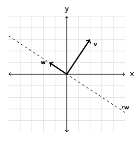
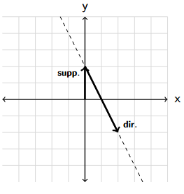

# Linear algebra recap

## Definition of vector space
Given a field F and a set V with:
- v + w for all v, w ∈ V
- scalar multiplication s*v for all s ∈ F, v ∈ V

which satisfy all the following axioms for ALL u, v, w ∈ V and ALL r, s ∈ F:
- *associativity*: u + (v + w) = (u + v) + w
- *commutativity*: v + w = w + v
- *neutral element*: There is a 0 ∈ V such that 0 + v = v
- *inverse element*: There is a −v ∈ V such that v − v = 0
- *associativity for scalars*: r(sv) = (rs)v
- *neutral element for scalars*: 1v = v
- distributivity I: r(v + w) = rv + rw
- distributivity II: (r + s)v = rv + sv

## Vector form
The following vector is from domain R^3, where R stands for real number.

    ( v1 )
v = ( v2 ) = (v1, v2, v3)^t , where t stands for *transposed*
    ( v3 )

## Vector length
For vector v ∈ R^2, v = (v1, v2)^t
The vector length is denoted as ||v|| = √((v1)^2 + (v2)^2), which is the same formula as Pythagoras' Theorem.

For vector v ∈ R^3, v = (v1, v2, v3)^t
The vector length is denoted as ||v|| = √((v1)^2 + (v2)^2 + (v3)^2), which is the same formula as Pythagoras' Theorem.

## Distance between points
To calculate the distance between two vector points, simply use subtraction and length computation. For two vector points v, w ∈ R^3:

||v - w||

If v = (1, 2)^t and w = (-2, 1), the distance is:

√((1 - (-2))^2 + (2 - 1)^2) = √(9 + 1) = √10

## Dot product
For vectors v = (v1, v2, v3)t and w = (w1, w2, w3)t, the dot product is:
v*w = v1*w1 + v2*w2 + v3*w3

## Injective, Surjective, and Bijective
A function f: V -> W is:

- *Injective* if f(v) = f(v′) ⇒ v = v′ -- only maps to one element
- *Surjective* if for each w ∈ W there is some v ∈ V such that f(v) = w -- covers all elements
- *Bijective* if it is both injective and surjective

## Linear Independence and Basis
A set of vectors v1,....,vk ∈ V is linearly independent if the only solution to r1*v1 + . . . + rk*vk = 0 is if 
r1 = . . . = rk = 0 (it only has the trivial solution). If we turn this to an augmented matrix and perform row reduction and the result is a m*k+1 identity matrix with the last column all 0s, then it is indeed linearly independent vectors.

Otherwise it is linearly dependent. 

A set of linearly independent vectors v1, . . . , vk ∈ V is called a basis, if for every vector v ∈ V,
there are scalars r1, . . . , rk such that v = r1*v1 + . . . + rk*vk. This means the vectors in a basis from V can represent every other vector in V with different scalars.

## Basis Completion
Given a vector u = (1, 2, 3)t , how to complete this to a basis?

1. pick a vector that is not linearly dependent, e.g., v = (1, 0, 0)t .
How do you know it’s not linearly dependent? The system v = r*u has no solutions.
2. For a basis, need a third vector w = (w1, w2, w3)t, such that w = r*u + s*v has no solutions. 
This happens if w*u = 0 and w*v = 0. Thus
0 = w * v = w1
0 = w * u = 2w2 + 3w3 ⇒ w2 = (-3/2)*w3
w = (0, (-3/2), 1)

## Computing a basis representation (coordinates)
Given a basis v = (3/2, 1/2)t, w = (1/2, 1)t, how to find coordinates r, s to express the vector u′ = (1, (−3/2)) in this basis?

Solve the linear system:

(3/2)r + (1/2)s = 1
(1/2)r + 1*s    = -3

.... this will result in r = 1.4 and s = -2.2

## Angles betwen vectors
For two vectors v,w the angle α between them can be computed as v ⋅ w = ∥v∥ * ∥w∥ * cos(α)

α = arccos(( v ⋅ w ) / ∥v∥ * ∥w∥)

The two vectors that enclose an angle of 90 degrees are called *orthogonal*. IF the angle is 90 degrees, then 
cos(α) = 0 and thus v ⋅ w = 0 as well. If we know that vector v = (2, 3)t, find the other orthoogonal vector 
w = (w1, w2)t, such that 

v ⋅ w = 2*w1 + 3*w2 = 0 

Thus all vectors of the form w = r*(-3/2, 1)t are orthogonal to vector v.

## Orthgonal vector in 3D
Give two vectors v = (1, 0, 1)t and w = (0, 1, 1)t ∈ R^3, we need a third vector u = (u1, u2, u3)t ∈ R3 that is orthogonal to the first two vectors. Solve the following linear system:

v ⋅ u = u1 + u3 = 0
w ⋅ u = u2 + u3 = 0

This shows us u1 = u2 = -u3. Therefore all vectors of the form u = r*(1, 1, -1)t is orthogonal to vectors v and w.

## Definition matrix
In R^3 and R^3, all linear maps can be written as matrices.

If A is an *m x n* matrix, B must be an *n x k* matrix to be able to multiply to A. This means AB is possible but BA is not.

## Matrix inverse
For a matrix to have the *possibility* of an inverse, it must be a square ( n x n matrix). To check whether the square matrix *has* an inverse check its *determinant*. 

For matrix  A = [a  b] the determinant is *ad - bc*. If the determinant *ad - bc* = 0, then there is no inverse.
                [c  d]                                  
If the determinant is not 0, the inverse matrix C of matrix A exists:

C =    1    [d  -b] 
    ad - bc [-c  a]

There is also the property CA = I, with I being the identity matrix. 

## Definition line
A line in R^2 can be represented via the linear equation 'y = mx + b' for some scalars m,b ∈ R. It can also be represented as a composition of *support vector* and *direction vector*. For example 'y = -2x + 1' can be represented as:

(0, 1)t + r*(1, -2)t, where (0, 1)t is the support vector (constant) and (1, -2)t is the direction vector (coefficient).

## Points on a line
Consider a line represented by support vector s and direction vector d:

(s) + r*(d), with r ∈ R.

To see whether a vector v (point) is on that line, solve the linear system:

(s) + r*(d) = v

If there is a solution, then vector v in on that line. Otherwise, it is not.

## Definition plane
If the vectors are in R^3 and not R^2, then it is no longer *direction vector* but *spanning vector*. Similar to spanning a line on R^2, you can span a plane on R^3 with two spanning vectors. With support vector u, and spanning vectors v,w the palne satisfies:

u + rv+ sw, is the *spanning form* of a plane, with r and s ∈ R.

Alternatively, find a *normal vector* n, which is orthogonal to both v and w. A *normal vector* to a plane is a vector that is perpendicular to the plane at any given point. Therefore, a normal vector n is:

n ⋅ v = 0
n ⋅ w = 0

Then any point (vector) p on the plane satisfies:

n ⋅ (p − u) = 0, which is a representation of a plane in *normal form*

## Going from one plane to the other
Consider the plane in a normal form (1, 0, 1)t ⋅ (v − (0, 1, 0)) = 0

If you take the normal vector of the plane's normal form, which is (1, 0, 1)t in this case, you can write down the plane's spanning form by finding two vectors orthogonal to the normal vector. The vectors (0, 1, 0)t, (1, 0, −1)t are orthogonal to the normal vector. Thus the spanning form of the plane is:

(0, 1, 0)t + r (0, 1, 0)t + s(1, 0, −1)t 

## Points on sides of a plane
For points, v, w, you can see how they are ordered along a line spanned by u by looking at the dot product. Consider the normal form of a plane:

(0, 1, 1)t ⋅ (v − (0, 0, 3)t) = 0

The point (0, 0, 3)t on the plane yields (0, 1, 1)t ⋅ (0, 0, 3)t = 3.