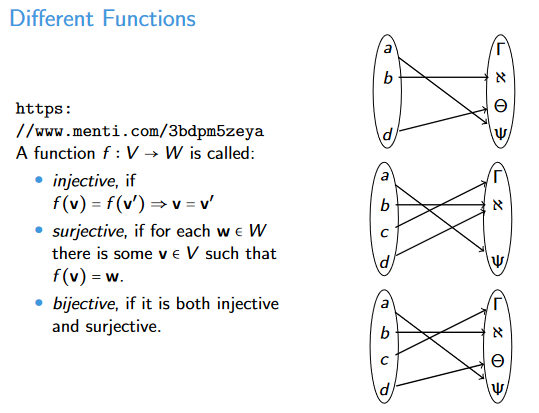

# Linear algebra recap

## Definition of vector space
Given a field F and a set V with:
- v + w for all v, w ∈ V
- scalar multiplication s*v for all s ∈ F, v ∈ V

which satisfy all the following axioms for ALL u, v, w ∈ V and ALL r, s ∈ F:
- *associativity*: u + (v + w) = (u + v) + w
- *commutativity*: v + w = w + v
- *neutral element*: There is a 0 ∈ V such that 0 + v = v
- *inverse element*: There is a −v ∈ V such that v − v = 0
- *associativity for scalars*: r(sv) = (rs)v
- *neutral element for scalars*: 1v = v
- distributivity I: r(v + w) = rv + rw
- distributivity II: (r + s)v = rv + sv

## Vector form
The following vector is from domain R^3, where R stands for real number.

    ( v1 )
v = ( v2 ) = (v1, v2, v3)^t , where t stands for *transposed*
    ( v3 )

## Vector length
For vector v ∈ R^2, v = (v1, v2)^t
The vector length is denoted as ||v|| = √((v1)^2 + (v2)^2), which is the same formula as Pythagoras' Theorem.

For vector v ∈ R^3, v = (v1, v2, v3)^t
The vector length is denoted as ||v|| = √((v1)^2 + (v2)^2 + (v3)^2), which is the same formula as Pythagoras' Theorem.

## Distance between points
To calculate the distance between two vector points, simply use subtraction and length computation. For two vector points v, w ∈ R^3:

||v - w||

If v = (1, 2)^t and w = (-2, 1), the distance is:

√((1 - (-2))^2 + (2 - 1)^2) = √(9 + 1) = √10

## Dot product
For vectors v = (v1, v2, v3)t and w = (w1, w2, w3)t, the dot product is:
v*w = v1*w1 + v2*w2 + v3*w3

## Injective, Surjective, and Bijective
A function f: V -> W is:

- *Injective* if f(v) = f(v′) ⇒ v = v′ -- only maps to one element
- *Surjective* if for each w ∈ W there is some v ∈ V such that f(v) = w -- covers all elements
- *Bijective* if it is both injective and surjective

## Linear Independence and Basis
A set of vectors v1,....,vk ∈ V is linearly independent if the only solution to r1*v1 + . . . + rk*vk = 0 is if 
r1 = . . . = rk = 0 (it only has the trivial solution). If we turn this to an augmented matrix and perform row reduction and the result is a m*k+1 identity matrix with the last column all 0s, then it is indeed linearly independent vectors.

Otherwise it is linearly dependent. 

A set of linearly independent vectors v1, . . . , vk ∈ V is called a basis, if for every vector v ∈ V,
there are scalars r1, . . . , rk such that v = r1*v1 + . . . + rk*vk. This means the vectors in a basis from V can represent every other vector in V with different scalars.

## Basis Completion
Given a vector u = (1, 2, 3)t , how to complete this to a basis?

1. pick a vector that is not linearly dependent, e.g., v = (1, 0, 0)t .
How do you know it’s not linearly dependent? The system v = r*u has no solutions.
2. For a basis, need a third vector w = (w1, w2, w3)t, such that w = r*u + s*v has no solutions. 
This happens if w*u = 0 and w*v = 0. Thus
0 = w * v = w1
0 = w * u = 2w2 + 3w3 ⇒ w2 = (-3/2)*w3
w = (0, (-3/2), 1)

## Computing a basis representation (coordinates)
Given a basis v = (3/2, 1/2)t, w = (1/2, 1)t, how to find coordinates r, s to express the vector u′ = (1, (−3/2)) in this basis?

Solve the linear system:

(3/2)r + (1/2)s = 1
(1/2)r + 1*s    = -3

.... this will result in r = 1.4 and s = -2.2

## Angles betwen vectors

