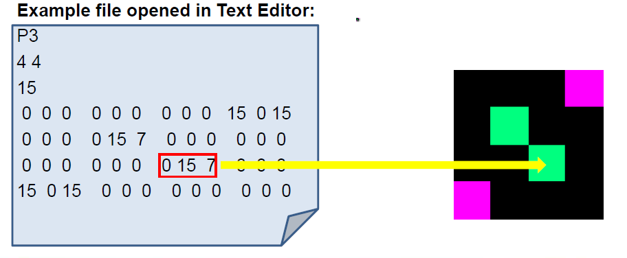
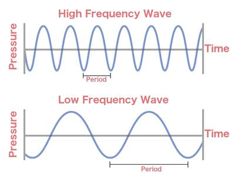
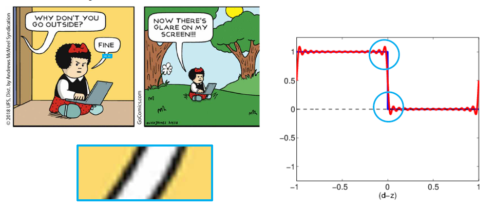
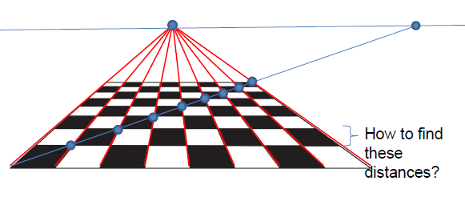
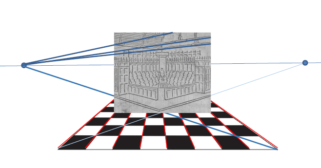
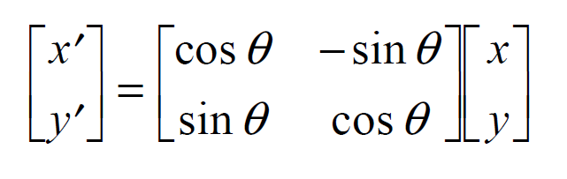
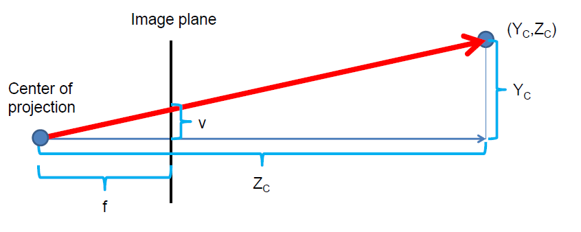

## Storing
There are several formats for images. Two major categories:
- Lossy, complex, small space - JPEG
- Lossless, simple, large space - PPM

### PPM
PPM image is lossless, simple, and takes up large space. It consists of a header and image data (body). Header specifies all meta data. The header contains

- *magic number* - e.g. P3: for human-readable (the big array part) pixel values in RGB format
- Image width <Whitespace> Image hieght <Whitespace>
- Maximum color value between [0, 65535] (more precise than 8 bit)

IN the example, you will see that 15 is the hightest number in any pixel. Thus max color value is 15.

PPM is simple but inefficient in terms of storage. Size directly relates to
- bytes per color channel (if not human-readable)
- resolution

### JPEG
JPEG is much more complicated than PPM. Compression is achieved by reducing the quality (lossy). Regardless, a compression ratio of 1:10 still results in high quality images. Basically, it uses *frequencey decomposition* by removing high frequency waves first to compress. High frequency means the period is shorter, not a bigger difference from top to bottom. 

In JPEG, each image is separated into multiple groups, with each group consisting of 8 x 8 pixels. A group is represented by a *cosine function*, which itself is represented by multiple *consine waves*, specifically 64 different cosine waves: 

To determine how to get the combination of colors in the pixel group, we have to determine the cosine function and thus what the weights (coefficients) are for each 64 different cosine waves. This is called *discrete cosine transform*

We start off with a low frequency cosine wave and gradually add more cosine waves with higher frequency. This will later converge into a *Fourier series*:

The lower frequency consine waves will have a higher impact on the image than the higher frequency cosine waves. Generally higher frequency cosine waves don't contribute much to the image, thus have very subtle effect on the actual image. Thus if we remove the high frequency cosine waves, the image will be almost identical. As shown below, the part with a high frequency is removed by the function (red):

Only by really zooming in on the image you will see that there is some difference:

In conclusion, JPEG represents the image with multiple cosine functions

For each of the functions in the image, functions that change very little will have large coefficient values and the ones that change frequently will have small coefficient values:

When working with JPEG images, takes up more space in RAM than compared to space in a hard disk.

## Linking algebra with GPU
In a GPU, things are projected in 3D. But a GPU's job is also to project a 3D model onto a 2D screen:

This can be done with *linear perspective*. *Linear perspective* is having one point where everything converges to. When the checkboard turns, the central point will lie somewhere on a horizontal line. 

To calculate the distance between two sections of a vertical lines, we calculate the intersection from the original point lines:

You can move the central point along the horizontal line to the opposite side and you can create *two point perspective*:

In *projective geometry* everyting is lienar using homongeous equations.

## Virtual Camera model
Given a 3D point, find a function that results in the points projecting on to a 2D image. As the camera moves or the object moves, the image will be the same. On the graphics card, the 3D object is always the same, we just change our perspective on the 2D screen. 

Movement and orientation in 2D is simple:

- To translate an image (vertices), add a vector to our vertices.
- To rotate an iamge, use matrix multiplication with the cos, sin matrix

Combine these to calculate the *perspective projection*, which is a design technique used to display a 3D object on a 2D surface.

For the computer to calculate where to project it on the screen, use the ratio of similar triangles:

- v/f  =  Y/Z
- u/f  =  X/Z

Naive operation to project a scene point with the camera:
1. Apply camera position (add offset)
2. Apply rotation (matrix mul)
3. Apply projection (non linear scaling)

This can become complicated. A better way is to unify translation, rotation and projection with a matrix multiplication. But because translations and projections are not linear we can't use matrixes with mere 2D values. Instead use *homogenous coordinates* from projective geometry. Homogenous coordinates are 3-vector that can represent 2D coordinates 

A camera projection is a matri and combining matrices allows us to define *hierarchical-object dependencies*.

## Homogenous coordinates
Goal: given 3D point M, we want a function C such that C(M) is the point’s projection in a 2D photo

As mentioned before, homogenous coordinates can represent N-D projective space with N + 1 coordinates in vector forms. Null vectors (0, 0, 0) are not part of the space. 

A group of vectors are considered homogenous coordinates if they satisfy the following condition:

*Two points p,q are equal iff exists a!=0 s.t p * a = q*

Example:
In a 2D projective space of P2:

(2,2,2) = (3,3,3,) = (4,4,4)
(3, 3, 3) != (4, 3, 4)
(0, 1, 0) = (0, 2, 0)

If we have a vector from a standard *vector space* Rn and want to represent this in an N-Dimensional *projective space*, add a 1 to its end. A point (x, y) in R2 embbed in a P2 corresponds to (x, y, 1)

Example:
(1, 4) in R2 => (1, 4, 1) in P2

All points (x, y, 1) form a plane, called as *affine plane*:

ALl these points are basically lines, simply scaled with a scalar.

(x, y, w) in 2D projection space corresponds to (x/w, y/w) in 2D vector space. Only when the 'w' = 1 is the x, y value same as in both projection and vector space.

Only when w != 0 is there point in the projection space that corresponds to the point in the vector space.

But the points where w = 0 has no correspondence to the vector space. This is because the plane with w = 0 is not reachable. The points with w=0, as you drag w near towards 0, the points go towards infinity:

This is a way to describe points at infinity and they converge to that central point:

