# Image
3D models are typically triangles. 
*Projection*: Transforming coordinates to 2D screen
*Rasterization*: Filling screen pixel

When specifying image size, we define it as **width * height**

# Pixels
A image is basically many pixels with different colors combined. Each pixel color can be represented by 3 color components: 
- Red
- Green
- Blue

## Pixels index
Each value is between 0 ~ 1, typically a continuous value. In practice, they must be discretized, so we assign 8 bit per color component. This gives us 256 available values per color component and 256^3 total combinations. 

The formula for this conversion: **min(v * 255, 255)**

In the memory, each pixel representation is grouped by factor of 3 since RGB. We prefer to use index to map each pixels:

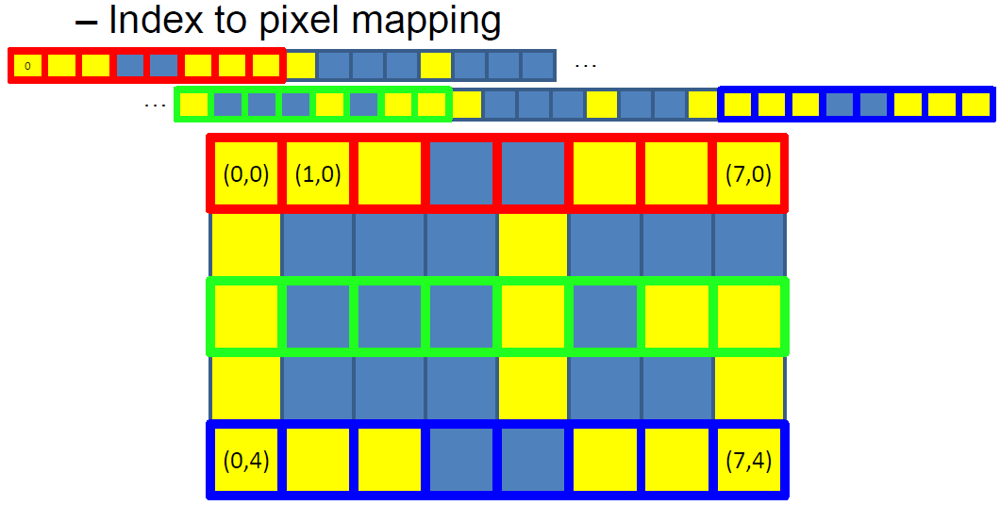

The LHS number corresponds to veritical (width) movement and the RHS number corresponds to horizontal (height) movement. For a RGB pixel (i, j), the memory location (index) is: 

**3 * (j * width + i)**

3 is for the 3 components for each RGB pixel. If we were working with a grayscale image which only has one pixel the memory location is:

**(j * width + i)**

This is because each component takes up 1 index. Width is important thus this info is typically stored in image file as well. Height as well but can be derived from data

Ex) For a grayscale image with resolution (8 * 5), with 8 being the width, the pixel (3, 4) index is
(4 * 8 + 3) = 35:

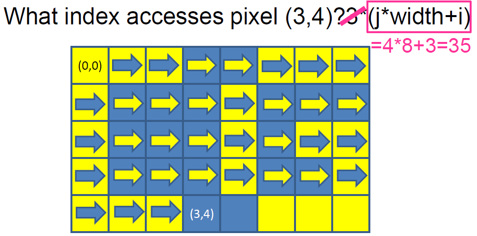

Ex) For a RGB image with resolution (8 * 5), with 8 being the width, the pixel (3, 4) index is
3*(4 * 8 + 1) = 105:

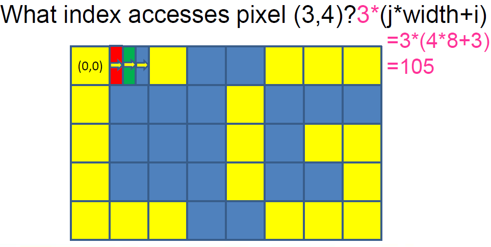

## Pixels reverse index
If we want to find a pixel(i, j) given index I for a grayscale image:

**i = I % width** - full rows that fit into I
**j = I / width** - remainder that offsets in the row

*note that j is an integer division thus 5/3 = 1, not 1.666666666

# Filter
Filter basically applies some computation on each pixel and for each color channel on the pixel. In bright values, hard to detect small changes. In darker values, our eyes are better at detecting. 

## Box Filter
**Box filter** is literally just a box filter, where we have a center pixel and a box filter that defines how many pixels. It then averages out the pixel value and apply it to the center pixel:

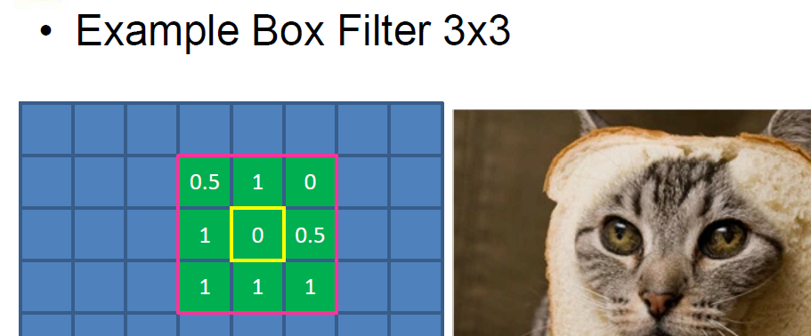

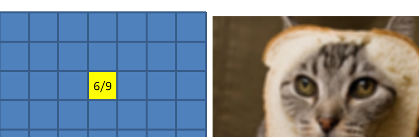

The formula to set the size of our Box Filter is;

**2 * Filtersize + 1** 

*Filtersize* is the size of our pixel of interest. The formula is like the above so that we cover the entire region around the center pixel and that the pixel of interest can be at the center:

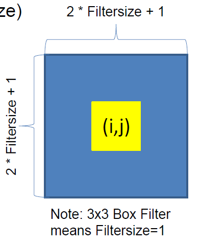

Thus the box filter size is (2 * Filtersize + 1) * (2 * Filtersize + 1)

Notes:
- Avoid the pow() function in C++ and use the typical math expression like aboe.
- i and j are pixel positions so we do want them to be integers, but for the sum we want them to be float because.
- In the box filter code, we first make a copy of the image and then store the pixel result in the copied image, to prevent averaging what you already averaged.

## Boom filter
1. Copy the original image
2. Threshold the image (only keep large color values like > 0.9). 
-> instead of immediately dropping down any below threshold value to 0, have a function that makes this transtion smoother.
3. Apply box filter on thresholded image. 
-> This may result in a darker image. If too dark, multiply by scalar to scale up the highlighted values.
4. Add the highlighted values to the original image

The square box from the boxfilter may be visilbe on the result. You can also have a generla filter. THe sum of the values in the filter image should always be 1, to maintain brightness level.

Simply put, machine learning is a successive filtering and thresholding process, where filtered pixel entires are optimized during training:

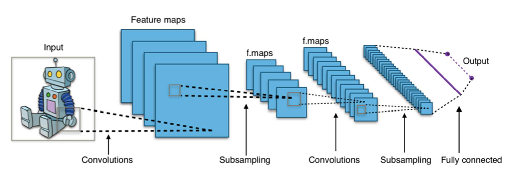

# Storing image
There are several formats for images. Two major categories:
- Lossy, complex, small space - JPEG
- Lossless, simple, large space - PPM

## PPM
PPM image is lossless, simple, and takes up large space. It consists of a header and image data (body). Header specifies all meta data. The header contains

- *magic number* - e.g. P3: for human-readable pixel values in RGB format
- width <Whitespace> height <Whitespace>
- max color value between [0, 65535] (more precise than 8 bit)

In the example, you will see that 15 is the hightest number in any pixel. Thus max color value is 15.

PPM is simple but inefficient in terms of storage. Size directly relates to:
- bytes per color channel (if not human-readable)
- resolution

## JPEG
JPEG is much more complicated than PPM. Compression is achieved by reducing the quality (lossy). Regardless, a compression ratio of 1:10 still results in high quality images. Basically, it uses **frequencey decomposition** by removing high frequency waves first to compress. High frequency means the period is shorter, not a bigger difference from top to bottom. 

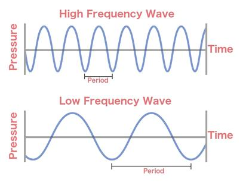

In JPEG, each image is separated into multiple groups, with each group consisting of 8 x 8 pixels. A group is represented by a *cosine function*, which itself is represented by multiple *consine waves*, specifically 64 different cosine waves: 

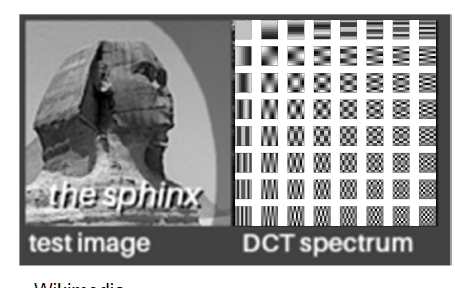

To determine how to get the combination of colors in the pixel group, we have to determine the cosine function and thus what the weights (coefficients) are for each 64 different cosine waves. This is called *discrete cosine transform*

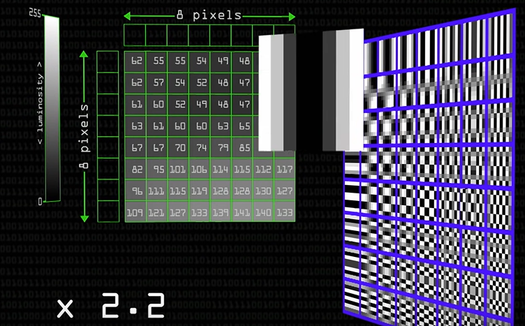

We start off with a low frequency cosine wave and gradually add more cosine waves with higher frequency. This will later converge into a *fourier series*:

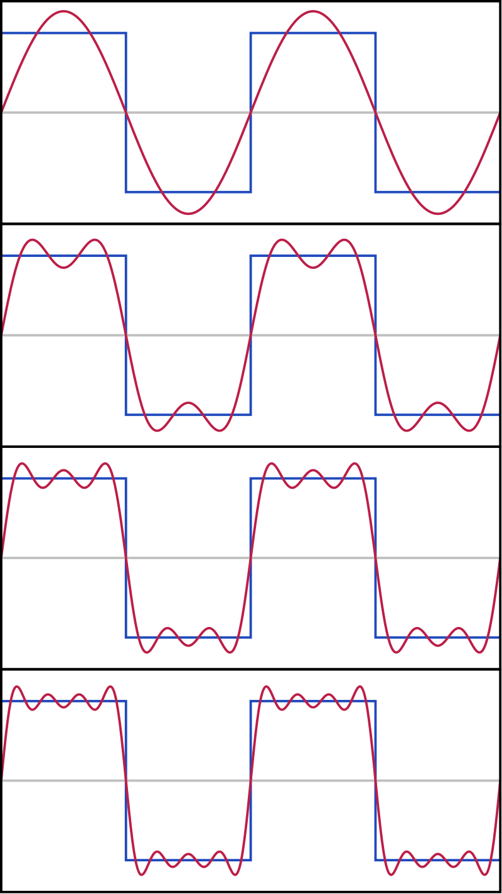

The lower frequency consine waves will have a higher impact on the image than the higher frequency cosine waves. Generally higher frequency cosine waves don't contribute much to the image, thus have very subtle effect on the actual image. Thus if we remove the high frequency cosine waves, the image will be almost identical. As shown below, the part with a high frequency is removed by the function (red):

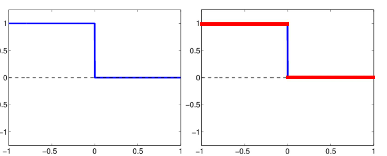

Only by really zooming in on the image you will see that there is some difference:

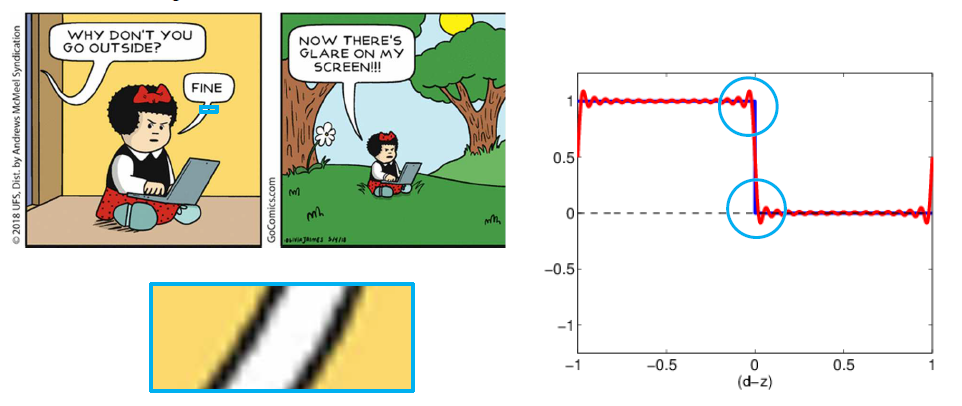

In conclusion, JPEG represents the image with multiple cosine functions

For each of the functions in the image, functions that change very little will have large coefficient values and the ones that change frequently will have small coefficient values:

When working with JPEG images, takes up more space in RAM than compared to space in a hard disk.

# Linking algebra with GPU
In a GPU, things are projected in 3D. But a GPU's job is also to project a 3D model onto a 2D screen:

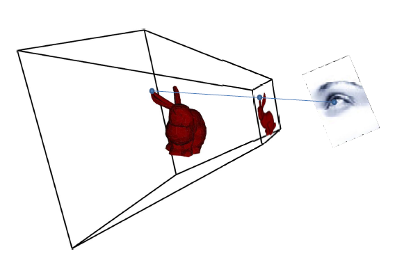

This can be done with *linear perspective*. *Linear perspective* is having one point where everything converges to. When the checkboard turns, the central point will lie somewhere on a horizontal line. 

To calculate the distance between two sections of a vertical lines, we calculate the intersection from the original point lines:

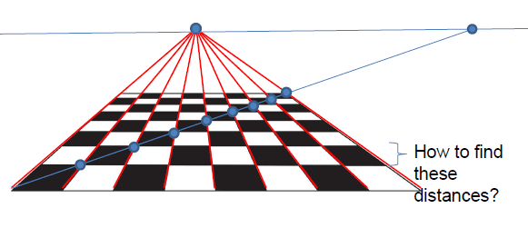

You can move the central point along the horizontal line to the opposite side and you can create *two point perspective*:

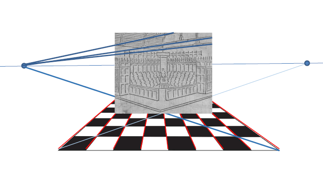

Only two points are needed if the vertical lines are parallel on the image. There is a *third* vanishing point; if the camera is looking straight at the center it is projected to infinity. If the *camera was tilted slightly downards the third vanishing point would appear at the top* of the image.

To determine the locations of the vanishing points, take the directions of the sides of the building in 3D (with w = 0) and project using the projection matrix.

## Virtual Camera model
Given a 3D point, find a function that results in the points projecting on to a 2D image. As the camera moves or the object moves, the image will be the same. On the graphics card, the 3D object is always the same, we just change our perspective on the 2D screen. 

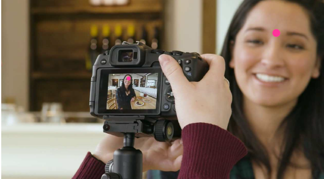

Movement and orientation in 2D is simple:

- To translate an image (vertices), add a vector to our vertices.
- To rotate an iamge, use matrix multiplication with the cos, sin matrix
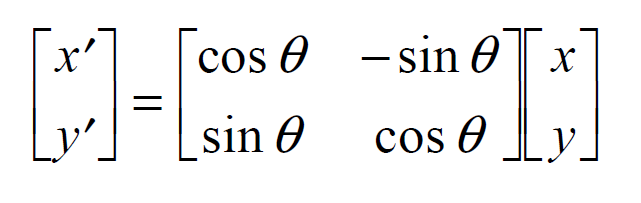

Combine these to calculate the *perspective projection*, which is a design technique used to display a 3D object on a 2D surface.

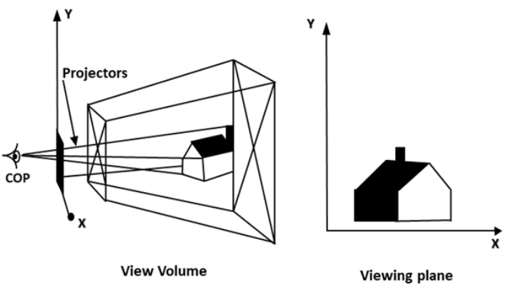

For the computer to calculate where to project it on the screen, use the ratio of similar triangles:

- v/f  =  Y/Z
- u/f  =  X/Z

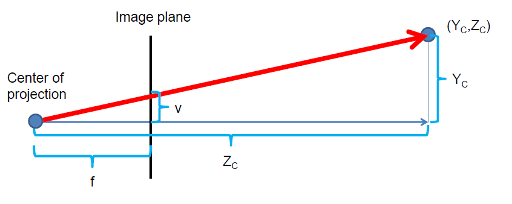

Naive operation to project a scene point with the camera:
1. Apply camera position (add offset)
2. Apply rotation (matrix mul)
3. Apply projection (non linear scaling)

This can become complicated. A better way is to unify translation, rotation and projection with a matrix multiplication. But because translations and projections are not linear we can't use matrixes with mere 2D values. Instead use **homogenous coordinates** from projective geometry. **Homogenous coordinates** are 3-vector that can represent 2D coordinates.

A camera projection is a matrix and combining matrices allows us to define **hierarchical-object dependencies**.
