# Homogenous coordinates
Goal: given 3D point M, we want a function C such that C(M) is the point’s projection in a 2D photo

As mentioned before, homogenous coordinates can represent N-D projective space with N + 1 coordinates in vector forms. Null vectors (0, 0, 0) are not part of the space. 

A group of vectors are considered homogenous coordinates if they satisfy the following condition:

*Two points p,q are equal iff exists a!=0 s.t p * a = q*

Example:
In a 2D projective space of P2:

```
(2,2,2) = (3,3,3,) = (4,4,4)
(3, 3, 3) != (4, 3, 4)
(0, 1, 0) = (0, 2, 0)
```

If we have a vector from a standard **vector space** Rn and want to represent this in an N-Dimensional **projective space**, add a 1 to its end. A point (x, y) in R2 embbed in a P2 corresponds to (x, y, 1)

Example:
```
(1, 4) in R2 => (1, 4, 1) in P2
```

All points (x, y, 1) form a plane, called as *affine plane*:

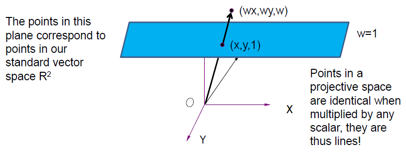

ALl these points are basically lines, simply scaled with a scalar.

Remember the following properties:

- if w != 0, there exists a point in the projection space that corresponds to the point in the vectore space
- if w = 1, the x,y values of point (x, y, w) in projection is equal to the point (x, y) in vector space
- if w = 0, it has no correspondence to the vector space. This is because the plane with w = 0 is not reachable. As you drag w near towards 0, the points go towards infinity:

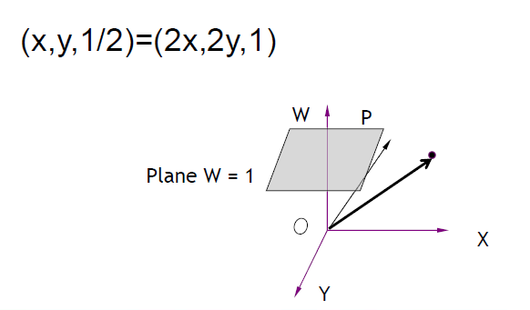

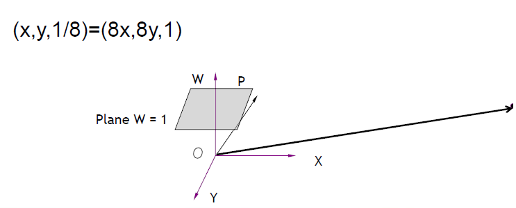

This is a way to describe points at infinity and they converge to that central point:

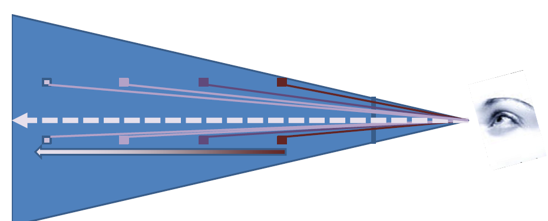

# Transformaion with homogenous coordinates
In a vector space, we simply add the other vector for translation:

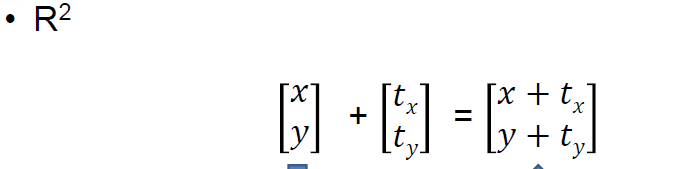

In a projection space, we multiply it by a matrix:

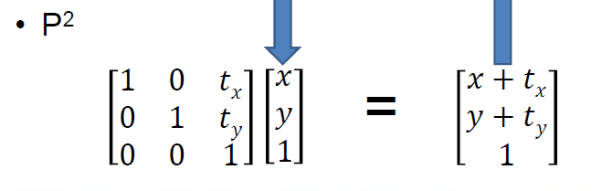

The above works by adding x with tx, y with ty, and 1 * 1 for the w. Or when w = 2, it is still the same point because remember, we *scale w down to 1 to get the real coordinates*:

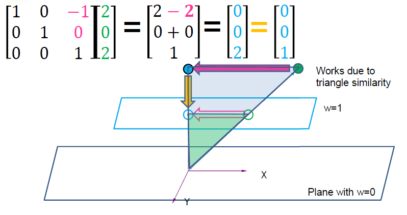

Similar but different approach for rotation. This is because with translation, x and y value is only concerned with themselves but for rotation, the value of the other affects the final result:

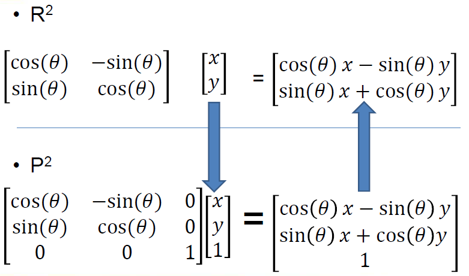

Same if w > 1:

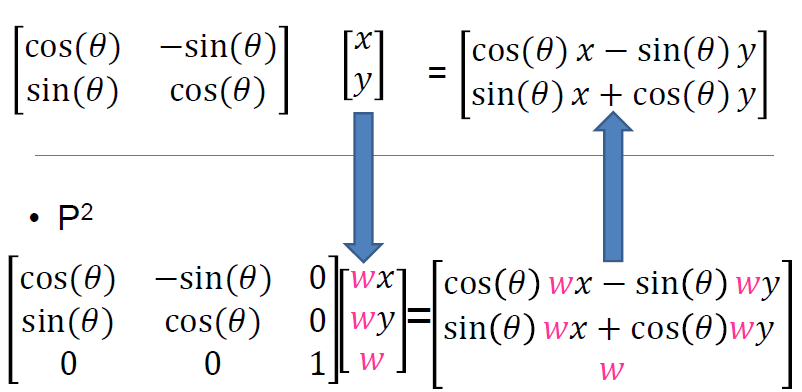

For points at  inifinity, where (x, y, 0), translation doesn't do anything since infinity will still be in infinity. For points at infinity when rotation, it actually does rotate

To get a location in infinity space:
- translate Q to origin
- Rotate around origin
- Translate back to Q

As shown below, we can combine rotation and translation operation into one. The following combination only works IFF we apply rotation first, and then translations: 

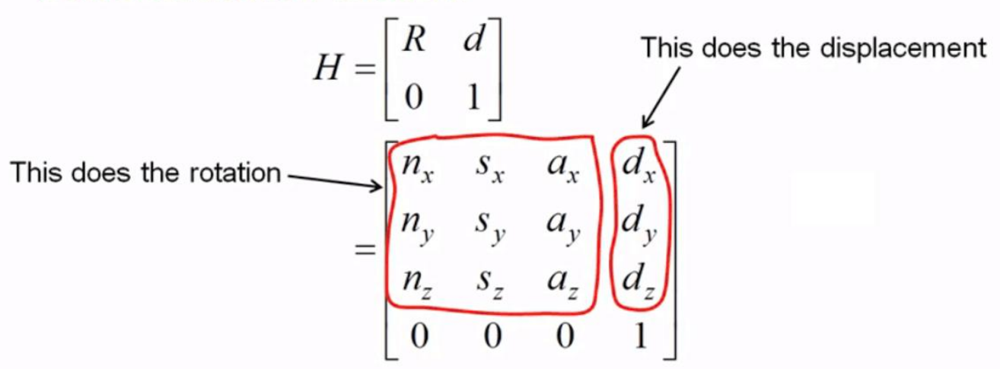

Let's say we want to apply scaling but only in direction of x-axis. In that case:

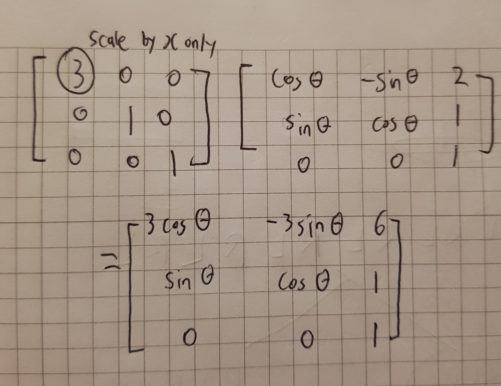

# 3D transformation
In 3D, we have a four coordinates in our vector and all transformations are 4 by 4 matrices. It doesn't change much from the 2D points we used from above, except for rotation.

Translation in 3D:

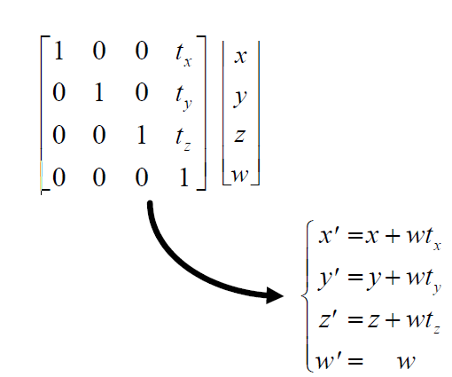

Rotation in 3D is a bit more complicated. When we are rotating around the z-axis, the axis z doesn't change; only the y and x. Same concept for y axis and x axis:

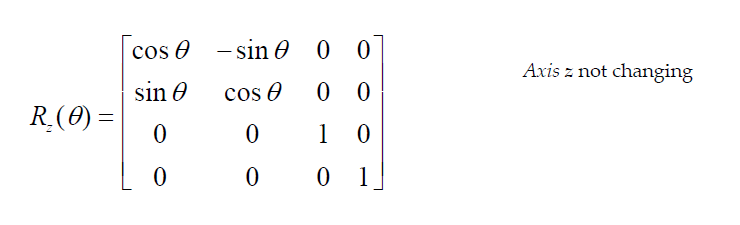
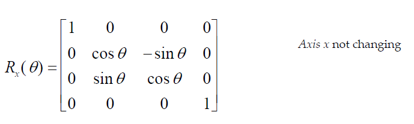
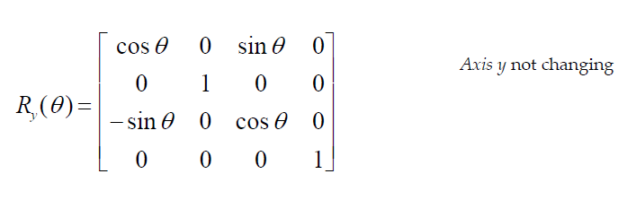

The formula to rotate on a point that is not on a axis is very complicated. 
*Don't memorize formula

Since matrix multiplication is not commutative (not all AB != BA), thus order matters. If for some point P we want first scaling as S, and second translation T:

T * S * P = P'         S * T * P != P'

To remember:
- Scaling should always come first before any other operation 
- for translation, only give value that you want to move. Otherwise, 0 for the rest (not 1)
- If an object is on the origin and we rotate by an axis, it will rotate while the object is still in the current location.
- If an object is on the origin and we first translate and then rotate by an axis, the translated coordinates will also be affected by the rotation, thus the translated distance will also be rotated.
- Don't do same-location rotation while the coordinates is not in the origin. Formula complicated

## Complex objects
Objects are often defined as many components. It is the result of multiple objects at precise coordinaes of each other. We concatenate matrices to place objects. 

Lets say a group of matrices make a complex arm object of multiple components. If we apply a new matrix in the beginning, it will propagate to the rest of the matrices and the whole arm will move based on the new added matrix:

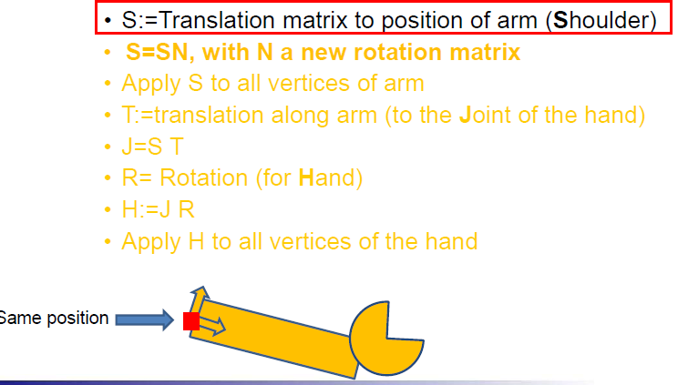

## Order
The Matrix object can store a single transformation or a sequence of transformations. A sequence of transformations is called a **composite transformation**, which is a result multiplying the matrices of the individual transformations. 

As mentioned before the order matters. Say you want to apply operations to a point P in this order:
1. S
2. R
3. T 

The point p is generally on the far right side of the expression. Thus the order of applying this one by one will be 1, 2, 3. 

For applying the transformation one by one, the calculation goes from right to left:

Left                 Right
<-----------------------
P' = T * R * S * P

For creating a composite transformation and then P, the calculation goes from left to right:

Left                 Right
---------------------->
P' =  (T * R * S) * P

As shown above the direction of the multiplication doesn't affect the result, ONLY THE ORDERING OF THE TRANSFORMATIONS.

When in doubt always assume we are applying one by one thus right -> left direction.

## Reverse transformation

Remember that (0, 0, 1) vector is the origin in 2D space

All transformation matrixes are guaranteed to have an inverse to go back to. Thus to undo a transformation, multiply the point by the inverse of the transformation. In CS, due to precision issues of floats and doubles, matrix A multiplied by its inverse is not always the identity matrix. Therefore, it is safer to store each transformation matrix result into a stack and to go back certain steps.

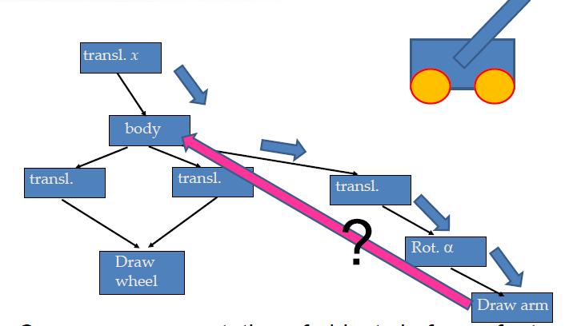

To keep track of the *hierarchical objects* walk over the tree using DFS. Use a stack to keep track of the matrix concatentations along the way:

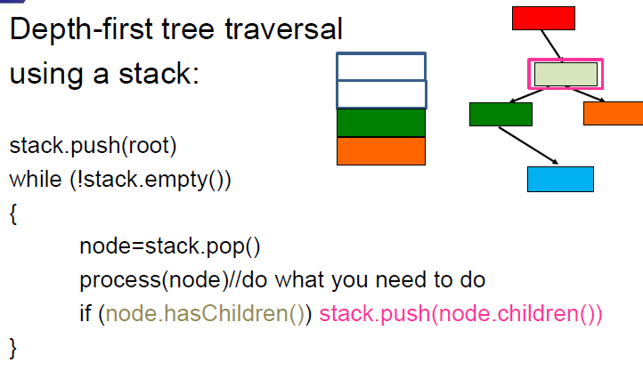

# 1. Transformation, 2. Projection, 3. Viewport

## Projection
After transformation, we have to apply the projection to finally be able to project a 3D point onto our 2D screen. This was straight-forward with our naive approach and using 3-value vector for 3D projection space. 

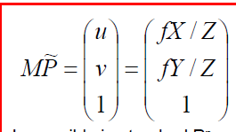

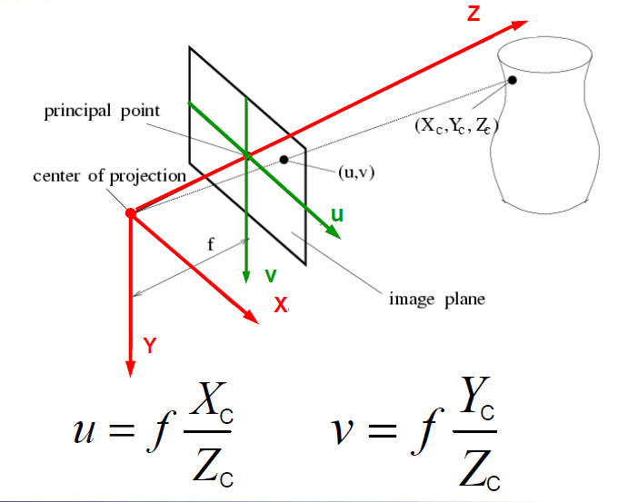

But with homogenous coordinates, we require 4-value vectors and not so simple.

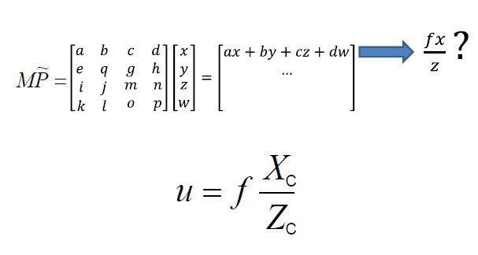

But there is a solution; Z can easily be removed by scaling by Z. Remember that with homogenous coordinates (x/z, y/z, 1) = (x, y, z). Therefore:

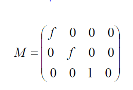

The above *f* stands for **focal length** which will be explained in the next section.

## Viewport
After projection, we now have to transform the points from the **window** (world view) to the **viewport** (screen view). The center coordinates of the window must remain at the center position of the viewport.

Not that our point is on our **image plane** or **projection plane**, we now have to calculate how large the image is. The image plane has a width and height range of (-1, 1):

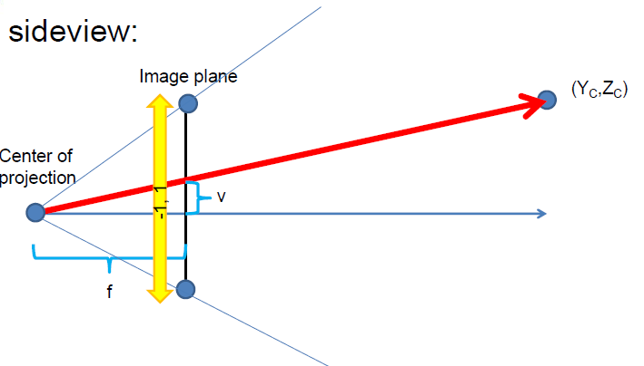

The above f stands for **focal length** and it is the distance from the camera to the projection plane. The projection plane is almost always placed at a distance from the camera such that the distance from the *projection plane's center to the projection plane's top and bottom is 1*. This image from this website shows it well: 

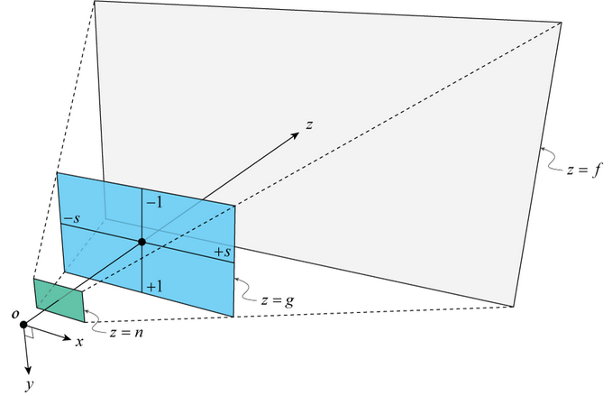

**Viewport** is simply mapping our projection onto pixels for display. We take the image plane and transform it into a [0 * width - 1] * [0 * height - 1] matrix. 

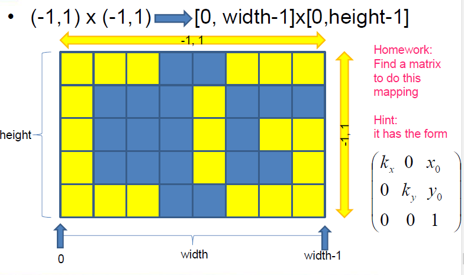

After finding the matrix *viewport* our camera model is finally complete:

