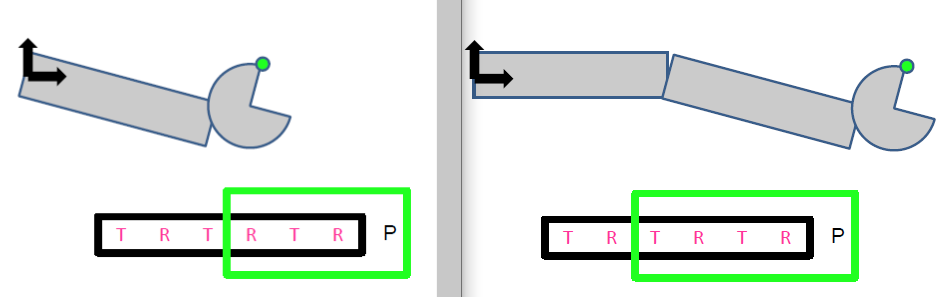
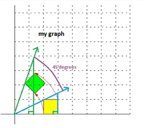
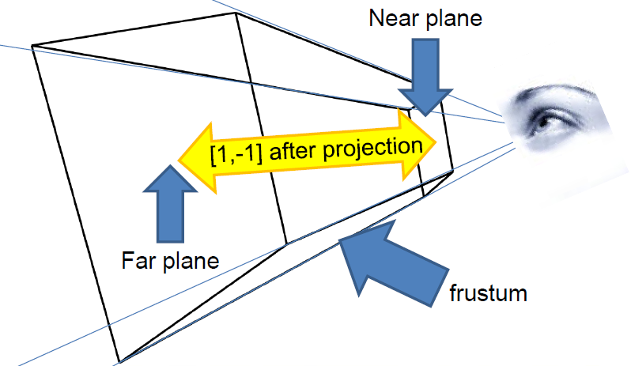

# Week 2

## Homogenous coordinates
Goal: given 3D point M, we want a function C such that C(M) is the point’s projection in a 2D photo

As mentioned before, homogenous coordinates can represent N-D projective space with N + 1 coordinates in vector forms. Null vectors (0, 0, 0) are not part of the space. 

A group of vectors are considered homogenous coordinates if they satisfy the following condition:

*Two points p,q are equal iff exists a!=0 s.t p * a = q*

Example:
In a 2D projective space of P2:

(2,2,2) = (3,3,3,) = (4,4,4)
(3, 3, 3) != (4, 3, 4)
(0, 1, 0) = (0, 2, 0)

If we have a vector from a standard *vector space* Rn and want to represent this in an N-Dimensional *projective space*, add a 1 to its end. A point (x, y) in R2 embbed in a P2 corresponds to (x, y, 1)

Example:
(1, 4) in R2 => (1, 4, 1) in P2

All points (x, y, 1) form a plane, called as *affine plane*:


ALl these points are basically lines, simply scaled with a scalar.

(x, y, w) in 2D projection space corresponds to (x/w, y/w) in 2D vector space. Only when the 'w' = 1 is the x, y value same as in both projection and vector space.

Only when w != 0 is there point in the projection space that corresponds to the point in the vector space.

But the points where w = 0 has no correspondence to the vector space. This is because the plane with w = 0 is not reachable. The points with w=0, as you drag w near towards 0, the points go towards infinity:


This is a way to describe points at infinity and they converge to that central point:


## Transformaion with homogenous coordinates
In a vector space, we simply add the other vector for translation:


In a projection space, we multiply it by a matrix:


The above works by adding x with tx, y with ty, and 1 * 1 for the w. Or when w = 2, it is still the same point because remember, we *scale w down to 1 to get the real coordinates*:


Similar but different approach for rotation. This is because with translation, x and y value is only concerned with themselves but for rotation, the value of the other affects the final result:


Same if w > 1:


For points at  inifinity, where (x, y, 0), translation doesn't do anything since infinity will still be in infinity. For points at inifnity when rotation, it actually does rotate

To get a location in infinity space, 
- translate Q to origin
- Rotate around origin
- Translate back to Q

## 3D transformation
In 3D, we have a four coordinates in our vector and all transformations are 4 by 4 matrices. It doesn't change much from the 2D points we used from above, except for rotation.

Translation in 3D:


Rotation in 3D is a bit more complicated. When we are rotating around the z-axis, the axis z doesn't change; only the y and x. Same concept for y axis and x axis:


The formula to rotate on a point that is not on a axis is very complicated. 
*Don't memorize formula

Since matrix multiplication is not commutative (not all AB != BA), thus order matters. If for some point P we want first scaling as S, and second translation T:

T * S * P = P'         S * T * P != P'

Three main operations to transformation:

- Scale (scale by z axis by 5, multiply the vector (1, 1, 5))
- Translation
- Rotation

To remember:
- Scaling should always come first before any other operation 
- for translation only give value that you want to move. otherwise, 0 for the rest (not 1)
- If an object is on the origin and we rotate by an axis, it will rotate while the object is still in the current location.
- If an object is on the origin and we first translate and then rotate by an axis, the translated coordinates will also be affected by the rotation, thus the translated distance will also be rotated.
- Not possible to achieve same-location rotation while the coordinates is not in the center and rotate by an axis


## Complex objects
Objects are often defined as many components. It is the result of multiple objects at precise coordinaes of each other. We concatenate matrices to place objects. 

Lets say a group of matrices make a complex arm object of multiple components. If we apply a new matrix in the beginning, it will propagate to the rest of the matrices and the whole arm will move based on the new added matrix:


### Order
As mentioned before the order matters. Say you want to apply operations to a point P in this order:
1. T
2. R
3. T 
4. T
5. T
6. R

If we apply the matrix operation one at a time to the point, it should be 6, 5, 4, 3, 2, 1. But if we concatonate matrices to create one composite matrix transformation, the *order is reversed*: 1, 2, 3, 4, 5, 6. To show you it's true:

1. RP , rotate around the origin
2. TRP, move the vertex not the origin
3. TTRP, rotate around the origin
4. TTTRP
5. RTTTRP
6. TRTTTRP 

In short:

P'  = (T * R * T * T * T * R) * P 
    =  R * T * T * T * R * T  * P

In coding, the first operation is usually the very last argument.

### Robot arm
After the cube, when we want to apply an operation to its whole, the operation should be applied at the very last thus after it is finished creating parts for cube. This is to ensure the entire cube is affected by the operation in the end.

When drawing a segment that is influenced by a previous one, operations are involved that take part from the previous segment in order to be influenced by the previous segment's movement as well.

If segment3 exists after segment1 and segment2, the *order of applying the previous operations should be reversed*. For segment3 operation:

1. segment3's scaling
2. segment3's rotation (self position)
3. apply translation from segment2's distance
4. apply rotation from segment2's angle
5. apply segment1's translation
6. apply segment1's rotation

```
    glm::mat4 matrix_segment1 = 
        glm::rotate(id, segment1.rotationX, x_axis) * 
        glm::scale(id, segment1.boxSize) * 
        centering;

    glm::mat4 matrix_segment2 = 
        // Operation to allign with segment1:
        glm::rotate(id, segment1.rotationX, x_axis) * 
        glm::translate(id, { 0, 0, segment1.boxSize.z } ) *

        // Segment2's self operation
        glm::rotate(id, segment2.rotationX, x_axis) * 
        glm::scale(id, segment2.boxSize) * 
        centering;

    glm::mat4 matrix_segment3 =
        // Operation to allign with segment1:
        glm::rotate(id, segment1.rotationX, x_axis) *
        glm::translate(id, glm::vec3 { 0, 0, segment1.boxSize.z }) *

        // Operation to allign with segment2:
        glm::rotate(id, segment2.rotationX, x_axis) *
        glm::translate(id, glm::vec3 { 0, 0, segment2.boxSize.z }) * 

        // Segment3's self operation
        glm::rotate(id, segment3.rotationX, x_axis) * 
        glm::scale(id, segment3.boxSize) * 
        centering;
```

The below image depicts that after finishing applying segment2's rotation, we apply segment1's translation.



### Solar System
Solar system assignment is similar but has one more condition: orbiting and spinning are two separate operations that should not impact each other in any way.

If the moon has an orbit speed of zero, then it would always stay on the same side of the planet as seen from a static point in space:


In order to achieve this, we need to 'offset' the 'static-rotation' that occurs when the moon orbits around the sun. If not, then the moon won't face the same side of the planet when its orbit speed is zero, due to the 'static-rotation' that occurs when rotating the sun:



Same goes for spinning: if the spin speed were zero then the orientation of the body should not change relative to the orbit. 

In order to achieve the above two, we need to similary 'offset' the 'static-rotation' that occurs when orbiting around the planet. If we didn't do this then the moon's orientation will not be the same, due to the 'static-rotation' that occurs when rotating the planet.

Example of a moon's transformation that orbits around a planet which orbits the static sun:

```
rotationMatrix(computeAngle(planet.orbitPeriod, time), yaxis) *  // orbit(rotate) around sun
translationMatrix(glm::vec3 { planet.orbitAltitude, 0, 0 }) *    // translate to distance from sun
// offset to be on same side of planet when orbit speed is 0
rotationMatrix(-computeAngle(planet.orbitPeriod, time), yaxis) * 

rotationMatrix(computeAngle(body.orbitPeriod, time), yaxis) *   // orbit(rotate) around planet
translationMatrix(glm::vec3 { body.orbitAltitude, 0, 0 }) *     // translate to distance from planet
// offset to achieve static orientation when orbit speed is 0
rotationMatrix(-computeAngle(body.orbitPeriod, time), yaxis) *  /

rotationMatrix(computeAngle(body.spinPeriod, time), yaxis)      // moon static-rotate
```

### Reverse transformation

Remember that (0, 0, 1) vector is the origin in 2D space

All transformation matrixes are guaranteed to have an inverse to go back to. Thus to undo a transformation, multiply the point by the inverse of the transformation. In CS, due to precision issues of floats and doubles, matrix A multiplied by its inverse is not always the identity matrix. Therefore, it is safer to store each transformation matrix result into a stack and to go back certain steps.


To keep track of the *hierarchical objects* walk over the tree using DFS. Use a stack to keep track of the matrix concatentations along the way:


## 1. Transformation, 2. Projection, 3. Viewport
After transformation, we have to apply the projection to finally be able to project a 3D point onto our 2D screen. This was straight-forward with our naive approach and using 3-value vector for 3D projection space. 


But with homogenous coordinates, we require 4-value vectors and not so simple.


But there is a solution; Z can easily be removed by scaling by Z. Remember that with homogenous coordinates (x/z, y/z, 1) = (x, y, z). Therefore:


Not that our point is on our *image plane*, we now have to calculate how large the image is. The image plane has a width and height range of (-1, 1):


We take this image plane and transform it into a [0 * width - 1] * [0 * height - 1] matrix called a *viewport*:


After finding the matrix *viewport* our camera model is finally complete:


## Last but not least
From the above camera model pipeline, the Z value is lost as we project 3D points on to 2D screens. The Z coordinate is actually important as the GPU compares new distance to stored distance and only updates the pixel if new distance is nearer. 

Because the Z value is lost during projection, the projection matrix from the pipeline must be extended. But a 3D scene is infinite. To represent Z, add a near and far clipping plane:




For near=2 and far = 4 calculate the projection of (0,0,-2,1). 

Result of final pipeline:

