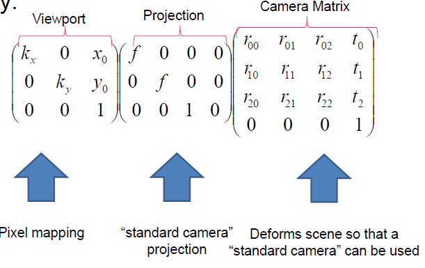
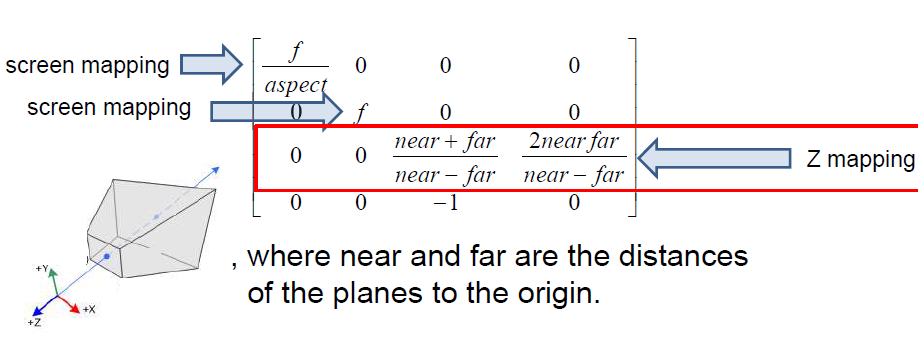

## Transformaion with homogenous coordinates
In a vector space, we simply add the other vector for translation:

In a projection space, we multiply it by a matrix:

The above works by adding x with tx, y with ty, and 1 * 1 for the w. Or when w = 2, it is still the same point because remember, we *scale w down to 1 to get the real coordinates*:

Similar but different approach for rotation. This is because with translation, x and y value is only concerned with themselves but for rotation, the value of the other affects the final result:

Same if w > 1:

For points at  inifinity, where (x, y, 0), translation doesn't do anything since infinity will still be in infinity. For points at inifnity when rotation, it actually does rotate

To get a location in infinity space, 
- translate Q to origin
- Rotate around origin
- Translate back to Q

## 3D transformation
In 3D, we have a four coordinates in our vector and all transformations are 4 by 4 matrices. It doesn't change much from the 2D points we used from above, except for rotation.

Translation in 3D:

Rotation in 3D is a bit more complicated. When we are rotating around the z-axis, the axis z doesn't change; only the y and x. Same concept for y axis and x axis:

The formula to rotate on a point that is not on a axis is very complicated. 
*Don't memorize formula

Since matrix multiplication is not commutative (not all AB != BA), thus order matters. If for some point P we want first scaling as S, and second translation T:

T * S * P = P'         S * T * P != P'

## Complex objects
Objects are often defined as many components. It is the result of multiple objects at precise coordinaes of each other. We concatenate matrices to place objects

Lets say a group of matrices make a complex arm object of multiple components. If we apply a new matrix in the beginning, it will propagate to the rest of the matrices and the whole arm will move based on the new added matrix:

As mentioned before the order matters. Say you want to apply operations to a point P in this order:
1. T
2. R
3. T 
4. T
5. T
6. R

If we apply the matrix operation one at a time to the point, it should be 6, 5, 4, 3, 2, 1. But if we concate matrices to create one composite matrix transformation, the *order is reversed*: 1, 2, 3, 4, 5, 6. To show you it's true:

1. RP , rotate around the origin
2. TRP, move the vertex not the origin
3. TTRP, rotate around the origin
4. TTTRP
5. RTTTRP
6. TRTTTRP 

In short:

P'  = (T * R * T * T * T * R) * P 
    =  R * T * T * T * R * T  * P

Remember that (0, 0, 1) vector is the origin in 2D space

All transformation matrixes are guaranteed to have an inverse to go back to. Thus to undo a transformation, multiply the point by the inverse of the transformation. In CS, due to precision issues of floats and doubles, matrix A multiplied by its inverse is not always the identity matrix. Therefore, it is safer to store each transformation matrix result into a stack and to go back certain steps.

To keep track of the *hierarchical objects* walk over the tree using DFS. Use a stack to keep track of the matrix concatentations along the way:

## 1. Transformation, 2. Projection, 3. Viewport
After transformation, we have to apply the projection to finally be able to project a 3D point onto our 2D screen. This was straight-forward with our naive approach and using 3-value vector for 3D projection space. 

But with homogenous coordinates, we require 4-value vectors and not so simple.

But there is a solution; Z can easily be removed by scaling by Z. Remember that with homogenous coordinates (x/z, y/z, 1) = (x, y, z). Therefore:

Not that our point is on our *image plane*, we now have to calculate how large the image is. The image plane has a width and height range of (-1, 1):

We take this image plane and transform it into a [0 * width - 1] * [0 * height - 1] matrix called a *viewport*:

After finding the matrix *viewport* our camera model is finally complete:

## Last but not least
From the above camera model pipeline, the Z value is lost as we project 3D points on to 2D screens. The Z coordinate is actually important as the GPU compares new distance to stored distance and only updates the pixel if new distance is nearer. 

Because the Z value is lost during projection, the projection matrix from the pipeline must be extended. But a 3D scene is infinite. To represent Z, add a near and far clipping plane:

For near=2 and far = 4 calculate the projection of (0,0,-2,1). 

Result of final pipeline:

