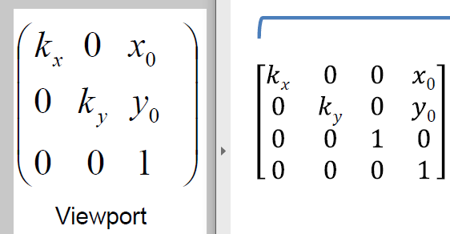

# Week 3
As *frustrum* is the portion of a solid that lies between one or two parallel planes cutting it:


To go from a 3D space to a 2D space, use the *camera model* matrix multiplication:

pixel mapping (image) *  "standard camera" projection (projection) *  deforms scene (orientation/location)

## Final camera model pipeline
Image of camera model pipeline from last time:


From the above camera model pipeline, the Z value is lost as we project 3D points on to 2D screens. The Z coordinate is actually important as *the GPU compares new distance to stored distance and only updates the pixel if new distance is nearer*. Simply put, we lost the depth of the projection.

Because the Z value is lost during projection, the projection matrix from the pipeline must be extended. But a 3D scene is infinite. To represent Z, add both *near clipping plane* and *far clipping plane*:


Sometimes in games or simulatinos, things pop up out of nowhere. This is because these things were in the far plane (which we don't care) and then within the near plane. Nowadays doesn't happen often and instead it is replaced with a fog or something to hide it. Other times you can get near an object and can at some point see inside of it. THat's because you cross the 'near plane'

As mentioned before, OpenGL conventions has the camera looking along the negative z-axis:


NOrmally we project based on a square. When a screen is wider, it squeezes the entire scene by a certain factor along the x axis (width). The *screen mapping* at the top right scales the scene such that the square image appears correctly strectched. This scaling is done at the END, not beginning:


This is scaling/stretching is necessary since most displays are rectangles, not squares.

Let's say a green dot is on the far plane and blue dot is on the near plane. Then the points inside the frustrum have R3 coordinates in [-1, 1]3 domain:


Projection is basically mapping the contents (points) of the frustum inside a cube:


The result is that content closer to the near plane will appear closer and contet further to the near plane will appear further:


Since we are now considering Z coordinate (depth) as well, our *viewport* from the previous lecture changes from 3x3 to 4x4:



Result of final pipeline:


The above multiplied together gets us a single 4 x 4 camera matrix


For near = 2 and far = 4 calculate the projection of (0,0,-2,1). 

## Triangle clipping
The above works well for individual points but fails for triangles. For parts of a triangle that are ouside of the frustum, we need to clip the crossing part. Everything inside the frustum is taken care of.

We clip the triangles AFTER applying the projection matrix. Thus we know whether a triangle is (partially) outside the cube if they are not inside the [-1, 1] range. 


## Rasterization
*Rasterization* is basically filling the sceren pixels to represent the image we get after the camera model pipeline. A pixel is filled if its center is covered:


This is why we get higher quality images if there are more pixels available to represent the image. A 4K TV (ultra high definition) has over eight million pixels (3840 x 2160).


Triangles can have different colors on vertices. If two points are yellow and the other point is red, then the pixel color values between these three points are created based on these three. This is called *interpolation*. It will look like a gradient effect:


The color values are extracted at the pixel centers:


*Aliasing* is the visual stair-stepping of edges that occurs in the image. It is the result when you hide the original represetation with a lower representation (too many to be captured on the pixels) or when pixels are partially covered.

This can be solved with *anti-aliasing* which is smoothing the jagged edges. One way is *super sampling*: render at higher resolution then reduce resolution by averaging the colors of the neighboring pixels. Results in lower resolution but smoother images:


The *super sampling* can choose a filter to do the averaging, with a popular one being the *box filter* as mentioned in week 1.

## Shading (light reflection)
In order to make 2D images look 3D, we have to apply *shading* or light reflection. We can use the *gonioreflectometer* to get all the precise light reflection data but it is often costly. So instead we mostly use mathematical models. It has the following properties:

- describes light interaction as a function
- more lightweight than the database from the instrument
- parameters to control appearance
- acquired materials can be approximated

One of the most popular mathematical model is the *Phong model*:


As mentioned before, we describe the color in 3 *cone types* (channels): Red, Green, Blue. Each color channel is represented as a single wavelength (cosine function) and we describe the model for a single color channel, thus do it 3 times.


The phong model has three properties/fucntions:

- Ambient
- Diffuse
- Specular

The variables represent the color properties in RGB, thus a tuple with 3 floats in range [0, 1].

### Phong model: Ambient
The *ambient* mimics the *scene light* which is reflections from neighboring surfaces. It is used to account for the small amount of light that is scattered about the entire scene. 


Here the *light property* means the light color, thus RGB in a tuple. The light property's value (I) is typically between [0, 1] (i.e  (0.9, 0.9, 0.9)).

The *surface property* means the reflectance of surface. 


The ambient term doesn't actually indicate the shape of the object as it only approximates the indirect light:


### Phong model: Diffuse
The *diffuse* property is the reflected light intensity from a surface such that the light scatters in many different angles rather than just one same angle. This tends to be the case when light is reflected off of rough surfaces like clothing, paper and asphalt. 


The ideal diffuse reflection is equal luminance when the object is viewed from all directions. Surfaces that do this are called *Lambert Surfaces*. 

The angle from the cosine is the angle between the light origin vector and the normal vector from point on surface (x). 


The *surface property* means the diffuse reflectance of surface. 

The diffuse term indicates the shape of the object and does NOT depend on observer position (looks same from all position)


Below we calculate both the diffuse and ambient value. If we add them all up, we get the resulting color


Careful: the light should always come from above
the surface, otherwise, it should stay black.
What does this mean for the angle 

### Phong model: Specular
The *specular* property is the reflected light intensity from a surface such that the light scatters in all the same angle (unlike diffuse). This tends to be the case when light is reflected off of smooth or glossy surfaces like a mirror. This results in that specific area being much more luminous than the rest:


The angle from the consine here is between the view (camera) direction and the ideal reflection direction (reflected light direction calculated by getting the normal vector of surface point x)


'n' is the shininess of the surface (not light source), whereas *I* is the intensity of the light source.

As the specular reflection coefficient (Ks) increases, the glossy reflected light intensity also increases. As 'n' (surface shinness) or the angle increases, the glossy reflected light intensity *decreases*. This is because as this angle increases, the number of *micro-facets* (mirros making up the surface) reflecting light towards the eye decreases, hence the decrease in brightness. 


### Phong model: Optional
There is one more extra property called *emission*. This equivalent to ambient with light set to 1. This is used when the object emits light like hot glowing metal.

The final result of combing all ambient, diffuse, and specular:


### Shading techniques
There are several shading techniques that makes use of the phong model:

- *Flat shading*: applies *phong model* to produce color per face 
- *Gouraud shading*: applies *phong model* to produce color per vertex, interpolate color from vertices over triangle
- *Phong shading*: applies *phong model* to produce color per pixel, interpolate parameters of *phong model*

Phong shading is one the most used techniques as it computes the color result per pixel. This is done by interpolating the normals (not color) of vertices over pixels:


The result is an image with much smooth sepcularities:


## Vectors and Shading
Remember that vector is not the same as position. Position is a point on a space. A vector is a direction from point A to point B. Just because they are both in the form of glm::vec3 in C++ does NOT mean same thing.

To get a vector going in the direction of point A:
```
point.A - point.B
```

If we did point.B - point.A, it is going in the direction of point B

When we calculate the dot product of two products, we are calculating their cosO, with O being the angle. Lets say we have a normal vector from a surface point and a light vector. In order to make sure that the light is only reflected ABOVE the surface and NOT BENEATH the surface:

```
    if (glm::dot(normal, lightVector) < 0.0)
        return { 0.0, 0.0, 0.0 }; 
```

This is because if the angle between normal vector and a vector is between 90 ~ 270 degrees (beneath the surface), cosO is [-1, 0]. Therefore, any dot product that is less than 0.0 can be dark.


For the shading assignment, the light, reflection, half-way, view (camera) vector ALL have to me normalized.
(L, R, H, V)

cross product of two vectors returns a new vector that is perpendicular to both vectors. But keep in mind that this result in a vector, which starts in the origin (0, 0, 0). If you wanted to use this result vector to get to a point, the selected position must be added to the vector (thing of it as 'new' origin). In addition, make sure the vector you use in cross product is in right direction.

The result of every 


## OpenGL tutorial
With OpenGL the camera is always fixed; we don't move the camera but move the objects. In order to render camear like we see in the slides, you have to set the coordinates so that the triangle doesn't lay on top of the camera: move the triangle away from the origin.

n-2 triangles in a n # of vectors of triangle strip

When transforming an object made up of thousands of triangles, we don't change each individual vectors cause that would be costly. Instead we use the first step from *camera model pipeline*, which is the *ModelView* matrix. Similary don't forget translate so that the object doesn't stay on top of the camera

In OpenGL, it reads in columns (not rows) thus the matrix has to be transposed (just like vector)


WHen you rotate first around an axis, it will move around
when you translate first and then rotate, it will simply rotate in current position

*Normalized device coorindates* is simply making the w of the coordinates 1. 

If triangle entirely inside the cube, we render the entire triangle.
If triangle paritally inside the cube, OpenGL cuts out the outside part and partially render
If triangle outisde the cube, nothing renders
*case where all three points outside cube but the part of the triangle is still inside the cube

OpenGL performs clipping in Clip Space, not in DNC. THis is to avoid doing any for triangle parts that have to be clipped

Because near and far are along the negative z axis in openGL, get the abs values for distance

focal length (f) has inverse relation with field of view (fov). As focal length becomes larger, the field of view becomes smaller. As focal length becomes smaller, te fiedl of view becomes smaller.

As the field of view or angle (Fovy) becomes smaller, our focus becomes narrow thus the object seems bigger. As the angle become bigger, our focus becomes wider thus object seems smaller

THe wider the camera, the shorter the *focal lens* (field of view or FOV)
