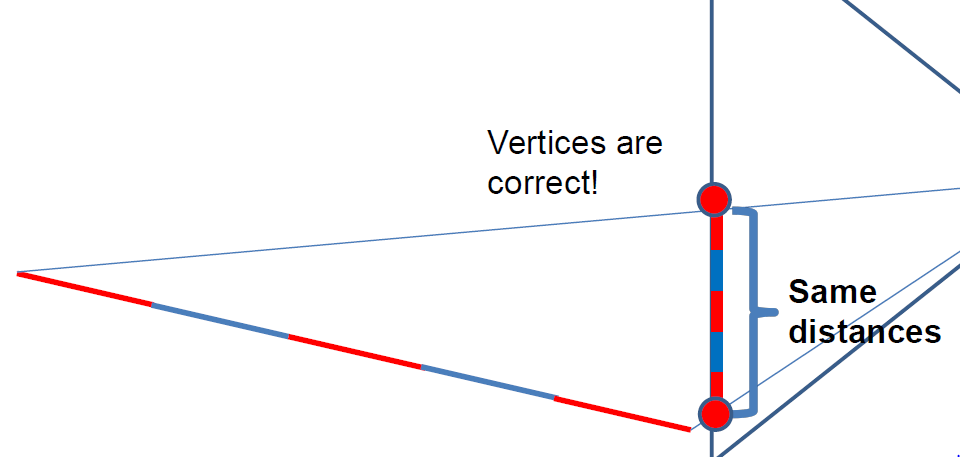
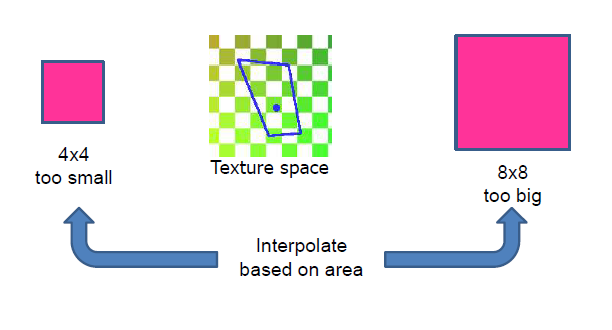

# Week 4

## Interpolation on a trinagle
To interpolate on a triangle, one should describe point P on the triangle as a combination of the three vertices that make up the triangle. For the three vertices A, B, C and coefficients x, y, z:

P = xA + yB + zC, with x + y + z = 1 & x,y,z>0

The coefficients determine the appropriate mix of corresponding vertex attributes. For each point on the triangle the coefficients are different. 

If the point P was directly in the center of the triangle the coefficients will be x = y = z = 1/3.

Interpolation is used for rasterization. But if the triangle doesn't cover the center of a pixel, than that pixel won't be colored.

## Texture mapping
Texture mapping is applying a 2D image on to a 3D geometric shape to add more details to the object. As mentioned before, an object in CG consists of numerous triangles. If we combine *texels* (texture pixels) with the wireframe of triangels, we get a texture mapped triangles:

We speciify a *texture coordinate* at each vertex. In order to define these texture coordinates we can do either 

- *mesh unwrapping*: load the mesh onto a 2D box to determine coordinates
- *geometric texture mapping*: define a function that takes a vertex position (x, y, z) in R3 and map onto 2D texture coordinates (u, v) = T(x, y, z)

### Mesh unwrapping
For *mesh unwrapping* there are special softwares that flattens the mesh for us:

After defining the texture coordinate, we then use interpolation on to the center of the triangle and get the following texel values:

Outside the texture, there are different modes per axis:

- *Border*: constant color
- *Clamp*: keep border texel value
- *repeat*: at borders

### Geometric Texture Mapping
Depending on how we define the function the result texture can vary. The function can be defined so that coordinate would be:

- T(x,y,z) = (x,y)
- T(x,y,z) = (y,z)
- T(x,y,z) = (z,x)

When we apply onto X,Y this is what happens:

The result:

You can apply the same concept to YZ and ZX:

But our functions can be mroe complicated than the above.

#### Cylinder
Let position (x,y,z) = (r*cos(t), r*sin(t), z) for suitable r,t,z

Then T(r*cos(t), r*sin(t),z)= (t/2pi, z) to get the x and z coodinate

Others:

#### Sphere
To do a sphere
Let position (x,y,z) = (r*cos(t)sin(s), r*sin(t)sin(s), r*cos(s)) for suitable r,t in [0,2pi) and s in [0,pi]. IF r is constant, points are on a sphere.

Then T( (r*cos(t)sin(s), r*sin(t)sin(s), r*cos(s)) ) = (t/2pi, s/pi)

#### Cube map
Texture (depends on the cube side) and coordinate

### Affine texture mapping vs Perspective texture mapping
The above interpolation techinque is called *affine interpolation*: we simply calculate the result as if it is on a screen-space (2D) thus no depth perception. 

But if we were to use this technique on an object that is distorted due to depth, this is actually what we will be calculating:

What we should actually should have calculated is the following: 

Thus this is the result of affine interpolation on a depth distorted object:

Affine texture mapping doesn't take Z-value into account and thus step uniformly over the texture. Nowadays, *perspective texture mapping* has become the norm due to enhanced hardware and industry standards.

### Texture Aliasing
As mentioned before, *pixel* is the unit of a screen space whiel a *texel* is the unit of a texture space. *Texture mapping* is mapping the texels to appropriate pixels in the output picture. We ideally want a one-to-one mapping between pixels and texture

*Texture aliasing* occurs when it is not a one-to-one mapping between texture and pixels.

- oversampling texture maps: more pixels on the screen than texels on the texture
- undersampling texture maps: less pixels on the screen than texels on the texture

### Oversampling
This occurs when more pixels map to a single texel. This results in a *nearest neighbor*:

To solve this jagged edges appearance, we apply interpolation:

- *texel interpolation* or *linear interpolation*: results in less block but washed out values. Below the alpha is any number in range [0, 1]:

- *bilinear interpolation*: Perform linear interpolation in x direction and linear interpolation in y direction:

The below calculation shows the yellow value having the highest coefficient (1-a > a && 1-b > b)

### Undersampling
This occurs when some pixels are too compressed with more texels:

This means one pixel doesn't necessarily correspond to one texel. This is why the further we go to the back, the more texels compressed into the one pixel:

To solve this, two options:
- render at higher resolution then average (filter) the result (costly, could be thousnads of texels in one pixel)

- before the actual mapping, average the values of the texels and look up the result: mipmapping

#### Mipmapping
*Mipmapping* is calculating series of optimized sequences of filtered textures, each of which is progressively lower resolution representation than the previous. Then depending on the pixel-to-texel mapping, we choose the correct level of the mipmap.

In the texture space, we approximate that region with a square pixel of sixe 2^k. It won't be a perfect match but the right sized square will approximate it nicely. Below the square is of size 4, thus k has to be 2, meaning level 2 on the mipmap

1 pixel equals 1 lookup, and we only want to do 1 lookup for efficiency. Therefore, if we were to use this on the original image (level 0 of mipmap), it would cover 4 * 4 pixels, requiring 16 lookups! That's why we go down the mipmap to lower resolution images. The next picture will cover 2 * 2 pixels, thus still 4 look ups. The next level is has an even smaller picture that covers 1 * 1 pixel, finally only 1 lookup.

Mipmapping only costs you 1/3 of extra memory:

In mipmapping, you can sometimes see the change in different mipmap levels:

Between these different mipmap levels, we can also apply interpolation called *trilinear interpolation*:

## Textures: Light maps
Render an image and store it as a textures