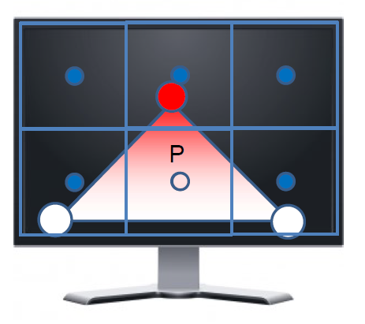
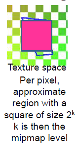

# Interpolation on a trinagle
To interpolate on a triangle, one should describe point P on the triangle as a combination of the three vertices that make up the triangle. For the three vertices A, B, C and coefficients x, y, z:

**P = xA + yB + zC**

Important constraints:

- x + y + z = 1
- x, y, z > 0

If the above constratins are violated, the result point is placed outside the triangle.

If the point P was directly in the center of the triangle the coefficients will be x = y = z = 1/3.

Interpolation is used for rasterization. But if the triangle doesn't cover the center of a pixel, than that pixel won't be colored.

# Texture mapping
Texture mapping is applying a 2D image on to a 3D geometric shape to add more details to the object. As mentioned before, an object in CG consists of numerous triangles. If we combine *texels* (texture pixels) with the wireframe of triangels, we get a texture mapped triangles:

We speciify a *texture coordinate* at each vertex. In order to define these texture coordinates we can do either 

- **mesh unwrapping**: load the mesh onto a 2D box to determine coordinates
- **geometric texture mapping**: define a function that takes a vertex position (x, y, z) in R3 and map onto 2D texture coordinates (u, v) = T(x, y, z)

## Mesh unwrapping
For **mesh unwrapping** there are special softwares that flattens the mesh for us:

After defining the texture coordinate, we then use interpolation on to the center of the triangle and get the following texel values:

The camera view will render this texture shape:

Outside the texture, there are different modes per axis:

- **Border**: constant color
- **Clamp**: keep border texel value
- **repeat**: at borders

## Geometric Texture Mapping
Depending on how we define the function the result texture can vary. The function can be defined so that coordinate would be:

- T(x,y,z) = (x,y)
- T(x,y,z) = (y,z)
- T(x,y,z) = (z,x)

When we apply onto X,Y this is what happens:

The result:

You can apply the same concept to YZ and ZX:

But our functions can be mroe complicated than the above.

### Cylinder
To map texture as cylinder shape, transform position 

(x,y,z) = (r * cos(t), r * sin(t), z) for suitable r,t,z

Then **T(r * cos(t), r * sin(t), z) = (t/2pi, z)** to get the x and z coodinate

Others:

### Sphere
To do a sphere
Let position (x,y,z) = (r * cos(t)sin(s), r * sin(t)sin(s), r * cos(s)) for suitable r,t in [0,2pi) and s in [0,pi]. IF r is constant, points are on a sphere.

Then **T( (r * cos(t)sin(s), r * sin(t)sin(s), r * cos(s)) ) = (t/2pi, s/pi)**

### Cube map
Texture (depends on the cube side) and coordinate

## Affine texture mapping vs Perspective texture mapping
So far we have used *affine interpolation*: we simply calculate the result as if it is on a screen-space (2D) thus no depth perception. But if we were to use this technique on an object that is distorted due to depth, this is actually what we will be calculating:

What we should actually should have calculated is the following: 

Thus this is the result of affine interpolation on a depth distorted object:

Affine texture mapping doesn't take Z-value into account and thus step uniformly over the texture. Nowadays, **perspective texture mapping** has become the norm due to enhanced hardware and industry standards.

# Texture Aliasing
As mentioned before, **pixel** is the unit of a screen space while **texel** is the unit of a texture space. **Texture mapping** is mapping the texels to appropriate pixels in the output picture. We ideally want a one-to-one mapping between pixels and texel.

**Texture aliasing** occurs when the mapping is not one-to-one. Causes:

- oversampling texture maps: more pixels on the screen than texels on the texture
- undersampling texture maps: less pixels on the screen than texels on the texture

## Oversampling
This occurs when more pixels map to a single texel, resulting in a *nearest neighbor*:

To solve this jagged edges appearance, we apply interpolation:

- **texel interpolation** or **linear interpolation**: interpolate over 1 dimension. Results in less block but washed out values. Below the alpha is any number in range [0, 1]:

- **bilinear interpolation**: interpolate over 2 dimensions. Perform linear interpolation in x direction and linear interpolation in y direction:

The below calculation shows the yellow value having the highest coefficient as 1-a > a and 1-b > b in this case:

## Undersampling
This occurs when some pixels are compressed with too many texels. This means one pixel doesn't necessarily correspond to one texel. This is why the further we go to the back, the more texels compressed into the one pixel:

To solve this, two options:
- render at higher resolution then average (filter) the result (costly, could be thousnads of texels in one pixel)

- use **mipmapping**, which occurs BEFORE the actual texture mapping

### Mipmapping
**Mipmapping** averages the values of the texels and look up the result per pixel. We calculate series of optimized sequences of filtered textures, each of which is progressively lower resolution representation than the previous. Then depending on the pixel-to-texel mapping, we choose the correct level of the mipmap.

In the texture space, we approximate that region with a square pixel of sixe 2^k. It won't be a perfect match but the right sized square will approximate it nicely. Below the square is of size 4, thus k has to be 2, meaning level 2 on the mipmap

1 pixel equals 1 lookup, and we only want to do 1 lookup for efficiency. Therefore, if we were to use this on the original image (level 0 of mipmap), it would cover 4 * 4 pixels, requiring 16 lookups! That's why we go down the mipmap to lower resolution images. The next picture will cover 2 * 2 pixels, thus still 4 look ups. The next level is has an even smaller picture that covers 1 * 1 pixel, finally only 1 lookup.

Mipmapping only costs you 1/3 of extra memory:

In mipmapping, you can sometimes see the change in different mipmap levels:

Between these different mipmap levels, we can also apply interpolation called **trilinear interpolation**:

# Advanced textures
Texture data can represent more than just colors of an image.

## Light maps
Texture can also hold light values. Instead of computing the lighting at the spot, we can instead precompute the lighting and save it as a texture. These are called **light maps** and combine these:

## Texture lookup
Texture can also stores values associated to a domain (domain accessed via texture coordinates). There are different domain dimensions and GPUs can natively support 1D, 2D, and 3D. In 1D texture, everything is defined as a function.

Sometimes the computations required to get the texture value can be complex. So instead of computating all the values, we approximate them via **texture lookups**. This means that we compute once and store it as a lookup array to be used again in the future. 

In addition to speed, another advantage is to filter a texture using **linear texture interpolation**. This allows us to get a continuous result via linear approximation and doesn't cost much.

In a 2D texture, the lookup also allow us to consider depths in the object:

To represent a volume, 3D texture is required and the texels represent volumes (volume pixels). To render volumes, we use *slicing*:

## Standard Alpha Blending
We used to describe pixel colors with RGB, thus 3 channels. There can be a fourth channel known as the *alpha value*. The alpha value describes the trasparency effect. If it's fully opaque, object is solid (no transparency). If it's fully transparent, object is completely see through. Here are the corresponding alpha values:

If the current background pixel color is (Rb, Gb, Bb) and there is an incoming fragment (R, G, B, A), we have to consider the alpha value A. The new pixel color is:

Lets say we have two triangles A, B and both have alpha values. We draw A first, thus only A's alpha value is reflected on the triangle. Then we draw B and parts of it overlaps A. For the overlapping part, we follow the above formula and apply B's alpha value on A's preexisting parts: 

The order of the drawn object is important. Above we drew B first thus B's alpha value is dominant on the overlapping part. If we drew B first and A last, then A's alpha value will override B's alpha value:

If A = 0, texel is considered transparent and not drawn.
If A = 1, texel is drawn.

## Environment mapping
Textures can encode its environment. This is called **environment mapping** and is useful for reflections of the environment. This requires a **cube map**, which represents on a cube all the values of light that you see around it.

Normally we have a point on our object and a center and check if the point is projected onto the cube from the center. This tells us the texture and coordinate:

We do something similar with environment mapping: take a reflection from the viewpoint to the object and calculate where that ends up on the cube:

The lookup from this *cube map computating is based only on the reflection (ray) direction*. This means the following:

*in a cube map, same direction equals same lookup even if the location is different*

Below the left reflection should lead to the ball and the right reflection shouldn't. But in a cube map, both have the same direction thus will show the ball to both, even though it shouldn't in real life.

In environment mapping we assume the enviroment is infinitely far away, thus the distances of the reflection location is not computed correctly.

## Dynamic textures
**Dynamic texture** goes one step beyond regular cube mapping and updates the cube map from time to time. This requires **multiple render passsing**: where instead of one image rendering, render multiple images by iteratively taking output of one image render and feeding it as input to another image rendering process. 

This technique is also used in **simultaneous multi-projection** to render multiple outputs at once and create multiple projection planes:

# Shadows
A **shadow** is a region of space where at least one point of the light source is occluded. There are three distinct parts of a shadow:

- **umbra**: completely dark region
- **penumbra**: partially faded region
- **antumbra**: paritally faded region that forms at a certain distance from the object casting the shadow

In computer graphics, we want to color specific places around the object to give the illusion that the object is creating a shadow. How detailed the shadow should be depends. If it is a simple game then the shadow may be simplified to save computing time and resources. If it is in a high budget animated film, then realistic shadows are required.

When creating shadows we can choose for either:

- **hard shadows**: point lights don't create penumbra
- **soft shadows**: point lights create penumbra

## Hard shadows: point light
To compute the shadow, we borrow the phong model which we used to calcualte how much light reflection is perceived by the camera(viewer):

Now place an object in the middle of the light vector and if the object blocks the pathway between L and P, then we reflect a shadow (not a light) to the camera. Symbols for the formula:

- *E(L)*: energy of the light
- *v(P, L)*: visibility test (whether light is visible or not due to object)
- *Transfer(P, L)*: calculation of reflection vector

No light => v(P, L) == 0 => B(P) == 0 => viewer sees shadow.

Point light source shadow will only create **hard shadows** as there is only one point on the light source, meaning the only possible values are either visible (1) or not visible (0).

## Soft shadows: area light
To get the penumbrae and create **soft shadows**, we need an area light source. The following is the formula to get the sot shadows:

This is very costly to compute in real. Prior to 2008 all real-time shadow algorithms only computed the approximate shadow:

A worse approach is for each pixel, checking if it can see each point of the area light source and compute the result.

### Shadow mapping
A good solution to the above approach is **shadow mapping**. We used to consider whether each point on the scene can see the light source. Shadow mapping does it backwards and considers whether the light source can see the point on the scene. Everything seen from light's perspective is lit and everything else is in a shadow. 

It goes like this:

1. Render an image view (using *depth buffer*) from light source
2. Store above depth value results in texture (*depth map*)
3. Render 3D environment from viewpoint
4. Take each drawn pixel and its corresponding 3D position (depth)
5. Compare the depth from the *depth map* and depth in the light view
6. If depth values are the same, pixel is lit. Otherwise pixel is in shadow

We use depth buffer instead of color buffer since color buffer doesn't tell anything about the depths of a pixel.

As shown below, the green dot from the light image view has same depth value as the green dot from the viewpoint. The red dot from the viewpoint doesn't have same depth value.

#### Shadow mapping problems
Several problems when it comes to shadow mapping

- Not enough texels
- too much texels
- Depth bias

As mentioned before, texel-to-pixel mapping may not be one to one. High resolution is required for good shadow generation from shadow mapping. As shown below, not enough texels to represent the image resulting in edge cases:

Too many texels is also problem as generated shadow will be noisy:

Another problem is *depth bias* which occurs from self-shadowing. 

Solution is to add an offset to shift all the depth values that corresponds to our texture a little back:

