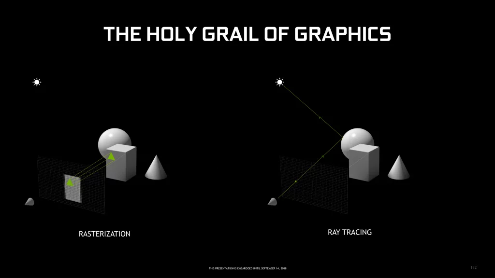

# Recap: rasterization
The current technique used to render a scene(image) is called **rasterization**. It is a *object-based* approach to scene rendering.
1. game source code instructs the GPU to draw 3D scenes with polygons (triangles)
2. polygons are **rasterized** onto each pixels of the 2D screen
3. use **shading** to add colors, textures, and shadow effects
4. scene is fully rendered

Rasterization is fast and suited for real time applications. But doesn't support complex visual effects as it can't easily track how the light in a scene should travel and interact with other elements of the scene. 

# Ray tracing: introduction
**Ray tracing** is an alternative *light-based* approach to scene rendering. It creates a scene based on virtual light and how that light source interacts with all the objects inside the virtual scene. 

Ray tracing is a technique that makes light behave in digital world as it does in real life. A superior form of rendering when it comes to graphical fidelity especially in relation to lighting.

Ray tracing is not only used for a single effect like reflection or shadow but to render an ENTIRE scene

Ray tracing in movies:
- concept: track all the millions of rays that come from each light source
- more computationally intensive
- lot more resources available: more money and time on rendering each scene
- uses ray tracing for the ENTIRE scene

Ray tracing in games
- concept: **backward ray tracing** which is tracing a path from the camera(user’s perspective), through a single pixel, then to whatever object is behind that pixel and then finally back to the light source of the scene in question
- modern games only use ray tracing for one aspect of a scene as opposed to rendering the whole scene using ray tracing itself
- less computationally intensive
- games require rendering of at least 30 frames per second (real time)
- use ray tracing for one aspect of a scene



*For both rasterization and ray tracing, the object is already there. It is a matter of how to represent that object onto a 2D frame.

# Backward ray tracing
Simulate light as bouncing photons with *each photon as a ray of light*
Probability of hitting a pinhole camera is zero. This means too few photons reach the simulated camera. In real life the sun emits about 10*19 photons/s/cm^2. Compared to that the RTX 3090 has 7*10^10 flops, which is a huge difference. 

Instead of simulating millions of light photons, we simply do **backward ray tracing**: Shoot a ray from camera

1. shoot a ray from camera(user's perspective)
2. trace a path from the camera, through a single pixel, to whatever object is behind that pixel (calculate **intersection**)
3. from the object trace further back to the light source of the scene
4. if the light is hit, evaluate Phong model
5. add more rays at **intersection**


5. evaluate shading recursively


## Ray representation
Pretty logical:


Most important task in ray tracing is intersecting the ray with a scene.

## Whitted-Style ray tracing
For the following scene below, we calculate from 3 pixel points:


Out of 3, the light source is visible from 2 of them. From those we calculate potential **reflection** and/or **refraction**, except for diffuse as their reflection is so smooth:


The reflection directs it to mirror and refraction directs it to other parts of the object, where we repeat the process:


And on and on until we stop at a certain point

# Recursion rendering equation


To calculate the reflected off light at X from above, we can just sample like crazy and integrate using the right algorithms. 

# Different Intersection Techniques
**Intersection** is simply calculating the ray vector and the object surface coordinates. 

## Ray / Plane intersection
For some point p, if the below plane equation is true:


then point p is on the plane.

D is how far plane has shifted from the origin. If D = 0, plane is at the origin.


*If p = Dn, it is the closest point to (0, 0, 0) on the plane*

Now apply the plane equation along with the ray equation:


To get the intersection point:


## Ray / Triangle intersection
To calcaulate where the ray intersects a triangle on the plane:
1. Compute plane containing the triangle
2. Compute intersection with triangle's plane
3. Check if intersection is actually inside the triangle

### 1. Compute plane containing triangle
We need to compute 
- normal vector 'n' that is orthogonal from the plane
- distance D which is distance

Calculate normal vector 'n'
-> vector that is orthogonal to the two vectors given by any edges of the triangle

Cross product of these two vectors -> result in vector orthogonal to the two vectors


Calculate distance D
-> any random vertex of the triangle and dot product with the normal vector


P - Dn will be a vector that is parllel to the plane

The dot product is the length of the orthgonal projection onto a normalized vector

### 2. Compute intersection with triangle's plane
Same as before, apply the ray equation onto the plane's equation:


### 3. Check if intersection is actually inside the triangle
Check if intersection point is inside triangle by checking the **Barycentric coordinates**:


1 - a - b = c

Apply simple condition checks:
```
if (a < 0 || b < 0 || c < 0)
-> not inside triangle
else
-> inside triangle
```

## Nvidia
Nvidia’s then-brand-new “RTX” series of graphics cards brought support for something called “Real-Time Ray Tracing” in games. The new GeForce “RTX” series of cards replaced the older “GTX” variety


