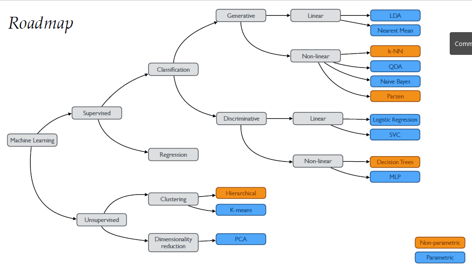
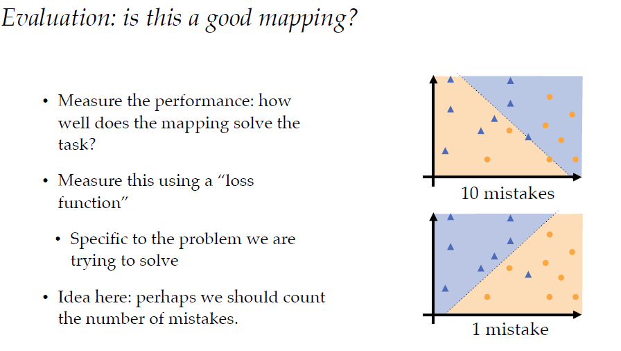
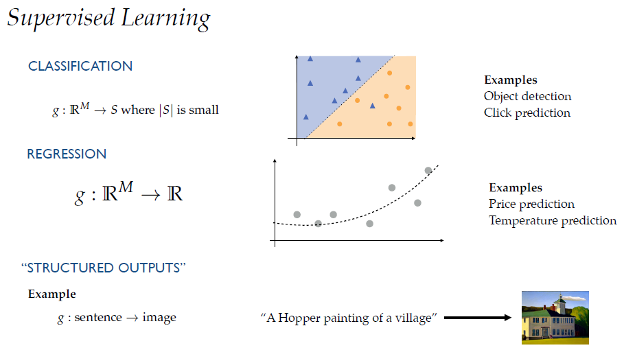
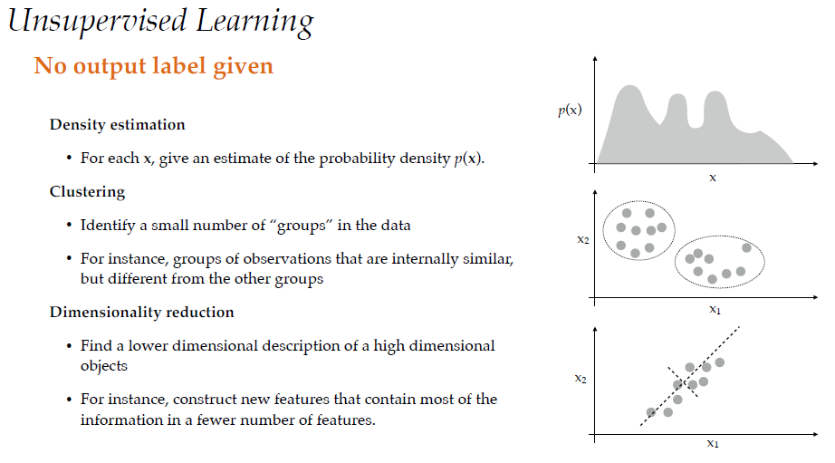
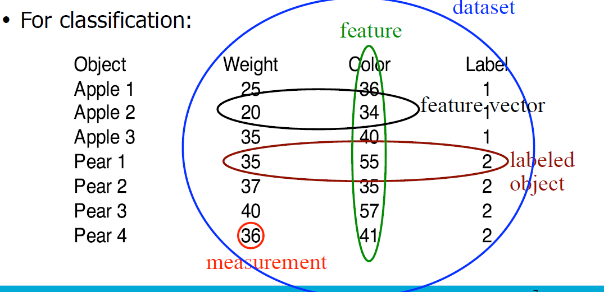
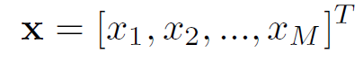
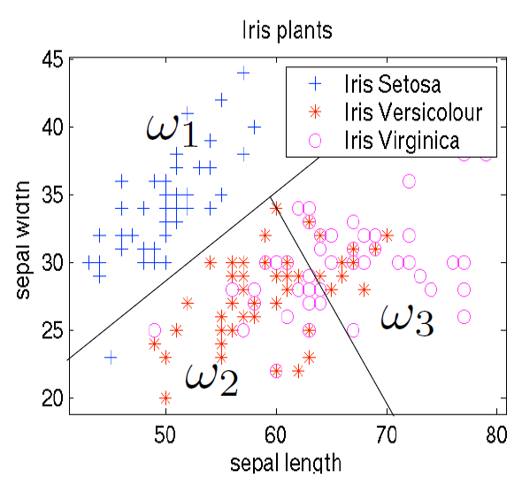
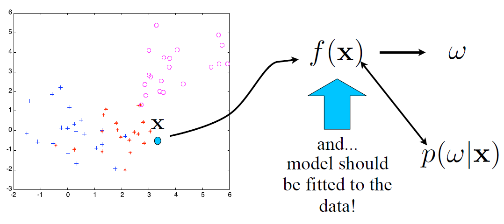
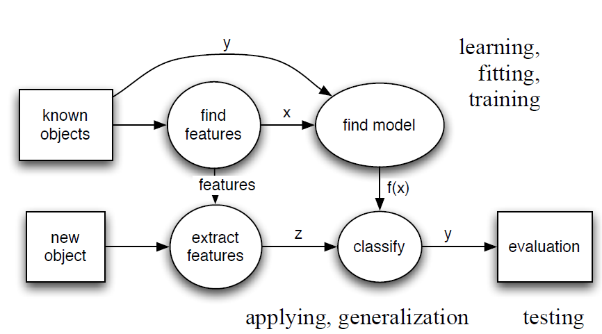
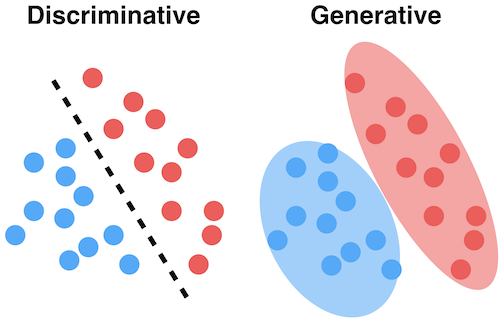

# Introduction to Machine Learning

"No Free Lunch" theorem - no best learning algorithm for all problems. Different problems have different approaches/algorithms that work best

Identify regularies in the world by learning from data (examples). The model should work beyond the specific examples it has been given. Machine learning exists because many tasks are too complicated to explicitely code.

The goal of machine learning is:
- create a model, a mapping from inputs to outputs
- calculate the expected loss, how bad the model is on average

To represent the object to use in a mathematical function, we need measurements. These are called features (variables, covariates) and depicted as vectors;. This vector space is called *feature space*.

Choosing informative features for the task makes it easy to discriminate between different classes. IF we don't choose right things, can't have a good model. It also depends on what type of classifier we use: linear or non-linear?

To train and test, divide data into *training set* and *test set*
1. Use traning set to fit the model
2. Evaluate performance on the test set

Since test set is an i.i.d (independent and identically distributed) sample from a data set, it generally gives a good estimate of he performance.

Types of machine learning:
- **supervised learning**: classification, regression - label exists

- **unsupervised learning**: dimensionality reduction, clustering - no output label is given

- **reinforcement learning**: selecting optimal actions

*for this course the focus is supervised and unsupervised learning

## Learning from examples
Machine learning is basically feeding data (examples) to a model and tweeking its parameters so that it become more accurate with its predictions on non-example test data. We divide the data set into two:

- training set: all examples are labeled for training
- test set: don't have to be labeled

## Features
To do the generalization automatically, we must encode the object by defining its **features**. These feature **measurements** or values are stored in vectors. We can interpret measurments as a vector in a vector space. 

 Given labeled data (feature) x, assign to each object a class label. This will split the feature space (vector space) into further separate regions

Once we have separate regions, a data that goes inside one of these regions will be given the same class label. Dividing up the vector space into separate regions requires a *function*. This function should give the predicted output. We say that the *model should be fitted to the data*.

For each object in the feature space, we should estimate the p(w|x), which is  probability of the class w given the feature of interest is x. This is also called the *posterior probability*

# Inference vs Prediction
**Inference**: Given a set of data you want to deduce how the output is generated as a function of the data.

**Prediction**: Given a new measurement, you want to use an existing data set to build a model that reliably chooses the correct identifier from a set of outcomes.

Inference: You want to find out what the effect of Age, Passenger Class and, Gender has on surviving the Titanic Disaster. You can put up a logistic regression and infer the effect each passenger characteristic has on survival rates.

Prediction: Given some information on a Titanic passenger, you want to choose from the set {lives,dies}
and be correct as often as possible. (See bias-variance tradeoff for prediction in case you wonder how to be correct as often as possible.) 

Prediction doesn't revolve around establishing the most accurate relation between the input and the output, accurate prediction cares about putting new observations into the right class as often as possible.

Given a set of passenger data for a single passenger the inference approach gives you a probability of surviving, the classifier gives you a choice between lives or dies. 

# Discriminiative classifiers
Within **supervised classification** there are 2 types of classifiers
- **generative classifiers**: model how data is placed throughout the space 
- **discriminiative classifiers**:  draw boundaries in the data space

Discriminative models draw boundaries in the data space, while generative models try to model how data is placed throughout the space.

