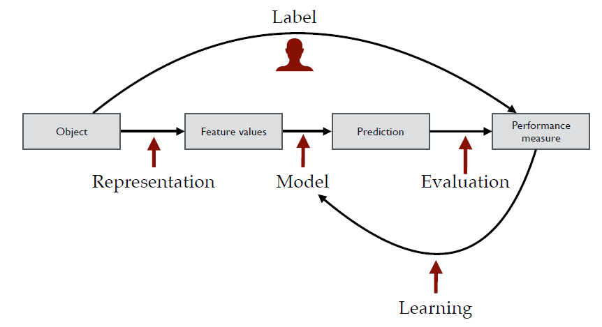
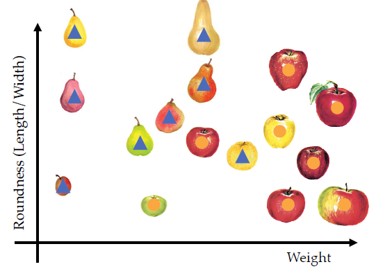

# Week1

## Introduction to Machine Learning
"No Free Lunch" theorem states that there is no best learning algorithm for all problems. Different problems have different approaches/algorithms that work best

Identify regularies in the world by learning from data (examples). The model should work beyond the specific examples it has been given. Machine learning exists because many tasks are too complicated to explicitely code. It is easier to map from input to output using examples. Because it learns about the world using data, strong connection to statistics, signal processing, and optimisation.

The goal of machine learning is:
- create a model, a mapping from inputs to outputs
- calculate the exepcted loss, how bad the model is on average

To represent the object to use in a mathematical function, we need measurements. These are called features (variables, covariates) and depicted as vectors;. This vector space is called *feature space*.

Choosing informative features for the task makes it easy to discriminate between different classes. IF we don't choose right things, can't have a good model. It also depends on what type of classifier we use: linear or non-linear?

To train and test, divide data into *training set* and *test set*
1. Use traning set to fit the model
2. Evaluate performance on the test set

Since test set is an i.i.d (independent and identically distributed) sample from a data set, it generally gives a good estimate of the performance.

Types of machine learning:
- *supervised learning*: classification, regression - label exists

- *unsupervised learning*: dimensionality reduction, clustering - no output label is given

- *reinforcement learning*: selecting optimal actions

*for this course the focus is supervised and unsupervised learning

## Learning from examples
Machine learning is basically feeding data (examples) to a model and tweeking its parameters so that it become more accurate with its predictions on non-example test data. We divide the data set into two:

- training set: all examples are labeled for training
- test set: don't have to be labeled

## Features
To do the generalization automatically, we must encode the object by defining its *features*. These feature *measurements* or values are stored in vectors. We can interpret measurments as a vector in a vector space. 

 Given labeled data (feature) x, assign to each object a class label. This will split the feature space (vector space) into further separate regions

Once we have separate regions, a data that goes inside one of these regions will be given the same class label. Dividing up the vector space into separate regions requires a *function*. This function should give the predicted output. We say that the *model should be fitted to the data*.

For each object in the feature space, we should estimate the p(w|x), which is  probability of the class w given the feature of interest is x. This is also called the *posterior probability*

## Create decision boundary
Lets use an example. Suppose we have the following gaussian data for some feature 1 and we want to estimate p(w|x), which is the probability that feature 1 is blue. Of course the sum of the probability of feature 1 being every possible class is 1.

[image](../../gaussian_data_graph.PNG)

Based on the data shown in the graph above, assgin the label of the class that has the largest posterior probability. So if p(w1|x) > p(w2|x), we assign the feature x with w1. If p(w1|x) < p(w2|x), assign the feature x with w2. Else, we draw a *decision boundary*. *Note that we are assuming that there are only two possible classes.

[image](../../graph_posterior_probability.PNG)

In many cases the posterior probability is hard to estimate, thus we use the *Bayes theorem* to rewrite it into another form:

[image](../../bayes_theorem.PNG)

*class conditional probability* is the probability of a particular feature value x, given the feature is in category wi

*class prior* is the probability of a class wi happening

[image](../../conditional_probability.PNG)
 
To be able to classify a feature space, we need the posterior probability. According to *Bayes rule*, that is possible wiith the *Bayes theorem*:
1. Estimate the class conditional probability
2. Multiply each with the class priors (e.i. p(x|w2)*p(w2))
3. Divide the result of 2 with uncoditional probability of specific feature x (p(x)) to get the posterior probabability
4. Assign objects to the class with highest posterior

Depending on the class-conditional-probability densities or distribution, complicated decision boundaries can appear: 

[image](../../complicated_decision_boundary.PNG)

[image](../../multi_modal_distribution.PNG)

If the class is too dispersed or the class prior is low (low probability of occuring) can be too small (class prior is low), no objects can be assigned to that class.

[image](../../absent_decision_boundary.PNG)

To obtain class conditional probabilities p(x|wi), we need to assume a model beforehand. Estimate the model parameters s.t the example objects fit will. This is where *maximum likelihood estimators* are useful.

Besides the feature vector, other ways of defining objects are:

- dissimilarity approach
- structural pattern recognition (graph)

But this course will only use feature vector as that is most reliable while others need more research.

## Error and Risk

