# Bayes theorem and posterior probability
In many cases the posterior probability is hard to estimate, thus we use the **Bayes theorem** to rewrite it into another form:

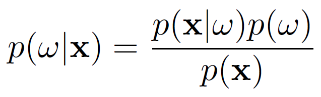

- p(x|w) = **class conditional distribution**: probability of feature x is observed, given the condition of class wi.
- p(x) = **unconditional data distribution**: probability of feature x is observed in any scenario
- p(w) = **class prior probability**: probability of a class wi happening (assumed knowledge)
- p(w|x) = **posterior probability**: probability of a class wi happening, given that feature x occurs (what we want to find out)

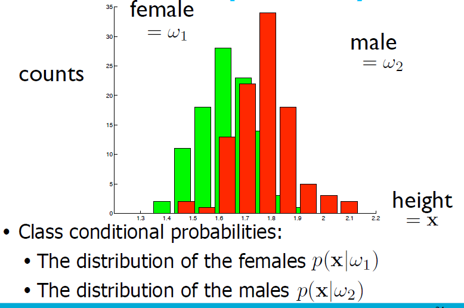
 
To be able to classify a feature space, we need the posterior probability. According to **Bayes rule**, that is possible wiith the **Bayes theorem**:

# Note on notation
In the bayes theorem formula. The class w is discrete (label), the feature x is continous. Thus:

- p(x|w) (likelihood or conditional distribution): probability density function 
- p(x) (unconditional data distribution): probability density function 
- p(w) (prior probability): probability mass function
- p(w|x) (posterior probability): probability mass function. Thus posterior probability will have a probability mass function. 

*for this course we are interested in the probabiliy mass function and course only work with discrete variables.

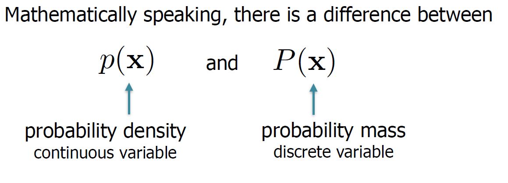

# Simplify classifier
When classifying, most of the times just need to know which posterior probability is largest, not the exact value of the posterior probability. In this case, *p(x) not explicitely necesssary* as both sides of the comparision are divided by the same p(x).

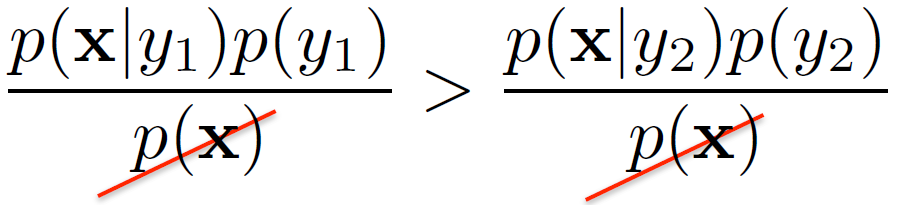

Several ways to describe a classifier

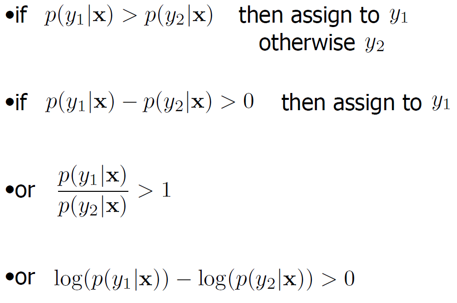

# Create decision boundary
Suppose we want to estimate p(w|x).

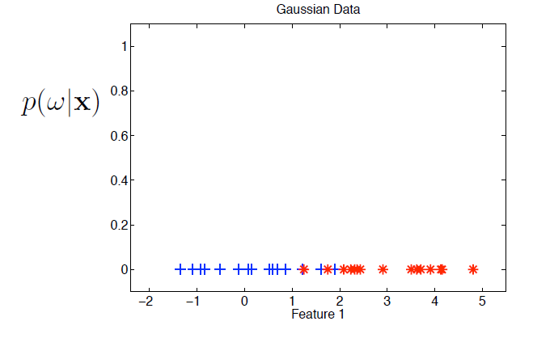

Caclulate posterior probability using Bayes theorem. Assign the label of the class that has the largest posterior probability.

- If p(w1|x) > p(w2|x) or p(x|w1)p(w1) > p(x|w2)p(w2) assign feature x with w1. 
- If p(w1|x) < p(w2|x) or p(x|w1)p(w1) < p(x|w2)p(w2), assign feature x with w2. 
- Else, draw a **decision boundary**. 

*Note that we are assuming that there are only two possible classes.

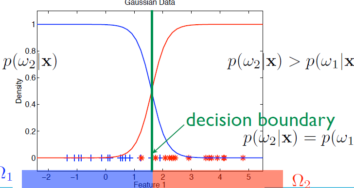

Depending on the class-conditional-probability densities or distribution, complicated decision boundaries can appear: 

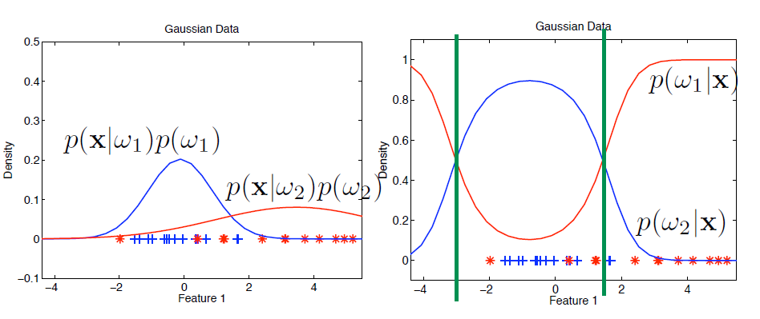

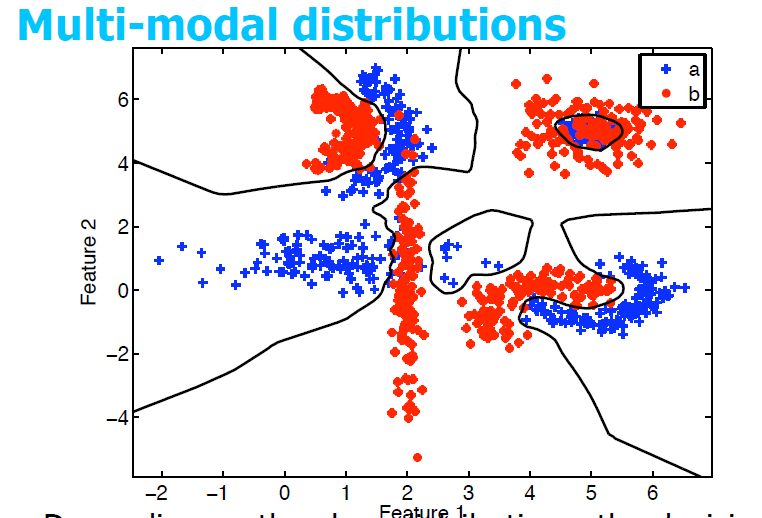

If the class is too dispersed or the class prior is low (low probability of occuring) can be too small (class prior is low), no objects can be assigned to that class.

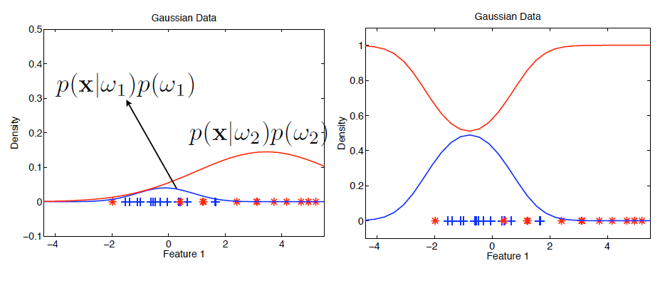

*To obtain class conditional probabilities p(x|wi), we need to assume a model beforehand*. Estimate the model parameters s.t the example objects fit will. This is where **maximum likelihood estimators** are useful.

Besides the feature vector, other ways of defining objects are:
- dissimilarity approach
- structural pattern recognition (graph)

But this course will only use feature vector as that is most reliable while others need more research.

# Models and distributions
We don't have a true distriution, only a sampled data set. Thus we have to approximate the class conditional probability density. We can use

- **Discriminative models**: must know posterior probability densities to classify
- **Generative models**: prior and conditional densities enough to classify

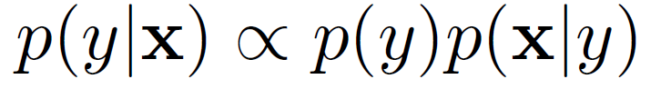

## Parametric Modeling & Estimation
<!-- Density estimation - uses non-parametic appraoch. -->
**Histogram-based density estimation**: approximate desnity by the histogram.

Each bin estimates one value (50 bins, 50 parameters)

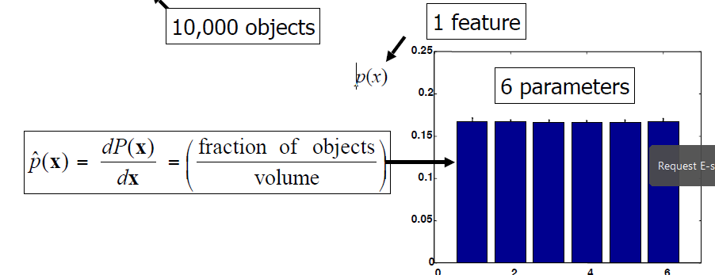

Not very accurate

Assume for 1-dimensional data, we need about 1000 objects. Assume this results in 50 parameters.
For M-dimensional (M features) data, we need 1000^M objects. This results in 50^M parameters. Thus this density is not suitable for M>2 features.

Curse of dimensionality: 
- using more features should give us more information about the outcome => but densities of these features unknown thus must estimate 
- number of parameters (histogram bin) to estimate increases with number of features
- to estimate the increasing parameters, need more objects

This results in an optimal number of features to use:

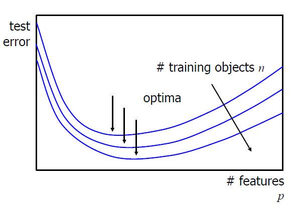

There are several density estimation appraoches:

**Parametric models**: 
- assumes a particular functional form (often linear model)
- only requires estimation of parameters
- easier to fit
- number of parameters fixed with respect to sample size

**Non-parametric models**:
- NOT assume pariticula functional form
- requires estimation of function form
- number of parameters can grow with the sample size. 
- more acurate as potential to fit wider range of possibile shapes for the true function

Examples of parametric models: 
- linear regression
- gaussian distribution (normal distribution)
- lasso regression

Examples of non-parametric models
- decision trees
- neural networks
- k-nearest neighbor
- support vector machines with gaussian kernels

*non-parametric does NOT mean no parameters. EVERY model takes the form of a function with some parameters (ceofficients)

# Gaussian distribution
**Gaussian Distribution** is equivalent to normal distribution.

Choose gaussian because of **central limit theorem**: sums of large numbers of i.i.d random variables convert to a Normal (Gaussian) distribution.

**Multivariate Gaussians** accounts for M - dimensional density.

The formula above is also denoted as:

N(x|μ, Σ)

Below is a guassian distribution for a 2-dimensional (2 feature) object data. mean is denoted as vector and the variance is replaced with **covariance matrix**:

If the mean vector changes, the shape is shifted. If the covariance matrix changes, the shape is widener, narrower or rotated.

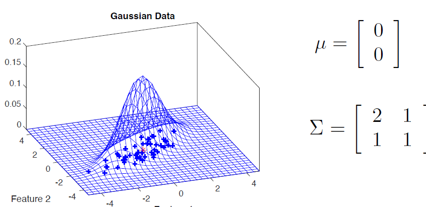

Below, the arrows are the eigen vectors of the covariance matrix:

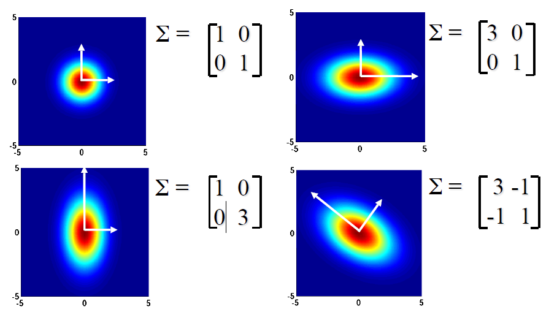

Coveriance matrix structure:

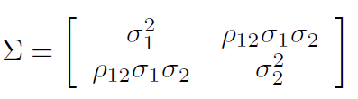

As shown in the gaussian formula, we need to find the inverse of the covariance matrix. If you can't find the inverse of the covariance matrix, it might mean 

- sample you used to compute the covariance matrix is too small
- sample is of sufficient size but it's member are not drawn from a continuous distribution so that some of the column/row of your sample repeat
- some feature is redundant and can be removed.

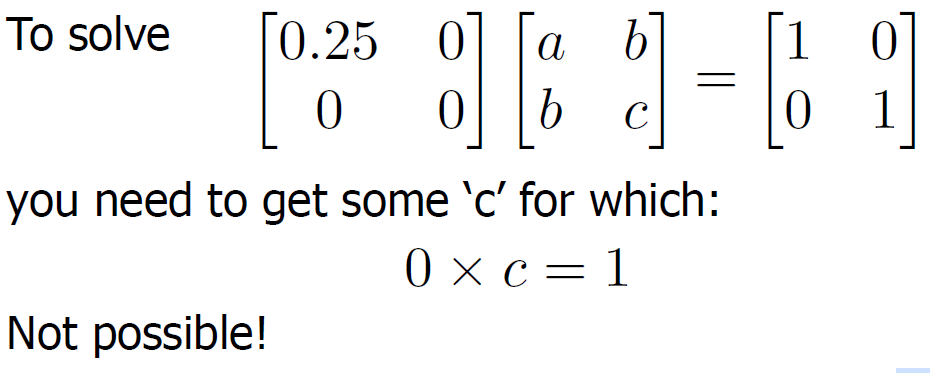

# Maximum likelihood and parametric estimation
Remember the maximum likelihood estimators for the mean and covariacne matrix:

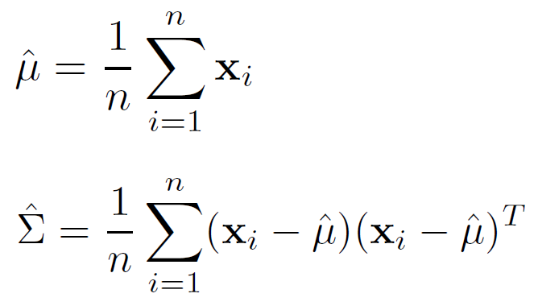

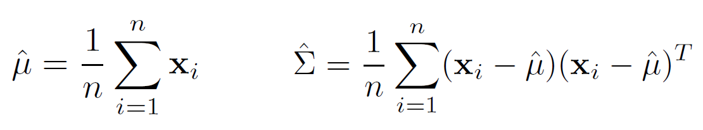

For n-dimensional data set in a gaussian distribution, you need at least:
- n elements for the mean vector
- 0.5 * n * (n+1) elements for the covariance matrix

### Quiz
Mean of class +1: if you look at the pic, the values that have class +1 are
2  0
3  0

2+3 = 5/2 =2.5. THus mean for feature 1 is 2.5.
0+0 = 0/2 = 0.  Thus mean for feature 2 is 0.

THe covariance of class +1 is a 2 by 2 matrix. The spread of feature 2 is 0. And the spread of feature 2 is 

# Estimate probabilities
For **Bayes Rule**, we need to estimate the following to get the p(w|x) posterior probability:

- p(y): class prior probability
- p(x): unconditional data distribution
- p(x|y): class conditional distribution

1. Compute class prior probability p(y):
- often already known/assumed
- just count:

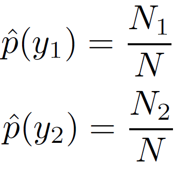

2. Compute unconditional data distribution p(x):

*p(x) = p(x|y1)p(y1) + p(x|y2)p(y2)*

*as mentioned before, unconditional data distribution not needed if just need to find the largest posterior probability.

3. Compute class conditional distribution p(x|y). Remember the Gaussian formula and estimators for mean and covariance matrix:

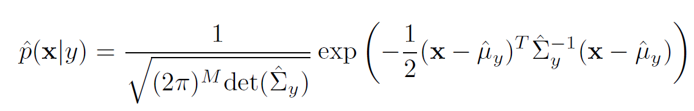

# Classifiers
When classifying, we need a **threshold function** denoted as f(x) to describe the **decision boundary**. This function is called the **discrimiant**.

Use **plug-in Bayes' rule** with normal distribution for every class to get different classifiers.

Idea is to map values of dotProduct(weightVector, featureVector).

## Linear classifier
**Linear classifier**:
- measurement from each class are normally distributed
- separate mean per class
- assume equal covariance of each class

To get the linear classifer, we define the following threshold function (two-class case):

Simplifying f(x) results in the following (see the calculation in quadratic classifier section):

Definition of function f(x):
- If f(x) >= 0, assign x to class y1
- If f(x) < 0, assign x to class y2

### wTx vs wTx + w0
**Linear discrimiant analysis** is a model that makes use of the **linear classifier** for 2 or more classes. LDA picks a new dimension that gives:
- max separation between means of projected classes
- min variance within each projected class

Definition of wTx:

Definition of wTx + w0:

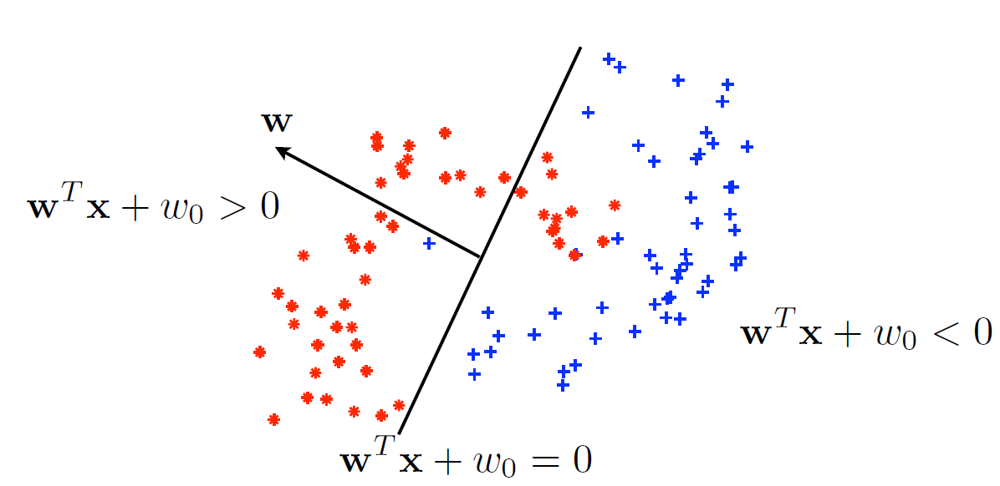

Reason for difference:

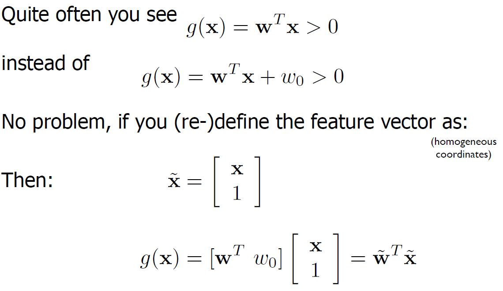

## Quadratic classifier
**quadratic classifier** is closely related to linear classifier.
- measurement from each class are normally distributed
- separate mean per class
- separate covariance matrix per class (each needs to be estimated)

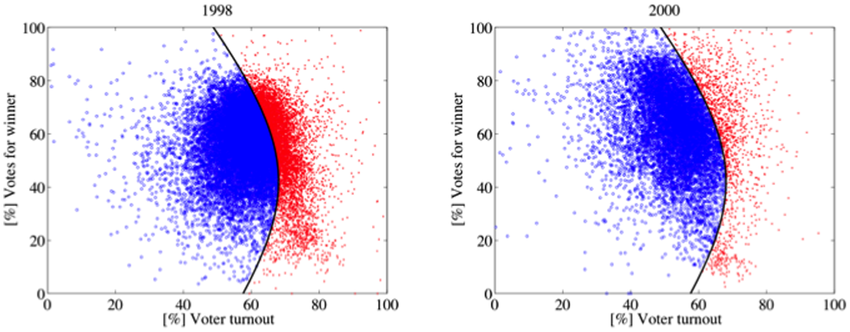

To get the quadratic classifer, we define the following threshold function (two-class case again):

Rewrite the above function:

Drop any constant and p(x) since independent of classes:

Definition of function f:
Assume i = class 1, and j = class 2
- If f(x) >= 0, assign x to class y1
- If f(x) < 0, assign x to class y2

The general form for a two-class quadratic classifier:

### Estimate covariance matrix
As mentioned before, we need to estimate the covariance matrix of each class for quadratic classifier. For each class k:

If no inverse for some covariance matrix, average over all covariance matrices:

For high-dimensional data, need many sampels to estimate covariance matrix. Can also assume all classes have the same convariance matrix. For a posterior probability for one class:

Notice how covariance matrix is not class specific (averaged covariacne matrix)

## Nearest mean classifier
**Nearest mean classifier** is ued when full averaged covariance matrix is too much to estimate. 

- measurement from each class are normally distributed
- separate mean per class
- separate **identity covariance matrix** per class

Assume all features have same variance and uncorrelated:

The general form for a two-class nearest mean classifier results in a linear classifier but only uses distance to the mean of each of the class:

# Conclusion

- More flexible classifier needs more training data
- Simple classifiers still perform quite well in practice

- For now ignore **mixture models**: combination of separate gaussian distributions with separate weights
- With increasing dimensions / # measurements, does Gaussian or histogram need more data? -> histogram

For histogram ou can have any distribution so as it increases, need more parameters.

Gaussian is already a normal distruiont so only need mean and covariacnce matrix.
