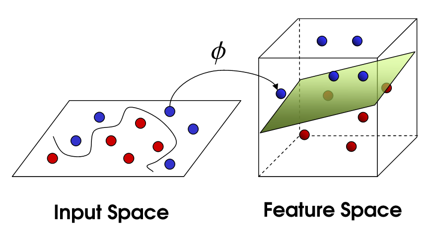
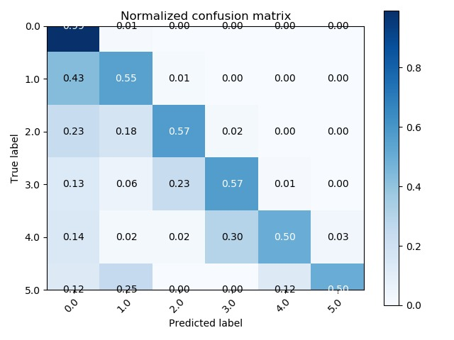
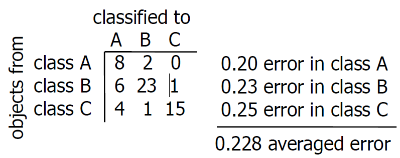

# Non-parametric density estimation
In real life we don't know distribution
=> can't esimate the global parameters

One way is to use a histogram:
1. split feature in subregions, or bins, of width h
2. COunt number of objects in each bin
3. Estimate the probabily of feature using the formula

Other methods than histogram are:
- **Parzen density esimate**
- **K-Nearest-neighbor density estimate**
- **Naive bayes**

*non-parametric generally more accurate since it gets the average of every data set and don't assume a pre-distribution type

## Parzen density esimate (Kernel density estimation)
Some terms:
- **Kernel function**: function that accepts vectors as inputs in original space and returns the dot product of the vectors in feature space.
- **Window function**: mathematical function that is zero-valued outside of some chosen interval

**Kernel density estimation** depicts the probability density function of the continuous or non-parametric data variables. It is a better approach than traditional histogram.

1. Apply **kernel function** or a **cell** on each data point. 
2. Sum these functions together to get the kernel density estimate of the random variable 

Below the kernel density estimate is defined by p(x), where h is he width.

Once we have the probability density function, we can use this along with the Bayes rul to classify the random variable.

Properties:
- does not assume known distribution
- estimates probability densities using kernel function
- uses kernel function of fixed shape and width
- width h matters
- use Bayes rule for classification

The parameter (width) h is NOT estimated from our data, thus it is a non-parametric approach

### Kernel function
For a kernel function K, the following should hold:

Several cell shapes to choose from:
- Gaussian
- Box
- Tri
- Triweight

KDE with a box kernel is not the same as histogram: with a KDE with box kernel, you can count all the boxes and determine how many data points, while histogram doesn't represent the # of data points just by looking at the bin.

Exaple:

Given the data below, use the kernel function with width h=1 to find the Parzen PFD:

## K-nearest-neighbor
Basic idea is to use 'closeness' to classify the data point. 

*Here 'k' is the number of data points to consider.*

How it works:
1. Locate the cell on the new point
2. Do not change the cell shape
3. Grow the cell untill it covers k objects.

- *𝑉𝑘* is the volume of the sphere centered at point x 𝑥
- *ki* is the number of neighbours of class i within Vk
- *ni* is the number of data points of class i in the dataset

When classifying:

- The algorithm:
1. compute distance D(x, xi) to EVERY training example xi
2. Select k closest instances xi - xk and their labels y1 - yk
3. output class y which is most frequent within the yi1 - yik (majority vote)

If k = all the x values (whole data set), we are basically looking at class priors (everything classified as the most probable class)

If k = 1, highly variable and result in unstable decision boundaries (any noise will have consequences)

To determine the right value of k is similar to choosing the right value of h from *kernel density estimation*:
1. set aside a portion of training data for validation (test data set)
2. vary k
3. pick k that gives best performance

If we have equal number of positive/negative neighbours:
- choose an odd k (doesn't solve multi class)
- randomly decide positive or negative
- pick class with greater prior
- use 1-nn classifier to decide

To measure the distance:
- Euclidean (numeric features)

- manhattan distance
- hamming distance (categorical features)

**Feature scaling** is scaling all your features into a certain range. This is necessary as it might make your boudnary decision more easier to look.

Pros:
- simple, flexible classifiers
- often good performance
- simple to adapt complexity of classifier

Cons:
- Relatively large training sets needed
- Complete training set has to be stored
- Compute distance to all training objects
- 'Right' features caling
- Optimize 'k' value

## Naive Bayes Classifiers
To get the pdf P(X) we need to do the following:

When estimating a class conditional probability density, each feature vector x can have many features. Estimating this **joint pdf** requires lots of data (**curse of dimensionality**).

**Naive Bayes** assumption: each feature is *independent* of each other. This allows us to multiply the probabilities of each feature:

*The class value explains all the dependence between each features*.

Can use three main models:
- Gaussian
- Multinomial
- Bernouli

Navie bayes clasifier can be used in both:
- parametric density function (bayes theorem to calculate the parameters) 
- non-parametric density function. 

*So with the same data set, we can get two different division of class*

Pros:
- Dataset can be small and still good performance
- relatively fast and simple

Cons:
- If features covary, they aren't independent 
- **Zero-Frequency problem**: If an instance in the test data set has a category that was not present during training, then it will assign zero probability.

Solution to zero-frequency problem is **Laplace smoothing**: adding a small positive number to the counts:

Gaussian density classifiers problem: not enough training data

# Classifier evaluation
Questions is what classifier to use?

Naive approach: pick several classifiers and choose one with least **error estimate**.

Once you have chosen a classifer, use the whole design set to train the classifier on the whole design set. Now this is no longer testable but this cross-validation has given some confidence that you made right choice in choosing classifier. 

Problems:
- Assume that the training set is a fair sample from true problem (don't know for sure)
- overfitting on the training set, thus not ready for new samples
- Sometimes classification error is not the real useful thing (cost of missing classifying a covid case is much higher than simply counting it as one error) -> redefine what the error actually is

Very important which feature you choose so that it represents a true distribution type in real life. 

If you had a model that can detect well certain object A but then started introducing only 'outliers' in the training data set, it is very likely that your model will become worse at predictin -> only outlier filled training data set is not a true representation of the distribution of real life occurences.

Small datasets require models that have:
- low complexity (few parameters) or high bias to avoid overfitting the model to the data
- simple the machine learning algorithm
- example is Naive bayes and Ridge regression

# Error estimate by test set
With a single **design set**, we divide it up into **training set** and **test set**:

*changing training set changes the classifier and changing the testing set changes the error estimate*

To calculate the error: sum of Bernoulli random variables over N test set size:

To compute the variance of the error estimate, do the following equation where epsilon is the true error:

*If N is not large enough, variance can get very big*

- Large training set -> good classifiers
- Large test set -> reliable, unbiased error estimate

Four naive cases:
- Same set for training and testing: good classifier but biased error estimate
- Small, independent test set: well trained classifier, unbiased but unreliable (large variance)
- Large, independent test set: badly trained classifier, unbiased and reliable (small variance)
- 50-50: The optimal balance

More better approaches use **cross-validation**:

## Bootstrapping
1. Randomly draw N objects from design set of size N (with replacement)
2. Use never-drawn objects while bootstrapping as testing set
3. Repeat m times and get m error estimates
4. average the m error estimates to get final error estimate

Potential problems
- design set already randomly drawn
- get same train objects several times

## K-fold cross validation
1. Divide the design set in *K* parts
2. Use K-1 parts for trainuing set and 1 for testing set
3. Rotate this K times for the other parts and get K error estimates
4. Average the K error estimates and get final error estimate

## Leave-one-out procedure
1. Divide the design set into a training set and testing set
2. Divide the testing set further into N objects
3. Rotate N times for each test object and get N error estimates
4. Average the N error estiamtes to get final error estimate

## Double cross-validation: Optimizing hyper parameters
Machine learning methods often have **hyperparameters**. Some examples:
- Parzen density estimator: width parameter h
- k-nearest neighbour: number of neighbours k
- Decision trees: pruning method, stopping criterion
- Neural networks: architecture, learning rate, …

If you optimize the hyperparameters by looking at the test set performance, this will lead to overfitting (no more data to test whether this hyperparameter really is best choice)

**Double cross-validation** is doing cross-validation inside another cross-validation:
1. For each training set from different sessions, rename it to **validation set**
2. Split the **validation set** into separate training and testing set to vary the hyper parameter.
3. Get separate error estimate Eij for different training sets within internal cross-validation
4. Choose hyperparameter with the lowest average:

*the error estimate from the interval cross-validaiton is separate from the external cross-validation*

# ML learning curve
As size of the training set increases, the estimate error (from training set) also increases -> lot of data means classifier will find problematic cases where it can't perfectly predict all the labels

But this isn't linear; more data you have, the more true error will decrease (more likely it represent the distriution type of real life occurence for that object). 

**Overfitting** is when the difference between true error and the estimate error is too big:

Different classifiers have different complexity. More flexible (more complex and more parameters) classifiers perform well with large data set but bad for small data set -> NO best classifier because it depends on how much training data you have.

## Parzen example
Below shows parzen density estimate classifier with a very small width parameter. Zero error from training set:

Now this is when the width parameter is very big. Classifier becomes more simple but more errors in training set:

*Increase the parameter (decrease complexity) just enough so that training and testing error goes up but overfitting is less*

# Bias-variance tradeoff
When given some data, almost never know what the true distribution of the data set is.

- **Variance** is how much classifier g(x) vary over different training sets.
- **Bias** is how much the average classifier g(x) differ from the true output.

Consider the squared error where g(x;D) is the classifier from the avveraged training sets and E[y|x] is the **optimal mean-squared regressor**:

Final result:

More simple classifiers:
- less parameters
- less flexible
- more stable
- require relatively small data

More complex classifiers
- more parameters
- more flexible
- less stable
- require large data

LDA vs kNN;

**Curse of dimensionality**: as number of parameters increase (more complex), the number of samples needed grows exponentially:

*If a classifier has too few features (too simplified), has low variance but large bias*

*If a classifier has too many features (too complex), has low bias but large variance.*

But the more training data we have, the more possibilities of estimating the parameters well and can flatten the curve on the rhs:

# Confusion matrices
**Confusion matrices** provides a detailed count of classifying error for each class. 

Example to calculate separate classification error for each class:

    misclassified objects from class A / # objects from class A

## ROC analysis
Once you have confusion matrix, make a trade off to determine how many errors for one class and how many errors for the other.

Below is the **ROC analysis** that demonstrates all possible trade offs for a specific classifier in this curve:

Below, error on class 1 is high but error on class 2 is vritually 0:

Below if class 1 prior is high, it means the class 1 error is much heavier than class 2 error for the total error estimate. 

Thus in this setting, if you go in -> direction (direction of class 1 error) the final error grows larger than when you go <- direction (direction of class 2 error):

Example: compute the ROC curve for the following data set

See the correspondence from above and below picture

