# Empirical risk minimization
Core idea: don't know how well an algorithm will perform in practice (the *true risk*) since we don't know the true distribution of data that the algorithm will work on. Thus measure its performance on a known set of training dtat (the *empirical risk*).

Generally true risk can't be computed since distribution of variable x is unknown. Therefore compute an approximate of the risk called **empirical risk**:

- average the **loss function** on the training set
-> compute expectation with respect to empirical measure

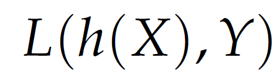

- X: random variable with input features of interest
- Y: outcome of interest (discrete or continuous)
- h: hypothesis function mapping input X to a decision value
- L: loss function to measure 'quality' of each hypothesis

**Empirical risk minimization** aims to look for the hypothesis function that minimizes this loss:

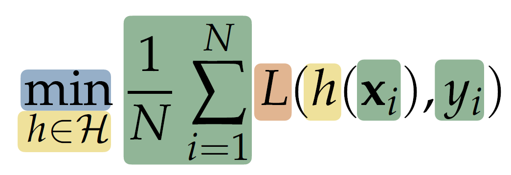

Conclusion: amongst multiple hypothesis function, choose the one with least loss.

# Hypothesis function
If the outcome is continuous (regression), h(x) can directly correspond to the function we want to find.
If the outcome is discrete (classification), h(x) is a **discriminant function** that gives a real-valued output which is later converted to a class/label. It can have the following form:

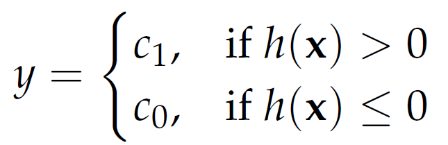

## Linear decision boundaries
As stated before the **decision boundary** is when the xTw + w0 = 0.
-> weight vector w is orthogonal to every vector within the decision boundary.

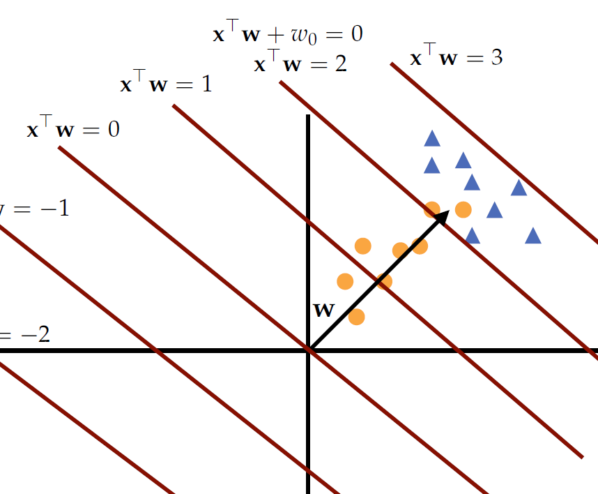

## Linear discriminative classifiers
**Linear classifieres** use the following linear hypothesis function:

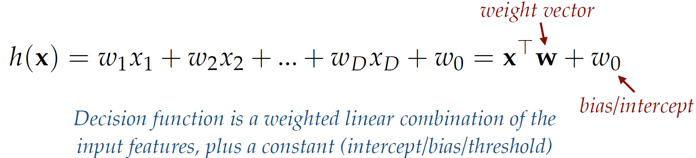

Sometimes the **bias** term is added to the **weight vector** like the following:

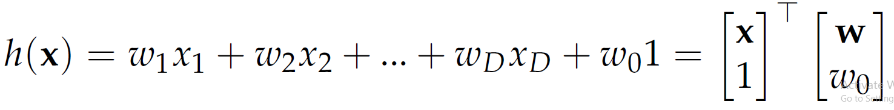

Note that the classes all have different weight vectors.

Apply the discrete function to the linear hypothesis function to the Empriical Risk Minimization formula:

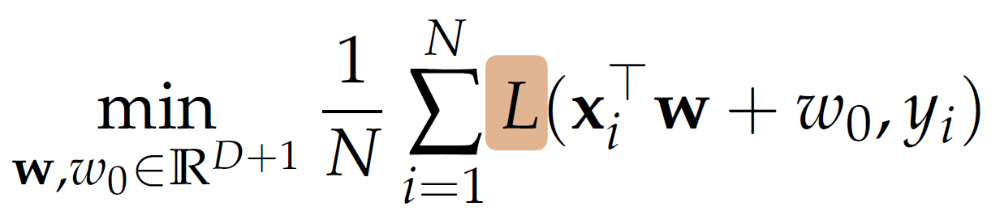

# Linear regression
Linear regression is used to solve problems with continuous outcome, not discrete clases. Loss is calculated by comparing difference between predicted value and the true value:

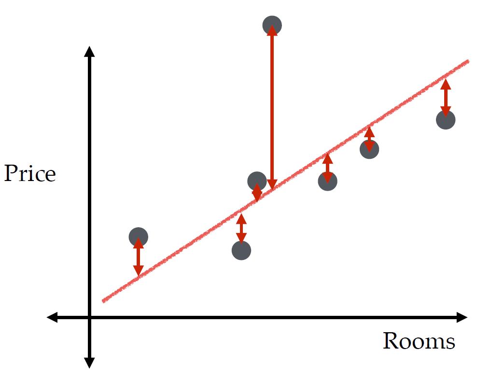

To define a loss:
- calculate the absolute difference
- square the difference (penalises large differences)

The loss function below:

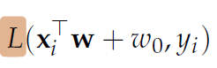

Can be interpreted like this:

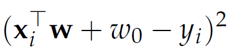

The loss function can then be graphed the following:

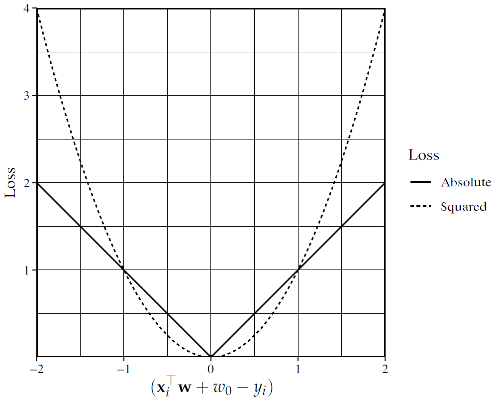

Rewriting the linear regression function: (note that the hypothesis class is only linear models and J() is the loss function)

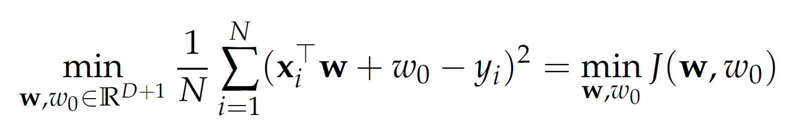

*Goal: find the best weight vector 'w'*

## Gradient Descent
**Gradient descent** helps to find the best weight vector 'w' in linear equation systems with minimum losses (global minimum). 

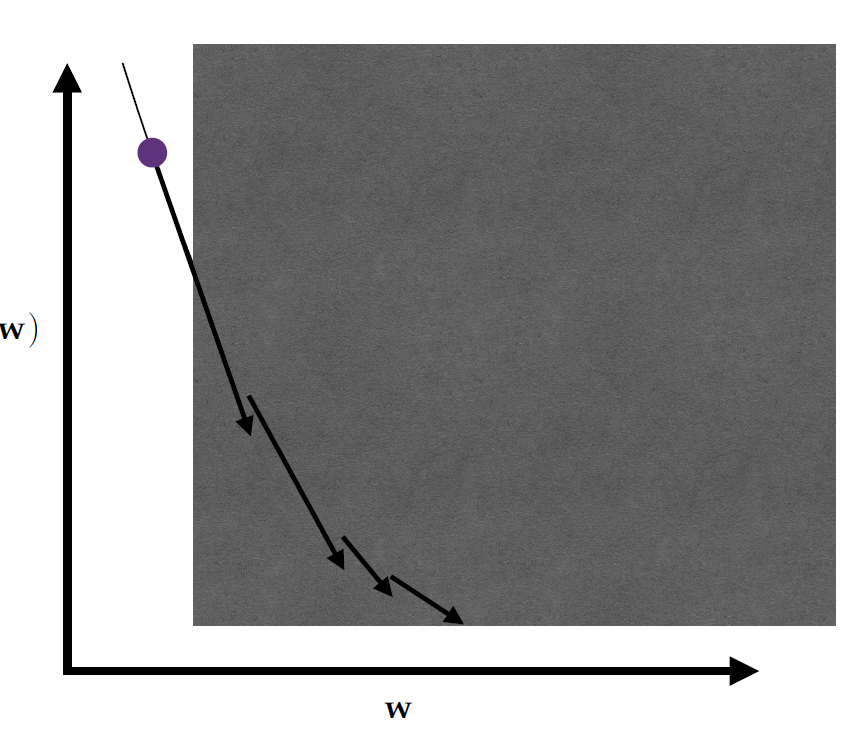

1. Pick a (random) starting value for the weight vector w, bias w0
2. Calculate its cost (risk)
3. Look at the slope of the cost function (assume we choose squared difference in the loss function)
4. Follow direction of the steepest slope (descend), so that risk becomes smaller each step we make
5. Continue until the gradient converges

Consider how big the step should be:

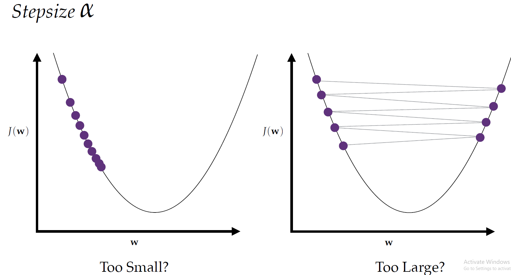

Two types of gradient descent:
- **batch gradient descent**: calculations over full training set at each step to compute gradient. Takes a lot of time thus not recommended for huge training samples. But scales well with number of features.
- **stochastic gradient descent**: choose random samples of training data at each step and then computes the gradient. Much faster than batch but doesn't settle down when close to minimum value.

**Epoch** is when you vist all the data once. Thus stochastic gradient descent does many steps (gradient updates) within epoch

The formula for gradient descent:

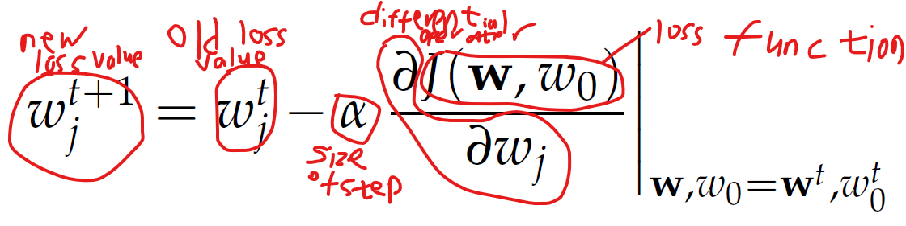

Another version of formula:

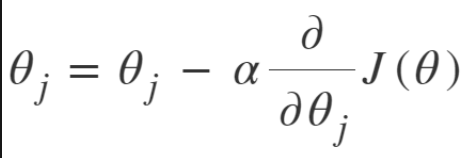

Since the gradient is the derivative of the cost function:

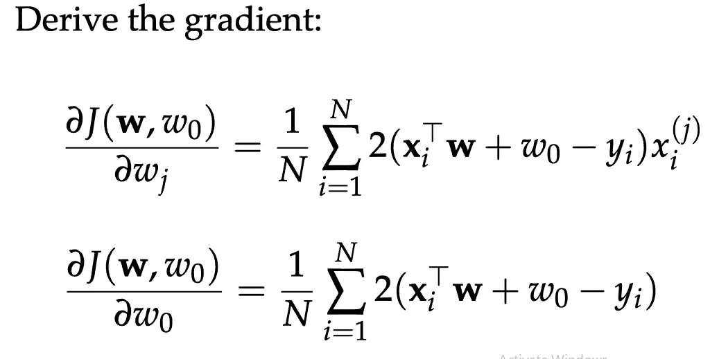

As shown below, the red line on LHS is the hypothesis function and righ line on RHS is the gradient descent step. As gradient reaches closer to the purple circle, the lower our loss function becomes and higher the accuracy of our hypothesis function.

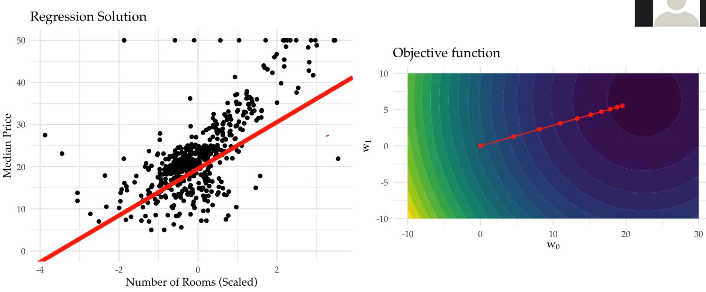

To go further, no need to fix the step size. Alternatives are:
- second order methods
- Line search
- Momentum

Depending on the cost function (also known as **objective function**) and function class, it is easy or hard to find the global minimum.
*global minimum is the classifier with the minimal value for the cost function, which may not be the best solution for the problem! Recall: we want the solution to work well for the expected loss

# Logistic regression (classification)
Objectives in classificiation is different than objectives in regression. In regression, objective is the least difference (risk) while classifications can have serveral:
- different weight for different mistakes
- accuracy of probabilities
- correct ordering of objects

Different goal: find hypothesis function that accurately approximates the probability of the label/class.

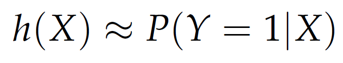

*If we want class predictions, we have to set a threshold for h(x) at a probability

To map the hypothesis function to a probability in the range [0, 1], we use the **logistic function**, where the z below can be replaced by the hypothesis function and the result is the probability (prediction):

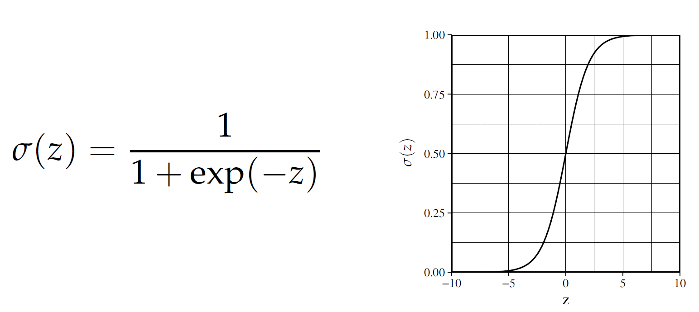

For 2 classes (assume Y is either 0 or 1) we use **N Bernoulli trials**. 

For object i, the estimated probability of observing label yi is:

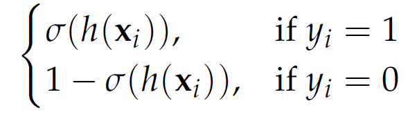

**Likelihood** is a measure of how well the estimated probabilities explain the observed labels, so we want to maximise this likelihood.

Instead of using loss function to find its minimum, we use the **likelihood function** to find its maximum:

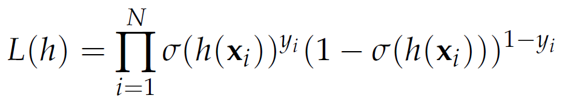

This is equivalent to finding the minimum of the negative log likelihood (similar to minimizing the 'loss'):

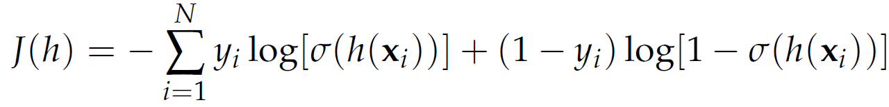

Its graph:

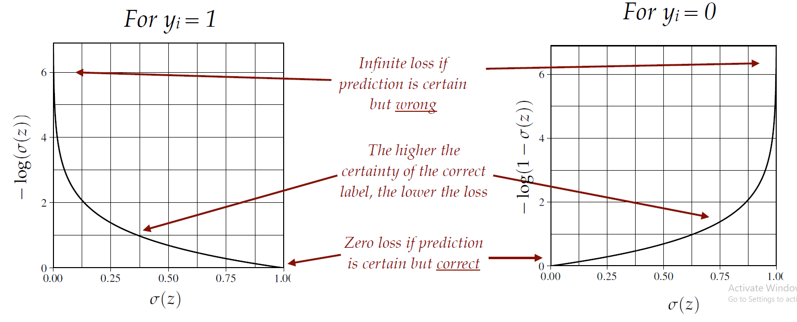

For linear logistic regression, apply the same hypothesis function from the discrete case:

To get the minimum negative log likelihood:

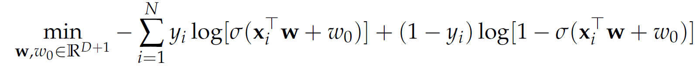

*Even if logistic function itself is not linear, the hypothesis function is linear thus **logistic regression** is considered a linear classifier.

## Gradient Descent (again)
If using negative log likelihood to find the minimum 'loss', we use gradient descent again. Use the following simplification:

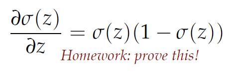

To turn the negative log likelihood formula below:

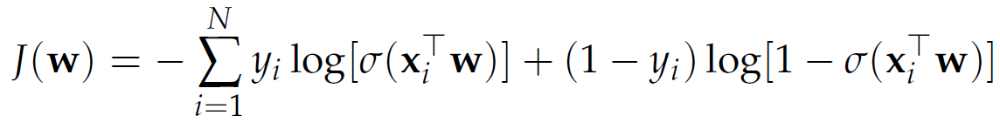

into its gradient by performaing derivative:

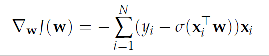

Pointers
- no analytical solution, so we use iterative procedures like gradient descent
- if no class overlap our quality measure is not sufficient: many equally good solutions

# Support vector machines
