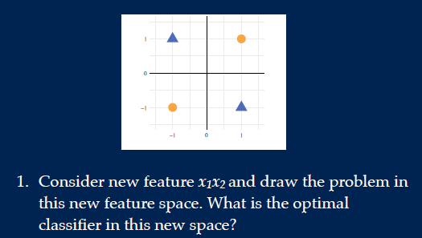
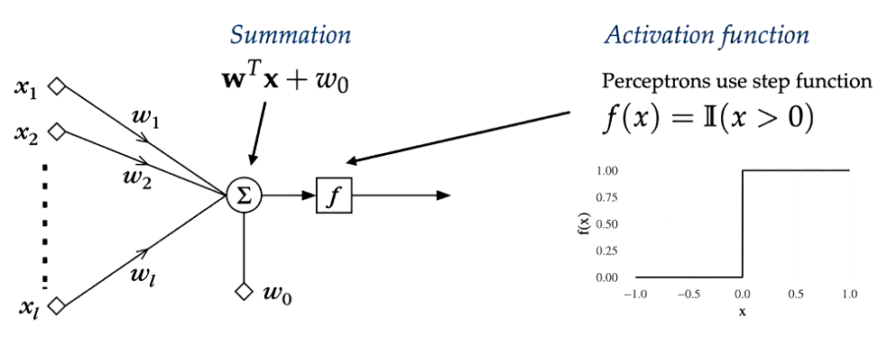

# Decision tree
Decision tree is a discriminative non-linear classifier. Split the feature space into rectangles using one feature at a time recursively.

If features not present in feature tree, simply ignore it.

The **indicator function** determines whether feature x is in the leaf, then the indicator function is 1, otherwise 0 

The optimal value for cl is the most common label within that leaf node.

The decision tree has two cases:
- multi-class (discrete): take sum over all classes in entrophy 
- regression (continuous):  squared loss as loss function, average outcome as leaf value, and minimum variance as split criterion

The split:
- if all objects in a node belong to one class we are done. 
- else pick the best attribute to split *(split that leads to the highest information gain).*

The relevant information is **purity**:  pureness of subset of examples after splitting the data. 

For this we mostly use **entrophy** as purity measure I(S):

Below we start with purity measure in original node and compare that with the purity in all the new nodes that were created due to the split.

Improvement measure example:

Some alternatives:

When we have continuous variables, we need a threshold for the split. For every finite threshold, calculate the gain and which threshold split leads to the biggest gain. 

When to stop to prevent overfitting:
- minimum node size
- max tree depth
- minimum information gain

An alternative to stopping is growing and pruning. **Pruning** is removing sections of the tree that are non-critical and redundant to classify instances.

Pros:
- Interpretable
- automatic features selection (not all are useful)
- fast

Cons:
- Unstable
- Can't model lienar relatioships well
- Greedy

# Condorcet's Jury Theorem 
Combine classifiers so that each one covers up the mistake of the other. 

**Condorcet's jury theorem** states that if p > 0.5, adding voters to the jury increases probability of correct majority vote (assuming voting is independent).

Idea: classifiers make prediction for certain data x, and choose the label with the most votes from the classifier.

If classifiers return probability, then get the max of the mean or product of each possible class.

Multiple classifiers can come from
- same classifier on different datasets
- different classifiers on same dataset

# Random forests
Random forests combine multiple decision trees to avoid overfitting and unstability from a single tree. 

When selecting the decision trees, choose from randomly selected objects and features and combine their decisions.

Several ways to generate a forest:

- **Bagging**: use bootstrapping to get objects from dataset with replacement. Do this multiple times and get multiple decions trees based on different data sets:

- **Random subspaces**: Take random selection of features in the dataset. Now datasets are missing some features

Pros:
- flexible/low bias
- works for many different types of data
- few hyperparameters

Cons
- Hard to interprest than single tree
- computationally expensive

# Perceptron
Below, the decision tree can't solve this problem. Splitting on either feature 1 or feature 2 will result in information gain of both 0.

One solution is to make below a linear classifier, create new feature space by some function and create classifier there:

Otherwise:

**Perceptron** is a unit of a **neural network** that neural. It is a function that maps its input x, which is multiplied by the learned weight coefficient, and generates an output value f(x).

So for the activation function:
- y` = 1 if Wx+b > 0 
- y` = 0 if Wx+b ≤ 0

*Perceptron is a simple linear binary classifier*.

Almost identical to classifiers, but it also has a **step function** as an activation function.

The loss function: if both class label and output are positive or negative, loss is 0. If the signs are different, we get a loss and penalize bigger losses.

 
To minimize the above loss function, we use gradient descent:

Above guaranteed to converge if:
- problem is linearly separable
- choose the right decreasing, linear rate

## Perceptron with logic gate
*For a perceptron to achieve each logic gate, we need to choose a certain model that satisfies certain gate properties*. For example:

w1*x1 + w2*x2 + b = 2x1+2x2–1  or x1+x2–1 , etc. 

Example:
For the AND perceptron, output is 1 only if both feature inputs (x1, x2) are 1. 

Model: w1=1, w2=1, b=-1

1. x1 = 0, x2 = 0
w1 * x1 + w2 * x2 + b = 1 * 0 + 1 * 0 + -1 = -1. Wx+b ≤ 0 thus y` = 0;

2. x1 = 1, x2 = 0 (and vice versa)
w1 * x1 + w2 * x2 + b = 1 * 1 + 1 * 0 + -1 = 0. Wx+b ≤ 0 thus y` = 0;

3. x1 = 1, x2 = 1
w1 * x1 + w2 * x2 + b = 1 * 1 + 1 * 1 + -1 = 1. Wx+b > 0 thus y` = 1;

# Multi-layer perceptrons
For the XOR problem, use 2 classifiers to create new feature space. 

Then use these the two outputs as input for the third classifier on the new feature space:

The process:

Terminology:

The activation function has to be differentialable. When building multi-layer perceptrons, we don't actually use combination of perceptrons but more combination of logsical regressions or other models.

## Calculating predictions
Given a model, we do prediction/inference as such:

For loss function, use any loss function like negative log likelihood from logistic regression or simply squared loss.

For objective function, use loss function to determine how good or how bad:

## Learning parameter weights
Many hidden layers, thus changing the weight vectors early on might not be clear what is contributing to the error. If you make mistake at the output, not clear which weights at which layer you should change. Thus use **back propagation**.

### Back propagation
**Back propagation** is how a single training example would like to nudge the weights and biases in all the layers.

*Basically, figure out whether we need to increase or decrease the weight value to reach minimum loss*

For this we use **(stochastic) gradient descent**.

1. first initialized some random value to ‘W’ 
2. Do the prediction (**forward propagation**) with some training set
3. Calculate error at the output layer (actual - output)
4. To reduce error, propagate backwards (**gradient descent**) and increase the relevant weight vectors contributing to the output
5. If error decreased, continue until global loss minimum (**gradient descent**). Otherwise, decrease the weight vector
6. Do this for all weight vectors in all layers contributing to that output.
7. Repeat step 2 - 6 until reached global loss minimum (**gradient descent**) for that one data.
8. Repeat step 1 - 7 for all training data

